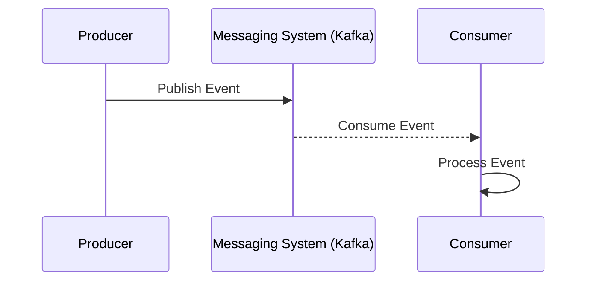

## Event Streaming

### Description

Event Streaming is a data ingestion pattern that involves processing data as a continuous and real-time stream of events. This pattern is instrumental in building applications that require real-time analytics, monitoring, and processing capabilities. Utilizing distributed messaging systems such as Apache Kafka, Apache Pulsar, or AWS Kinesis, event streaming allows multiple producers to generate and push event data simultaneously, supporting high-throughput and low-latency scenarios.

### Architectural Approach

Event Streaming is based on publish-subscribe models where producers publish events, and consumers subscribe to process those events. The architecture consists of:

- **Producers**: Entities that generate and send events. These could be any system components like IoT devices, microservices, or user applications.
- **Messaging System**: Acts as a buffer and message broker. Popular platforms include Apache Kafka, which stores streams of records categorized by topics, enabling reliable and durable event processing.
- **Consumers**: Services that subscribe to and process the event streams. Consumers handle data transformation, analytics, error handling, and persistence operations.

Using frameworks like Kafka Streams or Apache Flink, developers can build scalable stream processing applications that operate on the event data in near real-time.

### Best Practices

1. **Idempotency**: Ensure consumers are idempotent, meaning repeated processing of the same event does not produce different outcomes. This is crucial in distributed environments to handle event duplications gracefully.
   
2. **Schema Management**: Use schema registries for defining and maintaining data schemas to ensure that producers and consumers are aligned on data structure and format.

3. **Backpressure Handling**: Implement backpressure techniques to manage consumer lag and ensure the system remains stable under varying loads.

4. **Security**: Secure the data stream with encryption both at rest and in transit, and manage access control with appropriate permissions for producers and consumers.

### Example

A financial trading platform employs Kafka to stream trade events from various brokerages. Here's a simplified example demonstrating Kafka's usage:

```java
Properties props = new Properties();
props.put("bootstrap.servers", "localhost:9092");
props.put("acks", "all");
props.put("key.serializer", "org.apache.kafka.common.serialization.StringSerializer");
props.put("value.serializer", "org.apache.kafka.common.serialization.StringSerializer");

Producer<String, String> producer = new KafkaProducer<>(props);
for(int i = 0; i < 100; i++)
    producer.send(new ProducerRecord<>("trades", Integer.toString(i), Integer.toString(i)));

producer.close();
```

In this Java snippet, events are created and sent to a Kafka topic named "trades," representing trade events in real-time.

### Diagrams



### Related Patterns

- **Event Sourcing**: Models state changes as a series of immutable events, which can be replayed.
- **CQRS (Command Query Responsibility Segregation)**: Separates the read and write operations for improving query performance.
- **Data Lake Pattern**: Uses streams to ingest data into centralized storage.

### Additional Resources

- "Kafka: The Definitive Guide" by Gwen Shapira and Neha Narkhede.
- [Confluent Documentation](https://docs.confluent.io)
- AWS Kinesis [Developer Guide](https://docs.aws.amazon.com/streams/latest/dev/introduction.html)

### Summary

Event Streaming is a seminal pattern that enables the ingestion and processing of real-time data streams. By leveraging distributed messaging systems, this pattern supports high-performance applications requiring real-time insights, efficient handling of large data volumes, and resilient data processing. Implementing event streaming ensures that businesses can react to events as they happen, leading to faster decision-making and improved operational efficiency.
