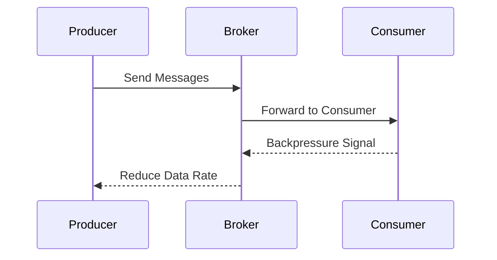

## **Backpressure Handling**

### **Description**

In distributed systems and stream processing, managing the flow of data between different components is crucial, especially when these components operate at different speeds. Backpressure handling is a methodology used to ensure that data producers and consumers remain synchronized, preventing system crashes and data loss due to overwhelming data ingress.

Backpressure mechanisms introduce control signals between producers and consumers, regulating the data flow based on the consumer's capacity to process incoming data. This pattern is vital in systems where input rates vary dynamically and consumers might become slow due to network issues, resource constraints, or heavy load.

### **Key Concepts and Implementation**

1. **Flow Control Protocols**: 
   - Use flow control protocols like TCP or application-level backpressure strategies found in reactive frameworks (e.g., Reactive Streams specification).
   
2. **Rate Limiting**:
   - Implementing rate limiting in request handling by using techniques such as token buckets or leaky bucket algorithms.
   
3. **Buffer Management**:
   - Use queues and buffers to handle bursty traffic, implementing strategies to either drop old data, reject incoming data, or compress the data.

4. **Feedback Loops**:
   - Employ feedback loops where consumer speeds are monitored and communicated back to producers to adjust data emission rates dynamically.

### **Example**

Consider a typical Apache Kafka setup for data streaming. The producers continuously send messages to Kafka brokers, and these are then consumed by downstream consumers or applications. 

When a consumer slows down its consumption rate, perhaps due to limited processing resources or heavy computational tasks, the brokers send backpressure signals to Kafka producers. This signal advises producers to decrease the data sending rate, thereby avoiding the risk of overloading brokers and potentially losing messages.

```scala
import akka.actor.ActorSystem
import akka.stream.ActorMaterializer
import akka.stream.scaladsl._

object BackpressureExample extends App {
  implicit val system = ActorSystem("BackpressureSystem")
  implicit val materializer = ActorMaterializer()

  val source = Source(1 to 1000)
  val slowConsumer = Sink.foreach[Int](x => {
    Thread.sleep(100)  // Simulate slow consumption
    println(s"Consumed $x")
  })

  source.async
    .throttle(10, per = 1.second, maximumBurst = 10, ThrottleMode.Shaping)
    .runWith(slowConsumer)  // Backpressure applied here
}
```

### **Diagrams**

Here's a simplified UML Sequence Diagram using Mermaid to represent a backpressure scenario in stream processing:



### **Related Patterns**

- **Circuit Breaker**: Used when components need a temporary shutdown to recover from transient faults.
- **Load Shedding**: Dropping messages under high-load conditions to protect system health.
- **Retry**: Transient failures might benefit from retries, which need to be controlled in conjunction to avoid exacerbating backpressure.

### **Additional Resources**

- [Reactive Streams Initiative](https://www.reactive-streams.org/)
- [Kafka and Backpressure Handling](https://kafka.apache.org/documentation/)
- [Akka Streams Documentation](https://doc.akka.io/docs/akka/current/stream/index.html)

### **Summary**

Backpressure handling is an essential design pattern that enhances the robustness and reliability of streaming applications by aligning the production and consumption rates. By regulating these rates through feedback mechanisms, systems can maintain operational stability, avoid data loss, and handle sudden workload spikes effectively. Incorporating backpressure management not only optimizes resource usage but also protects system components from being overwhelmed.
