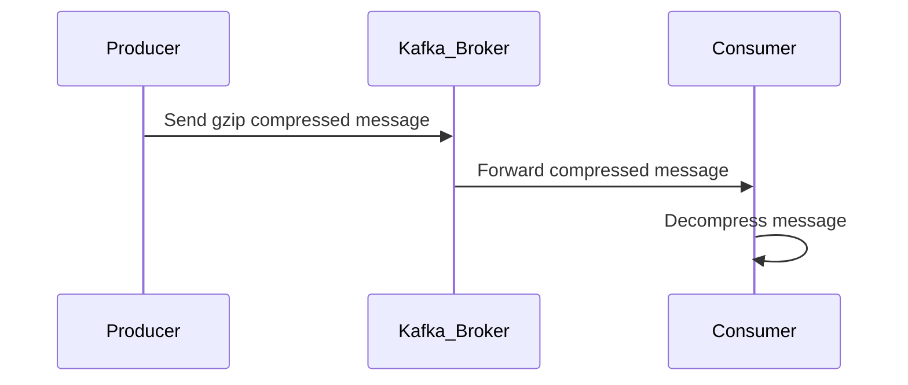

## Introduction

In the world of cloud computing and big data, the efficient handling of data is as crucial as the data itself. One effective method to achieve this is data compression during ingestion. This pattern enables systems to efficiently manage large volumes of data by reducing the amount of data that needs to be transported and stored, thereby optimizing resource usage and reducing costs.

## Design Pattern Overview

Data Compression During Ingestion involves applying compression algorithms to data as it flows from the source into a cloud storage or processing system. This pattern is especially beneficial in streaming data architectures where large data streams need to be processed in real-time.

### Benefits:
- **Reduced Network Bandwidth**: Compressing data during ingestion minimizes the amount of data transmitted over the network, reducing bandwidth needs and improving data transfer speeds.
- **Lower Storage Requirements**: With compression, the data size is significantly minimized, leading to reduced storage costs.
- **Enhanced Performance**: By decreasing data size, this pattern accelerates data processing and querying speeds.

## Implementation Approaches

### Example: Gzip Compression in Apache Kafka

Apache Kafka is a distributed streaming platform that can greatly benefit from compression during data ingestion. By enabling gzip (or other compression codecs like Snappy or LZ4) on Kafka topics, you can efficiently manage message sizes sent between producers and Kafka brokers.

#### Configuration Steps:
1. **Producer Configuration**: Configure your Kafka producer to use gzip compression.
   ```java
   Properties props = new Properties();
   props.put("compression.type", "gzip");
   // Additional producer configurations
   Producer<String, String> producer = new KafkaProducer<>(props);
   ```
   
2. **Broker Configuration**: Ensure that the Kafka broker accepts compressed messages. This typically requires no special configuration changes as Kafka brokers can handle compressed data out-of-the-box.

3. **Consumer Configuration**: Consumers automatically decompress messages, depending on the compression type set by the producer, needing no special configuration.

### Additional Implementation Considerations

- **Choose the Right Compression Algorithm**: Different algorithms have trade-offs between speed and compression effectiveness. Gzip is usually a good default, but for faster processing, Snappy or LZ4 might be more suitable.
- **Monitor CPU Usage**: Compression adds to CPU overhead. It’s crucial to monitor CPU usage to ensure the performance of your ingestion pipeline is not adversely affected.

## Related Patterns

- **Data Sampling**: Reduces data intake by selecting representative samples instead of entire datasets.
- **Batch Data Processing**: Complements data compression by grouping data into batches, allowing further optimizations.

## Best Practices

1. **Regularly Evaluate Compression Ratios**: Continuously monitor and evaluate compression ratios and their impact on performance and costs.
2. **Optimize Compression Settings Based on Data**: Different types of data respond variably to compression; understanding these nuances can lead to better settings.
3. **Combine Compression with Other Optimization Techniques**: Utilize caching, batching, and partitioning alongside compression for more efficiency.

## Diagram



## Additional Resources

- [Apache Kafka Documentation](https://kafka.apache.org/documentation/)
- [Confluent Kafka Compression](https://docs.confluent.io/platform/current/clients/producer.html#compression)

## Summary

Data Compression During Ingestion is a vital pattern in optimizing cloud systems dealing with substantial data loads. By effectively reducing data size through compression, systems can achieve lower costs, faster processing times, and efficient bandwidth utilization, proving invaluable for both storage and real-time streaming applications.
