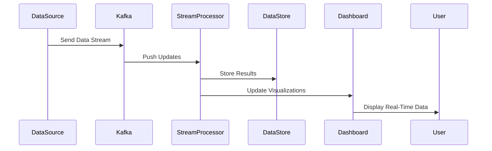

## Introduction

Real-time data ingestion is a critical pattern for applications requiring immediate data processing to deliver timely insights and responses. This encompasses systems that cannot afford latency due to the nature of required decision-making, such as fraud detection often employed within financial services or real-time monitoring for IoT devices.

## Detailed Explanation

### Key Characteristics:
- **Low Latency**: Real-time systems aim to handle and process data in milliseconds, providing instant feedback to user-facing applications or backend systems.
- **Scalability**: As the volume of incoming data increases, the solution must scale seamlessly.
- **Reliability**: Ensuring data integrity and consistency when data is processed in real-time.

### Architectural Approach:
1. **Data Sources**: 
   - Sensors, log files, transactional databases, or any systems outputting a continuous stream of data.

2. **Ingestion Layer**: 
   - Technologies like Apache Kafka, Amazon Kinesis, or Google Pub/Sub are often used to stream data reliably.

3. **Processing Framework**: 
   - Apache Flink, Apache Storm, or SaaS offerings like AWS Lambda enable real-time analytics and event stream processing.

4. **Storage and Output**:
   - Real-time analytics platforms or time-series databases like InfluxDB can store processed data while nodes process new incoming data and trigger necessary operations.

5. **Visualization/Dashboarding**:
   - Tools like Grafana or built-in visualization in services offer dashboard capabilities for real-time data interpretation.

### Example Code

Using Apache Kafka with Java for basic real-time data ingestion:
```java
Properties props = new Properties();
props.put("bootstrap.servers", "localhost:9092");
props.put("key.serializer", "org.apache.kafka.common.serialization.StringSerializer");
props.put("value.serializer", "org.apache.kafka.common.serialization.StringSerializer");

KafkaProducer<String, String> producer = new KafkaProducer<>(props);

ProducerRecord<String, String> record = new ProducerRecord<>("stock-trades", "key", "value");
producer.send(record);
producer.close();
```

### Diagrams

#### Sequence Diagram



## Best Practices

- **Ensure Fault Tolerance**: Incorporate mechanisms to handle failures without data loss using features like Kafka's replication.
- **Optimize Throughput and Latency**: Careful tuning of batch sizes and processing interval.
- **Monitor Performance**: Use metrics and logs to ensure ingestion processes meet performance SLAs.
- **Data Quality Checks**: Implement checks to filter noise or erroneous data before processing.

## Related Patterns

- **Batch Processing Pattern**: For data that doesn't require real-time processing, batch processing solutions can reduce complexity and resource usage.
- **Event Sourcing Pattern**: Guarantees data consistency and integrity by capturing changes as a sequence of events.

## Additional Resources

- [Apache Kafka Documentation](https://kafka.apache.org/documentation/)
- [Google Cloud Pub/Sub](https://cloud.google.com/pubsub/)
- [AWS Kinesis Data Streams](https://aws.amazon.com/kinesis/data-streams/)

## Summary

Real-time data ingestion patterns enable systems to process data at the moment it arrives effectively. Critical for time-sensitive applications, these patterns leverage scalable architectures, robust messaging platforms, and continuous processing frameworks to ensure that data is available for immediate analysis and decision-making. These systems are integral to industries ranging from finance to manufacturing, offering critical operational insights and drives sophisticated analytics solutions.
