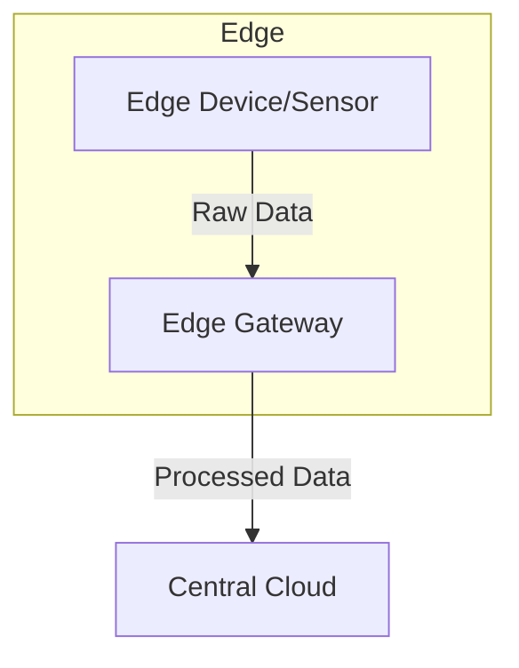

## Introduction

In the evolving landscape of cloud computing and the Internet of Things (IoT), handling vast amounts of data generated by edge devices efficiently and effectively is crucial. The **Edge Data Ingestion** pattern focuses on collecting, processing, and transmitting data from edge devices closer to where it is generated to minimize latency and reduce bandwidth costs. By performing some processing tasks at the edge, this pattern enhances responsiveness and can offload processing from central systems, thereby optimizing resource utilization.

## Architectural Approach

### Overview

The primary objective of the Edge Data Ingestion pattern is to manage data at the edge before transmission to central cloud resources. Performing preprocessing steps such as data filtering, aggregation, and even simple analytics at the edge can result in more efficient use of network resources and quicker response times. This pattern is instrumental in scenarios where latency is critical, or connectivity to the central system is intermittent.

### Key Components

- **Edge Devices**: Sensors, cameras, and other IoT devices that generate raw data.
- **Edge Gateway**: A computing resource positioned at the edge that processes data before sending it to the cloud. It can perform tasks like data aggregation, filtering, transformation, and even some level of analytics.
- **Central Cloud**: The primary data center that receives processed data from edge gateways for further analysis and storage.

### Architecture Diagram



## Example Code

Below is an example implementation using a simplistic edge processing service written in Python. It simulates an edge device sending periodic temperature readings, aggregated by an edge gateway, which then forwards the data to a central cloud service.

```python
import time
import random

class EdgeDevice:
    def __init__(self, id):
        self.id = id

    def read_data(self):
        # Simulates reading temperature data
        return {"device_id": self.id, "temperature": random.uniform(15, 25)}

class EdgeGateway:
    def __init__(self):
        self.buffer = []

    def process_data(self, data):
        # Simple aggregation
        self.buffer.append(data["temperature"])
        if len(self.buffer) >= 5:  # Aggregate every 5 readings
            aggregated_data = sum(self.buffer) / len(self.buffer)
            self.send_to_cloud(aggregated_data)
            self.buffer = []

    def send_to_cloud(self, aggregated_data):
        print(f"Sending aggregated data to cloud: {aggregated_data}")

def simulate():
    device = EdgeDevice(id=1)
    gateway = EdgeGateway()
    
    for _ in range(20):
        data = device.read_data()
        gateway.process_data(data)
        time.sleep(1)

if __name__ == '__main__':
    simulate()
```

## Best Practices

- **Data Minimization**: Process and filter the data at the edge to minimize the amount sent to the central cloud. Only relevant and necessary data should traverse the network.
- **Scalability**: Design edge gateways to handle increased device connections and data rates for future growth.
- **Security**: Ensure data encryption in transit and at rest to protect sensitive information gathered at the edge.
- **Resilience**: Implement mechanisms to handle network outages and ensure data is not lost during transmission interruptions.

## Related Patterns

- **Data Aggregation**: Combine multiple pieces of data for transmission or processing efficiency.
- **Data Transformation**: Modify data format or structure to suit storage or analytics requirements.
- **Data Filtering**: Exclude unnecessary data to reduce noise and relevance.

## Additional Resources

- [Understanding Edge Computing](https://example.com/understanding-edge-computing)
- [IoT and Edge Analytics](https://example.com/iot-and-edge-analytics)

## Summary

The Edge Data Ingestion pattern is a pivotal architectural approach in modern IoT deployments to ensure efficient data flow and processing. By collecting data close to its source, performing preliminary processing tasks, and reducing the load on central systems, this pattern offers a highly responsive and scalable solution that caters to the needs of latency-sensitive and data-intensive applications.
