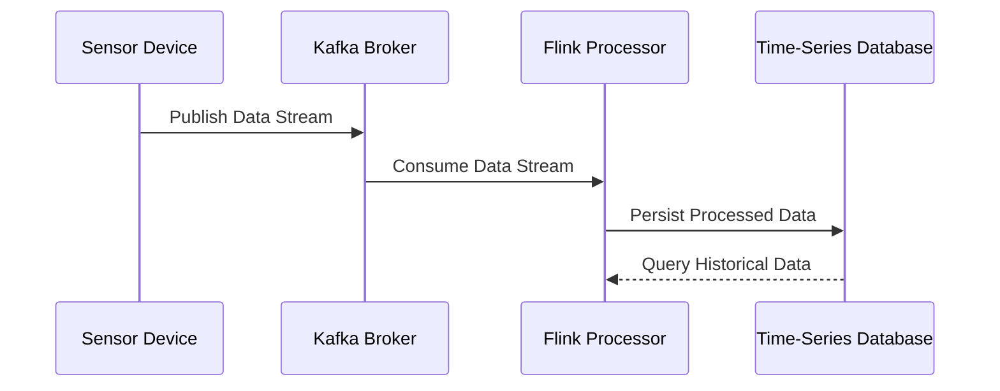

## Overview

**Sensor Data Streaming** involves the continuous ingestion of data streams emanating from various sensors. These sensors can be part of IoT devices deployed in diverse environments such as industrial settings, smart cities, or healthcare facilities. The main challenges include handling high-frequency data typically in time-series format, ensuring time synchronization across distributed systems, and maintaining correct data ordering to facilitate accurate analytics and insights.

## Architectural Approaches

### 1. **Data Ingestion and Collection**
- Utilize data streaming platforms like Apache Kafka, Amazon Kinesis, or Google Cloud Pub/Sub to collect sensor data.
- Stream processing can be implemented using frameworks such as Apache Flink or Spark Streaming to filter, transform, and aggregate the data in real-time.

### 2. **Data Processing and Storage**
- Implement time-series databases like InfluxDB or TimescaleDB, which are optimized for storing and querying large volumes of time-series data.
- Use cloud services such as AWS Timestream or Azure Time Series Insights for managed solutions.

### 3. **Time Synchronization and Ordering**
- Implement protocols like Network Time Protocol (NTP) for synchronizing the clocks of different devices and systems.
- Handle event ordering using mechanisms like event timestamps and watermarking to ensure the correct sequence of operations during processing.

## Paradigms and Best Practices

- **Event-Driven Architectures**: Use an event-driven approach to handle the real-time nature of sensor data. This allows systems to react to data as it arrives, triggering specific actions or workflows.
- **Decoupling**: Separate the data ingestion layer from the processing and storage layers to enhance scalability and flexibility.
- **Scalability and Fault Tolerance**: Implement scaling strategies that allow components to expand according to the data load. Use distributed stream processing technologies to ensure the system is fault-tolerant.
- **Real-Time Analytics**: Consider implementing real-time analytics using tools like Apache Druid or using streaming analytics platforms provided by cloud providers to derive insights as data is ingested.

## Example Code

Here's a simple example in Java using Apache Kafka and Apache Flink for sensor data ingestion and processing:

```java
import org.apache.flink.api.common.serialization.SimpleStringSchema;
import org.apache.flink.streaming.api.datastream.DataStream;
import org.apache.flink.streaming.api.environment.StreamExecutionEnvironment;
import org.apache.flink.streaming.connectors.kafka.FlinkKafkaConsumer;

import java.util.Properties;

public class SensorDataStreaming {
    public static void main(String[] args) throws Exception {
        // Set up streaming execution environment
        StreamExecutionEnvironment env = StreamExecutionEnvironment.getExecutionEnvironment();
        
        // Set Kafka properties
        Properties properties = new Properties();
        properties.setProperty("bootstrap.servers", "localhost:9092");
        properties.setProperty("group.id", "sensor-data");

        // Create a Kafka consumer
        FlinkKafkaConsumer<String> consumer = new FlinkKafkaConsumer<>("sensor-topic", new SimpleStringSchema(), properties);
        
        // Add the source to the execution environment
        DataStream<String> stream = env.addSource(consumer);
        
        // Process the data (simple printout in this case)
        stream.print();
        
        // Execute the application
        env.execute("Sensor Data Streaming");
    }
}
```

## Diagram



## Related Patterns

- **Event Sourcing**: Captures all changes to application state as a sequence of events. It complements the streaming pattern by ensuring all data states can be reconstructed.
- **CQRS (Command Query Responsibility Segregation)**: Separates the read and update operations for a data store to optimize performance, scalability, and security.

## Additional Resources

- [Apache Flink Documentation](https://flink.apache.org/documentation.html)
- [Kafka Streams Guide](https://kafka.apache.org/documentation/streams/)
- [Time-Series Database Overview](https://www.timescaledb.com/)

## Summary

Sensor Data Streaming is crucial in IoT applications and other areas requiring real-time data processing. By leveraging stream processing frameworks, time-series databases, and cloud-based analytics tools, enterprises can efficiently handle high-volume sensor data. Adhering to best practices such as decoupling, scalability, and adopting event-driven architectures ensures robust and responsive system designs capable of providing valuable insights through real-time analytics.
