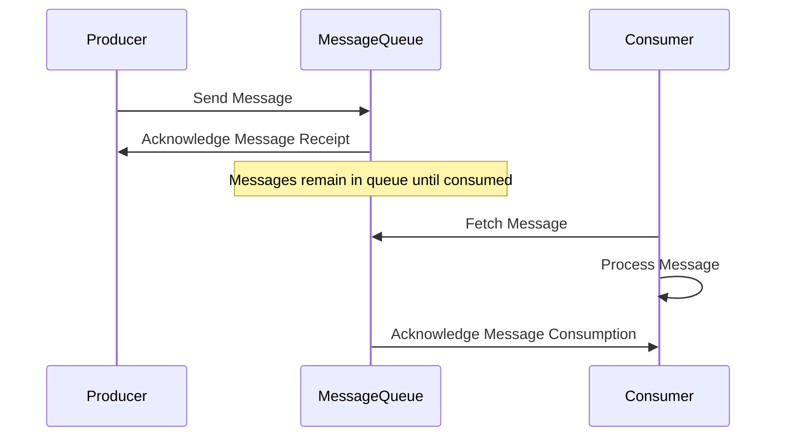

## Introduction

The Asynchronous Messaging pattern is employed to decouple producers and consumers of information by utilizing message queues. This design alleviates the issues related to variable ingestion rates, helps maintain system robustness during failure events, and optimizes the scalability of applications in distributed environments.

## Architectural Approach

At the heart of the Asynchronous Messaging pattern lies the concept of message queues, which act as intermediaries between producers and consumers. This leads to several architectural benefits:

- **Decoupling**: Producers send messages to queues without needing to know if a consumer is available or the number of consumers. Consumers can consume the messages at their own pace.
- **Reliability**: Messages placed onto a queue persist until consumed, ensuring that no data is lost even if consumers are temporarily unavailable.
- **Scalability**: This approach supports scaling by allowing multiple consumers to process messages from the same queue, thus distributing workload.
  
## Best Practices

- **Idempotency**: Design consumers to handle duplicates gracefully, as messaging systems might deliver messages more than once.
- **Durability**: Use durable queues where message persistence is critical for system reliability.
- **Monitoring**: Implement monitoring tools to track queue lengths, which can provide insight into performance bottlenecks or overloading of certain system components.

## Example Code

Here's an example of implementing the Asynchronous Messaging pattern using Java and the Apache Kafka messaging system:

```java
import org.apache.kafka.clients.producer.KafkaProducer;
import org.apache.kafka.clients.producer.ProducerRecord;
import org.apache.kafka.clients.consumer.KafkaConsumer;
import org.apache.kafka.clients.consumer.ConsumerRecords;

import java.util.Properties;

public class AsynchronousMessagingExample {

    public static void main(String[] args) {
        // Producer Configuration
        Properties producerProps = new Properties();
        producerProps.put("bootstrap.servers", "localhost:9092");
        producerProps.put("key.serializer", "org.apache.kafka.common.serialization.StringSerializer");
        producerProps.put("value.serializer", "org.apache.kafka.common.serialization.StringSerializer");
        KafkaProducer<String, String> producer = new KafkaProducer<>(producerProps);

        // Send a message
        producer.send(new ProducerRecord<>("orders", "order-1", "Order details for order 1"));
        producer.close();

        // Consumer Configuration
        Properties consumerProps = new Properties();
        consumerProps.put("bootstrap.servers", "localhost:9092");
        consumerProps.put("group.id", "order-consumers");
        consumerProps.put("key.deserializer", "org.apache.kafka.common.serialization.StringDeserializer");
        consumerProps.put("value.deserializer", "org.apache.kafka.common.serialization.StringDeserializer");
        KafkaConsumer<String, String> consumer = new KafkaConsumer<>(consumerProps);
        consumer.subscribe(List.of("orders"));

        // Consume messages
        ConsumerRecords<String, String> records = consumer.poll(Duration.ofMillis(100));
        records.forEach(record -> {
            System.out.printf("Consumed order: %s%n", record.value());
        });

        consumer.close();
    }
}
```

## Diagrams

Here's a sequence diagram illustrating the interaction between producer, message queue, and consumer:



## Related Patterns

- **Competing Consumers**: Integrates with the Asynchronous Messaging pattern by allowing multiple consumers to concurrently process messages from a single queue.
- **Publisher-Subscriber**: Complements by distributing messages to multiple consumers subscribing to specific message topics.

## Additional Resources

- [Apache Kafka Documentation](https://kafka.apache.org/documentation/)
- [RabbitMQ - Introduction to AMQP](https://www.rabbitmq.com/tutorials/amqp-concepts.html)
- [Azure Service Bus Messaging](https://azure.microsoft.com/en-us/services/service-bus/)

## Summary

Asynchronous Messaging is a crucial pattern for building scalable, reliable, and decoupled systems that can efficiently handle variable load and improve the fault-tolerance of applications. By leveraging message queues, this pattern addresses challenges such as variable rate data ingestion, system decoupling, and consumer reliability.
