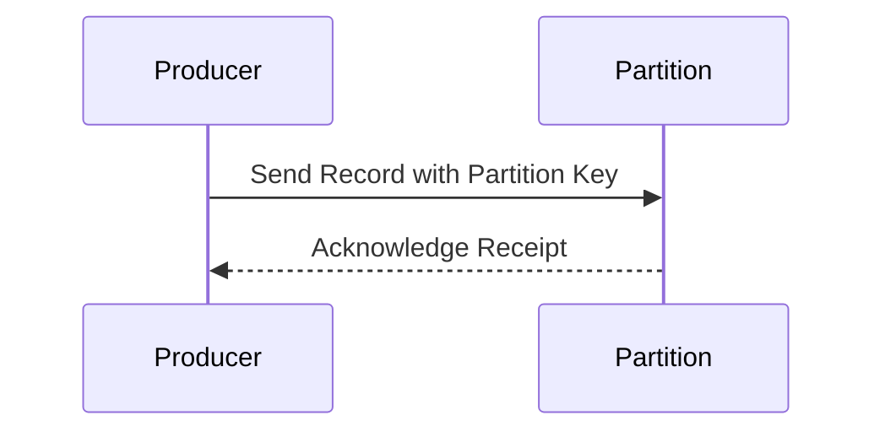

## Introduction

Data Partitioning is a design pattern commonly employed in distributed systems to achieve scalability and performance enhancements. By distributing data across different partitions based on a partition key, the system can leverage parallel processing capabilities to handle large volumes of data efficiently. This design pattern ensures that data associated with a particular key is directed to the same partition, allowing for data locality which enhances processing speed and maintains the order of operations.

## Detailed Explanation

### Key Concepts

1. **Partition Key**: The value used to determine which partition the data belongs to. It is crucial for balancing load across partitions and maintaining related data in proximity.

2. **Parallel Processing**: By spreading data across multiple partitions, different partitions can be processed simultaneously, improving throughput and reducing processing time.

3. **Data Locality**: Ensures that all data with the same key is routed to the same node, reducing the need for inter-node communication and maintaining order in streaming applications.

4. **Scalability**: As data volume grows, more partitions can be added, scaling the processing capability horizontally without affecting the running system.

### Architectural Approaches

- **Hash Partitioning**: This technique involves applying a hash function on the partition key to determine its partition. It’s simple to implement and balances data across partitions effectively.

- **Range Partitioning**: Here, data is divided into partitions based on a range of values. This is particularly useful for queries that involve range scans.

- **Round Robin Partitioning**: This is a straightforward method where entries are distributed evenly across partitions without considering the data content or key.

### Example Code

In Apache Kafka, data partitioning can be demonstrated by producers implementing custom partitioners:

```java
public class CustomPartitioner implements Partitioner {
    @Override
    public int partition(String topic, Object key, byte[] keyBytes, Object value, byte[] valueBytes, Cluster cluster) {
        List<PartitionInfo> partitions = cluster.partitionsForTopic(topic);
        int numPartitions = partitions.size();
        return Math.abs(key.hashCode()) % numPartitions;
    }

    @Override
    public void close() {}

    @Override
    public void configure(Map<String, ?> configs) {}
}
```

### Diagram



### Related Patterns

- **Consistent Hashing**: A strategy for distributing data across nodes such that the mapping has minimal impact when nodes are added or removed.
  
- **CQRS (Command Query Responsibility Segregation)**: Encourages separated models for reading and writing, which can pair with partitioning for enhanced read and write performance.

- **Sharding**: Similar to partitioning, sharding involves splitting databases into smaller, manageable pieces based on a shard key.

## Best Practices

- Choose a partition key that evenly distributes the load across partitions.
- Monitor partition sizes and adjust the partitioning strategy as the data grows.
- Ensure that your partitioning strategy supports your application's specific query patterns and data access frequencies.

## Additional Resources

- [Kafka Documentation on Partitioning](https://kafka.apache.org/documentation/)
- [Cloud Native Patterns for Partitioning](https://www.cncf.io/blog/)
- [Designing Data-Intensive Applications](https://dataintensive.net)

## Summary

Data Partitioning is integral for building scalable high-performance systems, especially in Big Data and real-time stream processing scenarios. By adopting appropriate partitioning strategies, systems architects can ensure efficient resource utilization, balanced load, and maintain data locality. With the common use in distributed data architectures, understanding and effectively applying the Data Partitioning pattern is essential for modern system designs.
