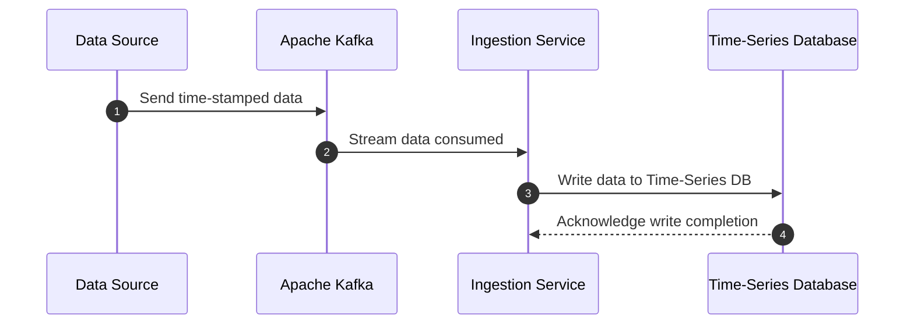

## Time-Series Data Ingestion

Time-series data ingestion involves efficiently collecting, storing, and querying data points indexed by time. As organizations increasingly rely on real-time analytics, IoT applications, and monitoring solutions, the necessity of handling vast quantities of time-stamped data becomes paramount. This pattern focuses on optimizing ingestion for time-stamped data, achieving high write throughput, and providing efficient querying capabilities over specific time ranges.

### Architectural Approach

1. **Data Source Identification**:
   - Identify sources of time-series data, such as IoT sensors, application performance monitoring (APM) tools, log files, financial markets, or social media streams.
   - Ensure data from these sources is pre-processed and time-stamped.

2. **Data Ingestion Layer**:
   - Implement scalable ingestion pipelines using frameworks like Apache Kafka, which can handle large-scale, distributed data streams.
   - Use efficient serialization formats like Avro or Protocol Buffers to minimize transmission overhead.

3. **Time-Series Database Integration**:
   - Use specialized time-series databases (TSDB) like InfluxDB, TimescaleDB, or Amazon Timestream, optimized for time-series workloads.
   - Ensure the chosen database supports efficient write operations and retention policies suitable for the data volume and velocity.

4. **Storage Strategy**:
   - Implement partitioning strategies based on time intervals (e.g., hourly, daily) to optimize read and write operations.
   - Use compression and down-sampling features to reduce storage costs.

5. **Query Optimization**:
   - Leverage range queries and built-in aggregation functions that TSDBs offer for efficient data retrieval.
   - Utilize indexing strategies that improve the performance of time-based lookups.

6. **Scalability and Fault Tolerance**:
   - Ensure the system is horizontally scalable to handle spikes in data volume.
   - Implement replication strategies or use cloud-native services to guarantee high availability and fault tolerance.

### Example Code

```java
// Example using InfluxDB client in Java to write time-series data
import org.influxdb.InfluxDB;
import org.influxdb.InfluxDBFactory;
import org.influxdb.dto.Point;

import java.util.concurrent.TimeUnit;

public class TimeSeriesIngestor {
    public static void main(String[] args) {
        InfluxDB influxDB = InfluxDBFactory.connect("http://localhost:8086", "user", "password");
        influxDB.setDatabase("exampleDB");

        Point point = Point.measurement("cpu_load")
                .time(System.currentTimeMillis(), TimeUnit.MILLISECONDS)
                .addField("value", 0.64)
                .addField("host", "server1")
                .addField("region", "us-west")
                .build();

        influxDB.write(point);
        influxDB.close();
    }
}
```

### Diagrams



### Related Patterns

- **Streaming Data Processing**: Focuses on real-time processing of data streams, often used in conjunction to provide real-time analytics on time-series data.
- **Event Sourcing**: Captures all changes to an application state as a sequence of events, effectively useful in combination with time-series databases for auditing or historical tracking.

### Additional Resources

- [InfluxDB Documentation](https://docs.influxdata.com/influxdb/)
- [TimescaleDB Best Practices](https://www.timescale.com/blog/how-to-make-time-series-queries-faster/)
- [Apache Kafka Use Cases](https://kafka.apache.org/documentation/streams/)

### Summary

Time-series data ingestion is crucial for any organization leveraging analytics solutions in real-time, especially across IoT, monitoring, and financial industries. By utilizing specialized time-series databases and efficient ingestion frameworks, it is possible to ensure high throughput and scalable solutions that maintain data integrity and query performance. This pattern helps optimize infrastructure to handle time-indexed data efficiently, making it essential for modern data-driven strategies.
