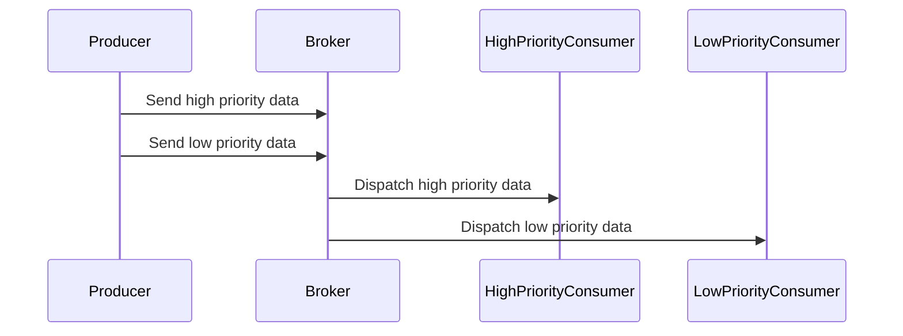

## Overview

Data Prioritization is a critical design pattern in environments where processing speed and resource constraints can impact the effective handling of information streams. This pattern involves assigning priority levels to data to ensure that the most critical information is processed first. This approach is especially vital in systems that require real-time processing and immediate decision-making, such as disaster response communication systems or real-time financial trading platforms.

## Architectural Components

### Priority Queues

A priority queue is a data structure where each element has a priority associated with it. Elements are dequeued based on their priority level, ensuring that high-priority data is processed first.

### Message Brokers

Message brokers like RabbitMQ, Kafka, or AWS SQS can implement prioritization by organizing messages into different queues based on their priority levels.

### Scheduling Algorithms

Scheduling algorithms such as round-robin with priority or weight-based scheduling ensure that high-priority tasks receive more resources or processing time.

## Example Code

Here's an example implementation using Apache Kafka to prioritize messages:

```java
Properties props = new Properties();
props.put("bootstrap.servers", "localhost:9092");
props.put("key.serializer", "org.apache.kafka.common.serialization.StringSerializer");
props.put("value.serializer", "org.apache.kafka.common.serialization.StringSerializer");

// Pseudo-code to assign priority
String highPriorityMessage = "Emergency Alert";
String lowPriorityMessage = "Regular Update";

Producer<String, String> producer = new KafkaProducer<>(props);
producer.send(new ProducerRecord<>("priority-high", "key", highPriorityMessage));
producer.send(new ProducerRecord<>("priority-low", "key", lowPriorityMessage));

producer.close();
```

In this scenario, two separate topics indicate different priorities, "priority-high" and "priority-low", with consumers designed to fetch "priority-high" messages first.

## Diagrams



## Best Practices

- **Categorize Data**: Ensure that data is correctly categorized based on its urgency and importance.
- **Efficient Queuing**: Utilize efficient queuing mechanisms to avoid bottleneck scenarios.
- **Scalable Infrastructure**: Design your infrastructure to handle load spikes effectively.
- **Monitoring and Adjustment**: Continuously monitor the performance and adjust prioritization rules based on changing business requirements.

## Related Patterns

- **Priority Queue**: Specific data structures for handling priority in queue structures.
- **Load Balancer Patterns**: Useful in distributing prioritized tasks correctly across multiple resources.
- **Circuit Breaker**: Prevents system overload by shedding non-critical load.

## Additional Resources

- [Priority Queue by Wikipedia](https://en.wikipedia.org/wiki/Priority_queue)
- [Apache Kafka Documentation](https://kafka.apache.org/documentation/)
- [AWS SQS Queue Types](https://aws.amazon.com/sqs/features/)

## Summary

The Data Prioritization pattern is essential for scenarios where it is crucial to handle critical information faster than less important data. By leveraging appropriate architectural components and following best practices, organizations can ensure their data is processed efficiently, maintaining operational integrity even under constrained resources. Priority queuing, strategic use of message brokers, and scheduling algorithms are key enablers of this pattern, providing both resilience and reliability to data-driven applications.
