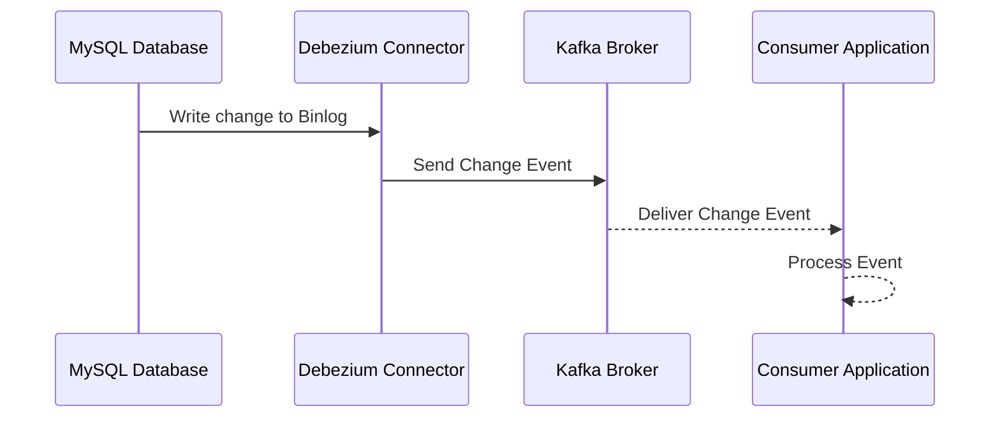

## Log-Based Change Data Capture (CDC)

### Description

Log-Based Change Data Capture (CDC) is a data ingestion pattern that enables the real-time extraction of database change events. By reading transaction logs, write-ahead logs, or similar logs in databases, changes like inserts, updates, and deletes can be captured and propagated to other systems in real time. This approach facilitates data synchronization between databases and downstream systems, helping ensure that applications and services remain in sync with the live data state.

### Architectural Approaches

The fundamental architecture of log-based CDC involves several core components:

1. **Database System**: A system where data changes occur—these are typically relational databases such as MySQL, PostgreSQL, or Oracle.
2. **Transaction Log**: A location where change events are recorded, such as the binlog in MySQL or WAL in PostgreSQL.
3. **CDC Tool**: The tool that reads and parses the transaction logs to detect data changes. This tool transforms these changes into events.
4. **Event Stream Processor**: Often a distributed data streaming tool like Apache Kafka, which ingests, processes, and routes change events to downstream systems.
5. **Downstream Systems**: These can include data warehouses, data lakes, search engines, applications, or microservices that consume the change data for further processing or storage.

### Example Implementation

Consider a scenario where MySQL serves as the primary database, and Kafka is the backbone for streaming events.

```shell
docker run -it --rm --name debezium -p 8083:8083 \
  -e GROUP_ID=1 \
  -e CONFIG_STORAGE_TOPIC=my-connect-configs \
  -e OFFSET_STORAGE_TOPIC=my-connect-offsets \
  debezium/connect:latest
```

- **Step 1**: Configure Debezium to connect to the MySQL database and monitor the binlog for changes.
- **Step 2**: Configure Kafka topics where the changes will be published.
- **Step 3**: Listen to these Kafka topics from a consumer application, such as a microservice or data processing pipeline to respond to the changes or further route them.

### Diagrams

#### Sequence Diagram



### Best Practices

- Ensure **high availability** and fault tolerance for CDC tools and streams, particularly if dealing with mission-critical applications.
- Securing **transaction integrity** by ensuring exactly-once semantics in data processing, which is crucial for maintaining consistent and reliable data views.
- Minimizing **latency** by optimizing configurations and leveraging advanced features of streaming platforms—low-latency event processing enhances real-time data freshness.

### Related Patterns

- **Event Sourcing**: In contrast to capturing existing changes, this pattern implements business logic as a sequence of events, providing historical consistency across services.
- **Data Stream Processing**: This pattern relates to processing streams of records in real-time, performing actions like filtering, aggregating, and smoothing transient data.
- **Database Sharding**: While sharding partitions the database for scalability, combining sharding with CDC enables distributed data capture.

### Additional Resources

- [Debezium Documentation](https://debezium.io/documentation/)
- [Apache Kafka Documentation](https://kafka.apache.org/documentation/)
- [Confluent Platform Guides](https://docs.confluent.io/platform/current/content/platform.html)

### Summary

Log-Based Change Data Capture (CDC) is a powerful pattern for synchronizing live data across systems in real-time, ensuring data relevance and availability. By leveraging CDC, businesses can obtain immediate insights, keep records consistent, and enhance the responsiveness of data-driven applications. CDC is invaluable in modern architectures that demand agility and real-time capabilities.
