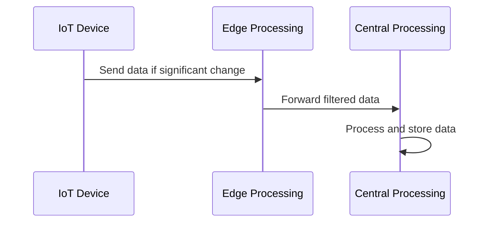

## Overview

**Source-Based Filtering** is a data ingestion pattern aimed at enhancing the efficiency of data processing systems by filtering out unnecessary or irrelevant data at the source. This strategy is particularly beneficial in reducing the volume of data transmitted and processed downstream, leading to significant savings in bandwidth, storage, and computational resources.

## Benefits

- **Improved Efficiency**: By limiting the data that needs to be transmitted and processed, resources are conserved, leading to quicker and more efficient processing.
- **Reduced Costs**: Decreased data volume means reduced costs in terms of bandwidth usage and storage requirements.
- **Scalability**: With less data to handle, systems are easier to scale.
- **Increased Relevance**: Ensures that only important and actionable data is processed and stored, improving decision-making processes.

## Architectural Approaches

### Design Considerations

- **Data Source Capability**: The filtering logic must be compatible with the capabilities of the data source, such as an IoT device or a data stream.
- **Filter Complexity**: Balancing the complexity of filtering logic with the source's processing power to avoid overburdening the device.
- **Latency and Timeliness**: Ensuring that the filtering process does not introduce unacceptable delays in data transmission.
- **Dynamic Configuration**: Ability to adapt and update filtering criteria without physical access to the device.

### Example Architecture

1. **Data Source Configuration**: Equip data sources (e.g., IoT devices) with logical filters to transmit data only under specified conditions (e.g., anomalies, threshold breaches).
2. **Edge Processing**: Implement lightweight processing agents at the edge to perform complex filtering when on-device filtering is infeasible.
3. **Central Processing**: For sources incapable of filtering, consider central aggregation points where first-level filtering can occur.

## Best Practices

1. **Threshold Setting**: Define clear rules for what constitutes relevant versus irrelevant data for each use case.
2. **Testing and Validation**: Regularly test the filtering logic against real-world scenarios to ensure no critical data is inadvertently filtered out.
3. **Monitoring and Logging**: Implement logging of filtered-out data for auditing purposes and pattern recognition.
4. **Security**: Ensure that filtering logic and data transmission protocols are secure, safeguarding data at rest and in transit.

## Example Code

Here’s a simple pseudo-code example of applying Source-Based Filtering for an IoT sensor capturing temperature data:

```java
class TemperatureSensor {
    double currentTemperature;
    double lastReportedTemperature;
    double threshold = 0.5; // Degree of change to trigger reporting

    void readTemperature(double newTemperature) {
        if (Math.abs(newTemperature - lastReportedTemperature) >= threshold) {
            reportData(newTemperature);
            lastReportedTemperature = newTemperature;
        }
    }

    void reportData(double temperature) {
        // Logic to send data to the server or processing node
        System.out.println("Reporting temperature: " + temperature);
    }
}
```

In this example, the `TemperatureSensor` only reports a new temperature when the change exceeds a defined threshold, reducing unnecessary data transmission.

## Diagrams



## Related Patterns

- **Edge Computing**: Complemented by Source-Based Filtering, edge computing can process and analyze data closer to where it is generated, reducing latency.
- **Event Sourcing**: Maintaining a full history of events can aid in refining filtering criteria dynamically.
- **Data Compression**: An alternative approach to managing large data volumes when filtering is not feasible.

## Additional Resources

- [AWS IoT Device Management](https://aws.amazon.com/iot-device-management/)
- [Google Cloud IoT](https://cloud.google.com/solutions/iot)
- [Microsoft Azure IoT Hub](https://azure.microsoft.com/en-us/services/iot-hub/)

## Summary

Source-Based Filtering is an essential design pattern in the modern data ecosystem, significantly enhancing efficiency by minimizing superfluous data. By filtering irrelevant information at the source, organizations can achieve better resource utilization and system performance, ensuring only the most pertinent data is stored and analyzed.
