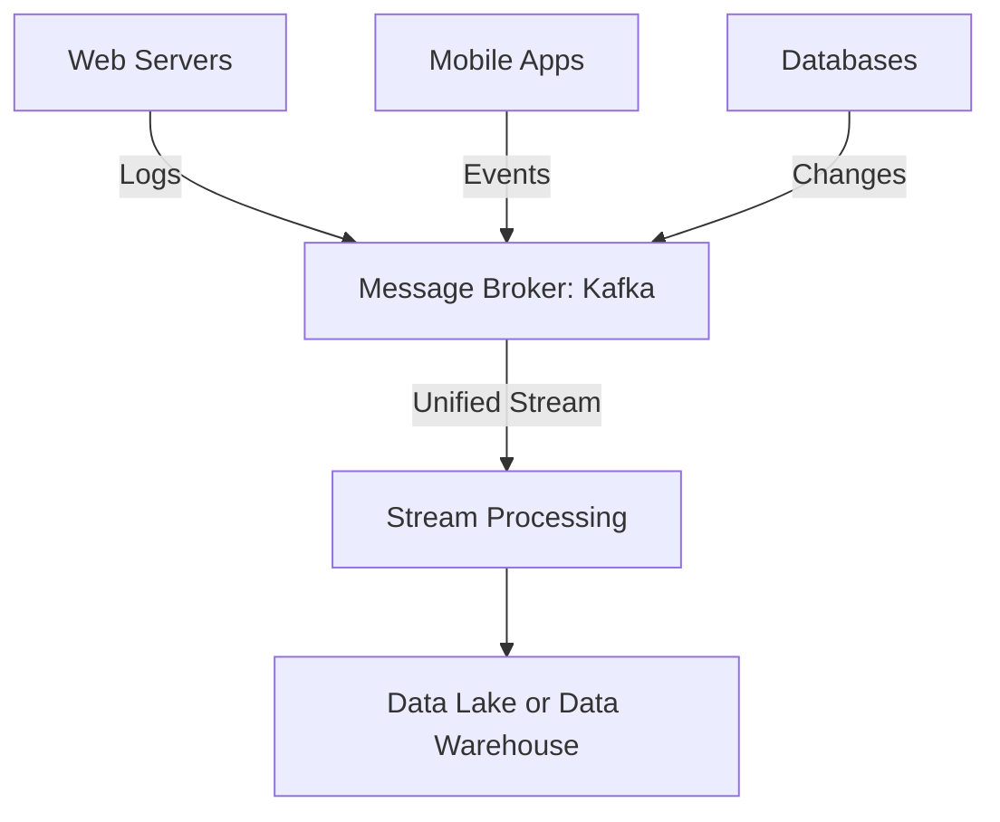

## Overview

Multi-Source Ingestion is a design pattern used to collect and combine data from disparate sources into a unified stream. It allows organizations to integrate data from various origin points such as web servers, databases, IoT devices, and third-party services into a streamlined process for real-time or batch processing. This pattern addresses the challenges of handling various data formats, differing protocols, and ensuring data consistency and completeness in the integration process.

## Key Concepts

- **Heterogeneity**: Managing data from different types which may have different structures, formats, and semantics.
- **Scalability**: Efficiently handling increased volumes of data as the number of sources and data rate scales.
- **Transformation**: Converting data into a common format or schema before processing or storage.
- **Data Consistency**: Ensuring data across all sources are accurately and consistently captured and combined.

## Architectural Approaches

### 1. Data Connectors and Adapters
Use specialized connectors and adapters for different data sources to handle source-specific data retrieval and convert data into a common intermediary format (e.g., JSON or Avro).

### 2. Stream Processing Frameworks
Utilize frameworks like Apache Kafka, Apache Flink, or Apache Beam which provide native support for ingesting, transforming, and processing streams from multiple sources.

### 3. Message Brokers
Employ message brokers like Apache Kafka or RabbitMQ to serve as a buffer and ensure reliable ingestion and queueing of data from various sources.

### 4. Data Lakes and Warehouses
Data ingestion processes can be configured to deposit unified and preprocessed data into cloud-based data lakes (e.g., Amazon S3, Google Cloud Storage) or distributed databases for historical analysis.

## Example Code Snippet

Here's a brief example using Apache Kafka and Kafka Connect to ingest logs from various sources:

```scala
import org.apache.kafka.clients.producer.{KafkaProducer, ProducerRecord}
import org.apache.kafka.connect.json.JsonConverter

// Configuring a Kafka producer
val props = new Properties()
props.put("bootstrap.servers", "localhost:9092")
props.put("key.serializer", "org.apache.kafka.common.serialization.StringSerializer")
props.put("value.serializer", "org.apache.kafka.connect.json.JsonSerializer")

val producer = new KafkaProducer[String, String](props)

// Sample log message in JSON format
val logMessage = """
{
    "source": "web-application",
    "timestamp": "2024-07-07T12:34:56Z",
    "message": "User logged in"
}
"""

// Sending the message to Kafka topic
val record = new ProducerRecord[String, String]("logs-topic", logMessage)
producer.send(record)

producer.close()
```

## Diagram

Below is a conceptual diagram using Mermaid syntax to illustrate the Multi-Source Ingestion pattern:



## Related Patterns

- **Change Data Capture (CDC)**: A method of capturing changes in a database to synchronize or stream updates to other systems.
- **Event Sourcing**: Storing changes to data as a series of events, which can be replayed to reconstruct past states.
- **Data Transformation Pattern**: Applying transformations to raw data to convert it into a desired format or structure before further processing.

## Additional Resources

- [Apache Kafka Documentation](https://kafka.apache.org/documentation/) - For an overview of implementing scalable stream processing.
- [Apache Flink](https://ci.apache.org/projects/flink/flink-docs-stable/) - Understanding high-throughput, low-latency stream processing.
- [Cloud Storage Solutions](https://aws.amazon.com/s3/, https://cloud.google.com/storage) - For scalable data storage after ingestion.

## Summary

The Multi-Source Ingestion design pattern provides an effective strategy for collecting and consolidating data from multiple heterogeneous sources. By employing connectors, intelligent stream processing frameworks, and leveraging message brokers, organizations can ensure seamless integration, transformation, and analysis of varied data. This pattern not only simplifies the complexity involved with handling diverse data formats and systems but also provides foundational infrastructure for real-time analytics and continuous insights.
