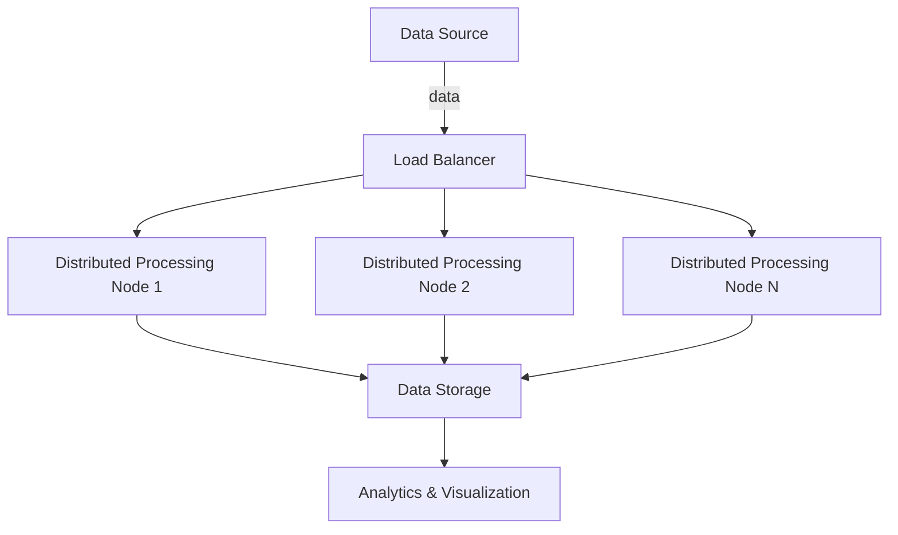

High-throughput ingestion is a design pattern focused on building data ingestion systems that can manage extremely high data rates efficiently. This pattern is essential for platforms that require real-time processing and analysis of incoming data streams, such as social media networks, IoT platforms, and financial services.

## Key Concepts

### Scalability
Handling large data volumes requires a scalable architecture. Horizontal scalability often involves distributing the load across multiple servers or clusters, leveraging concepts such as cloud-native services or Kubernetes.

### Parallel Processing
To manage high-throughput, systems often parallelize data processing tasks. This might involve splitting data streams into smaller chunks that can be processed simultaneously by distributed worker nodes.

### Optimized Network Usage
Efficient network usage is critical. Using techniques like data compression, effective batching strategies, and load balancing helps reduce network latency and bandwidth consumption.

## Architectural Approaches

### Distributed Systems
Using a distributed approach allows systems to scale horizontally and handle larger data volumes. Systems such as Apache Kafka, Amazon Kinesis, or Apache Pulsar are commonly used for building such architectures.

### Microservices Architecture
Microservices can be employed to manage different ingestion-related tasks such as data validation, transformation, and storage, allowing for independent scalability and management.

### Load Balancing
Load balancers are critical for evenly distributing incoming data across multiple processing nodes, preventing overloading of individual components.

## Best Practices

- **Use Asynchronous Processing**: Asynchronous data processing can significantly enhance throughput as opposed to synchronous processing, by allowing systems to handle multiple operations simultaneously.
- **Employ Adaptive Batching**: Dynamically adjusting batch sizes based on system performance can optimize throughput and resource utilization.
- **Optimize Data Serialization**: Use efficient data serialization formats like Avro, Protobuf, or Parquet to reduce data size and improve transmission speed.

## Example Code

Here's an example to conceptualize high-throughput ingestion using Kafka in Scala:

```scala
import org.apache.kafka.clients.producer.{KafkaProducer, ProducerRecord}

import java.util.Properties

object HighThroughputIngestion {

  def createProducer(): KafkaProducer[String, String] = {
    val props = new Properties()
    props.put("bootstrap.servers", "localhost:9092")
    props.put("key.serializer", "org.apache.kafka.common.serialization.StringSerializer")
    props.put("value.serializer", "org.apache.kafka.common.serialization.StringSerializer")
    props.put("linger.ms", "1")
    props.put("batch.size", "16384")
    new KafkaProducer[String, String](props)
  }

  def sendRecord(topic: String, key: String, value: String)(implicit producer: KafkaProducer[String, String]): Unit = {
    val record = new ProducerRecord[String, String](topic, key, value)
    producer.send(record)
  }

  def main(args: Array[String]): Unit = {
    implicit val producer: KafkaProducer[String, String] = createProducer()
    (1 to 1000000).foreach { num =>
      sendRecord("high-throughput-topic", s"key-$num", s"value-$num")
    }
    producer.close()
  }
}
```

## Diagrams

### High-Level Architecture



## Related Patterns

- **Event Sourcing**: Often paired with high-throughput systems to log all changes as events, ensuring data consistency and auditability.
- **Command Query Responsibility Segregation (CQRS)**: Enhances scalability by separating read and write operations, beneficial in high-throughput scenarios.

## Additional Resources

- [Designing Data-Intensive Applications](https://www.oreilly.com/library/view/designing-data-intensive-applications/9781491903063/)
- [Apache Kafka Documentation](https://kafka.apache.org/documentation)
- [AWS Kinesis Data Streams](https://aws.amazon.com/kinesis/data-streams/)

## Summary

High-throughput ingestion is critical for systems that process large volumes of data in real-time. By utilizing distributed systems, parallel processing, and network optimization, organizations can efficiently handle massive data flows to drive powerful analytics and insights. The adoption of best practices such as asynchronous processing and adaptive batching can further enhance system performance and reliability.
