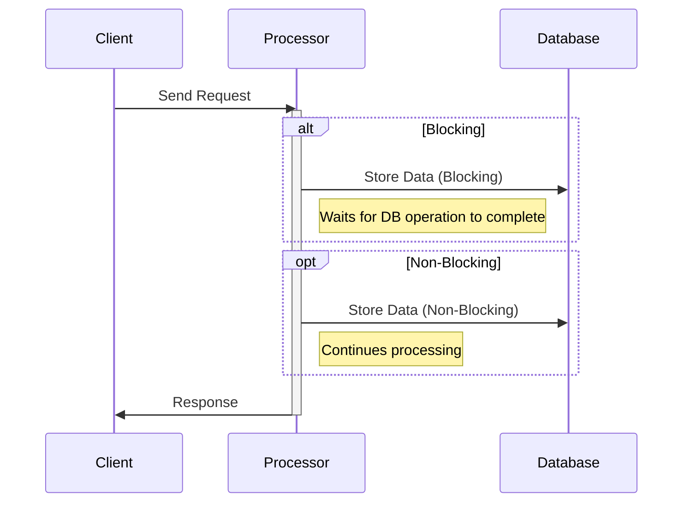

## Introduction

In the domain of stream processing and data ingestion, selecting between blocking (synchronous) and non-blocking (asynchronous) ingestion approaches is crucial for tuning the performance and responsiveness of your applications. This pattern describes the trade-offs and considerations involved in choosing between blocking and non-blocking data ingestion, particularly in cloud-native and distributed systems.

## Description

**Blocking Ingestion**: In a blocking (or synchronous) ingestion pattern, the process waits for an operation to complete before proceeding to the next step. This approach ensures that the sequence of operations is executed in the exact order they were invoked, essentially maintaining dependencies between successive operations.

**Non-Blocking Ingestion**: In contrast, a non-blocking (or asynchronous) ingestion pattern does not wait for an operation to complete before starting the next one. Instead, it continues processing, often by leveraging callbacks, promises, or parallel execution models. This is particularly beneficial when dealing with operations that can be performed independently or when I/O operations are involved, allowing systems to utilize resources more efficiently.

## Architectural Approaches

1. **Blocking Model (Thread-Per-Request):**
   - Utilizes traditional thread-per-request architecture.
   - Simple to implement and understand.
   - Potentially high resource consumption (e.g., threads waiting on I/O operations).

2. **Non-Blocking Model (Event-Driven Architecture):**
   - Utilizes event loops and asynchronous callbacks.
   - More complex, requiring consideration of concurrent execution and potentially complex debugging.
   - Generally more scalable under I/O-bound workloads.

## Best Practices

- **Assess Workload Type**: Decide between blocking and non-blocking based on whether your application is CPU-bound or I/O-bound.
- **Resource Management**: In non-blocking, ensure efficient resource allocation through proper configuration of event loops and thread pools.
- **Error Handling**: Implement robust error handling for non-blocking operations, especially in asynchronous callbacks.
- **Backpressure**: In non-blocking systems, consider backpressure mechanisms to prevent overwhelming downstream systems.

## Example Code

### Blocking Example (Java I/O):

```java
InputStream inputStream = socket.getInputStream();
BufferedReader reader = new BufferedReader(new InputStreamReader(inputStream));

String line;
while ((line = reader.readLine()) != null) {
    process(line);  // Blocking call, waits for each line
}
```

### Non-Blocking Example (Java NIO):

```java
Selector selector = Selector.open();
serverSocketChannel.register(selector, SelectionKey.OP_ACCEPT);

while (true) {
    // Non-blocking call, continues processing even while waiting for I/O
    selector.select();
    Set<SelectionKey> selectedKeys = selector.selectedKeys();

    for (SelectionKey key : selectedKeys) {
        if (key.isAcceptable()) {
            // Handle accept
        } else if (key.isReadable()) {
            // Handle read
        }
    }
    selectedKeys.clear();
}
```

## Diagrams

### Sequence Diagram: Non-Blocking Ingestion


## Related Patterns

- **Circuit Breaker Pattern**: Useful for managing failures in non-blocking scenarios.
- **Retry Pattern**: Applies to both blocking and non-blocking ingestion, offering strategy for handling transient faults.
- **Backpressure Pattern**: Particularly important in non-blocking streams to avoid overwhelming a system.

## Additional Resources

- *"Java Concurrency in Practice"* by Brian Goetz, for insights into handling concurrency in Java.
- Reactive Programming articles by the reactive streams community, such as those on Project Reactor and Akka Streams.

## Summary

Choosing between blocking and non-blocking ingestion approaches is a significant decision that impacts latency, throughput, and the design complexity of your application. Blocking ingestion favors simplicity and deterministic processing, whereas non-blocking ingestion excels in scalability and efficient resource usage, especially in I/O-bound contexts. By understanding the characteristics of your particular workload and the capabilities of your deployment environment, you can make informed decisions about which strategy to adopt.

Adjust your software architecture according to these principles, while employing practices like effective error handling and resource management to ensure optimal performance across your data ingestion pipelines.
