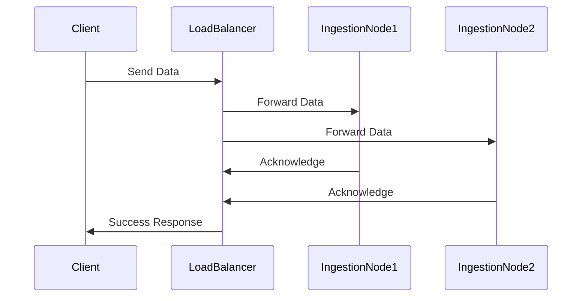

## Overview

Dynamic Scaling of Ingestion Pipelines is a prevalent design pattern aimed at optimizing resource usage and performance in distributed systems tasked with data ingestion. This pattern ensures that the ingestion pipeline can seamlessly adapt to varying workloads by dynamically adjusting computational resources. Autoscaling and load balancing are central techniques that facilitate this adaptive behavior, providing both cost efficiency and high availability of resources.

## Key Concepts

- **Autoscaling**: Automatically adjusting the number of computing resources (like VMs, shards, pods) based on predefined metrics or business thresholds. Autoscaling ensures that resources match the current demand without manual intervention.
  
- **Load Balancing**: Distributing incoming data streams across multiple ingestion nodes to ensure none of the nodes are overwhelmed and to maximize throughput.

- **Elasticity**: The ability of the system to seamlessly scale its resources up or down in real-time in response to changing workloads.

## Architectural Approaches

- **Horizontal Scaling**: Adding or removing identical resource units (e.g., nodes, shards) to cope with demand. This approach is most effective in distributed, stateless application architectures.
  
- **Vertical Scaling**: Increasing or decreasing the capabilities of current resources (e.g., CPU, memory). This approach is more limited compared to horizontal scaling in cloud-native environments.

- **Reactive Architecture**: Employing event-driven data processing systems that respond in real-time to varying data loads by invoking scaling actions.

## Best Practices

1. **Define Correct Metrics**: Establish clear autoscaling metrics (e.g., CPU usage, data throughput, latency) that accurately reflect the system's ingestion load.

2. **Implement Robust Monitoring**: Integrate comprehensive logging and alerting mechanisms to monitor ingestion metrics, enabling quick anomalies detection and response.
  
3. **Graceful Degradation**: Design the system such that it can handle resource constraints and degraded performance without complete failure.

4. **Resource Efficiency**: Ensure deliberate over-provisioning is minimized to reduce costs, opting instead for just-in-time provisioning of resources.

## Example Code

Here's a simple example of configuring automatic scaling in AWS for a Kinesis Data Stream:

```hcl
resource "aws_kinesis_stream" "sample_stream" {
  name             = "sample-data-stream"
  shard_count      = 1
  ...
}

resource "aws_appautoscaling_target" "kinesis_target" {
  max_capacity       = 10
  min_capacity       = 1
  resource_id        = "stream/sample-data-stream"
  scalable_dimension = "kinesis:stream:WriteCapacityUnits"
  service_namespace  = "kinesis"
}

resource "aws_appautoscaling_policy" "kinesis_policy" {
  name                   = "kinesis-scaling-policy"
  policy_type            = "TargetTrackingScaling"
  resource_id            = aws_appautoscaling_target.kinesis_target.resource_id
  scalable_dimension     = aws_appautoscaling_target.kinesis_target.scalable_dimension
  service_namespace      = aws_appautoscaling_target.kinesis_target.service_namespace

  target_tracking_scaling_policy_configuration {
    target_value         = 50.0
    predefined_metric_specification {
      predefined_metric_type = "Kinesis:WriteProvisionedThroughputExceeded"
    }
    scale_in_cooldown  = 300
    scale_out_cooldown = 300
  }
}
```

## Diagrams



## Related Patterns

- **Batch Processing**: Used for dealing with large volumes of data at regular intervals rather than real-time processing.
- **Event-Driven Architecture**: Allows the ingestion system to react to data events in real-time, effectively supporting dynamic workload changes.
- **Circuit Breaker**: Helps prevent the system from failing when subjected to loads that exceed predefined thresholds.

## Additional Resources

- [AWS Kinesis Autoscaling Guide](https://docs.aws.amazon.com/streams/latest/dev/kinesis-using-auto-scaling.html)
- [Google Cloud Pub/Sub Scaling](https://cloud.google.com/pubsub/docs/overview)
- [Microsoft Azure Event Hubs Autoscaling](https://learn.microsoft.com/en-us/azure/event-hubs/)

## Summary

The Dynamic Scaling of Ingestion Pipelines pattern provides an essential approach to managing varying data loads efficiently in cloud-based ingestion systems. By incorporating strategies such as autoscaling and load balancing, systems can ensure high performance and cost-effectiveness. Understanding and deploying this pattern is crucial for managing modern distributed data processing systems effectively.
