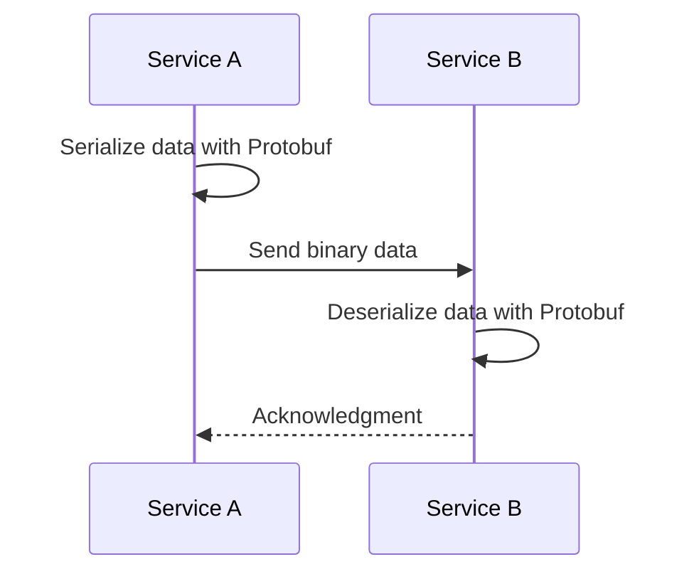

## Introduction

In the realm of modern distributed systems, particularly those employing microservices and stream processing, efficient data serialization is a crucial factor. Protocol Buffers (Protobuf), a language-neutral, platform-neutral extensible mechanism developed by Google, offers a compelling solution for efficient data serialization. It reduces message size, enhances transmission speed, and thus improves overall system performance.

## Detailed Explanation

### What are Protocol Buffers?

Protocol Buffers (Protobuf) enable the serialization and deserialization of structured data in a compact binary format. Unlike text-based formats such as JSON or XML, Protobuf's binary format is much more size-efficient, allowing faster processing and reduced storage requirements.

### Use Case in Microservices Architecture

In a microservices architecture, services often communicate over the network. The serialization format used for data exchange can significantly impact the performance of these communications. Using Protocol Buffers to serialize data can lead to:

- **Reduced Payload Size**: Binary format leads to smaller data payloads compared to text-based formats.
- **Faster Serialization/Deserialization**: Protobuf is designed for speed, making it quicker to encode and decode data.
- **Language Agnosticism**: Protobuf offers compiler support for multiple languages such as Java, C++, Python, Go, and more, which is ideal in systems with polyglot microservices.

### Implementing Protocol Buffers

To use Protocol Buffers, you define your data structure in a `.proto` file. Compiling this file generates code for your target programming languages, which you then use to serialize and deserialize your data.

```proto
// example.proto
syntax = "proto3";

message ExampleMessage {
  string id = 1;
  int32 amount = 2;
  bool validated = 3;
}
```

After compiling this with the Protocol Buffers compiler, you can use the generated code in Java, Python, or other supported languages to manage serialization.

```java
ExampleMessage message = ExampleMessage.newBuilder()
    .setId("12345")
    .setAmount(100)
    .setValidated(true)
    .build();

byte[] serializedData = message.toByteArray();
```

### Performance Considerations

When considering whether to use Protocol Buffers, evaluate factors such as:

- **Frequency of Data Exchanges**: High-frequency communications benefit significantly from reduced data size.
- **Scalability Needs**: As the system scales, maintaining high performance with reduced resource consumption is vital.
- **Type Safety**: Protobuf enforces type safety, which reduces errors during data transmission.

## Example Diagram

Below is a simple sequence diagram illustrating how a service might use Protocol Buffers to serialize data before sending it over the network in a microservice architecture.



## Related Patterns

- **Data Streaming Patterns**: Use in conjunction with patterns like Event Sourcing and CQRS for robust data ingestion.
- **Microservices Communication**: Combine with Message Broker or API Gateway patterns to optimize microservices interaction.

## Additional Resources

- [Google Protocol Buffers Documentation](https://developers.google.com/protocol-buffers)
- [Official GitHub Repository](https://github.com/protocolbuffers/protobuf)
- [Microservices with Protocol Buffers: A Tutorial](https://grpc.io/)

## Summary

Protocol Buffers Serialization offers a robust, efficient approach for managing data exchange in high-performance, distributed systems. By minimizing data size and improving processing speed, it serves as a critical tool in the arsenal of techniques for optimizing system architecture in a microservices environment. Embracing Protocol Buffers can lead to improved system efficiency, scalability, and cross-platform operability.
