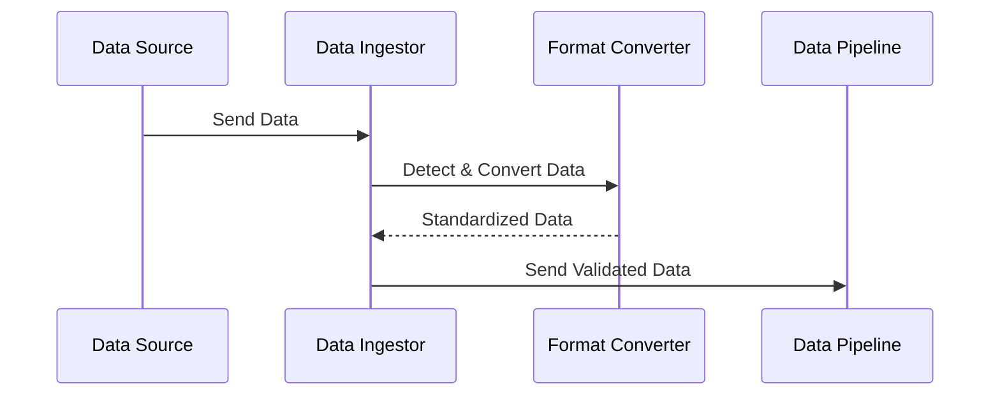

## Data Format Conversion

### Overview
Data Format Conversion is a fundamental cloud computing pattern focused on transforming incoming data into a common format upon ingestion. This ensures data consistency across the system and simplifies downstream data processing tasks. It is especially crucial in scenarios involving multiple sources that might output data in different formats like CSV, JSON, or XML.

### Key Concepts

- **Data Ingestion**: The process where raw data is collected and imported for immediate use or storage in a database.
- **Format Standardization**: Adopting a unified data schema, such as JSON, for all ingested data regardless of the original format.
- **Consistency and Simplification**: Ensures data integrity and simplifies the transformation and analysis processes downstream.

### Architectural Approaches

1. **Format Detection and Conversion**: 
   - Implement a system capable of detecting the format of incoming data and applying the appropriate conversion logic to transform it to a standard format.
   
2. **Schema Registry Integration**:
   - Use a schema registry to manage the evolution of data schemas dynamically and ensure backward compatibility as data formats evolve.

3. **Data Transformation Layers**:
   - Implement layers in the architecture dedicated to transformation tasks, keeping processing logic separate and improving code maintainability.

### Best Practices

- **Automation of Format Detection**: Automate the detection and transformation processes to reduce manual workload and potential human error.
- **Robust Conversion Logic**: Ensure that the logic to handle different formats is rigorously tested and capable of handling edge cases.
- **Consistent Schema Management**: Regularly update and manage the schemas used for standardization to handle new data types or sources efficiently.

### Example Code

Here's an example using Java with a fictional library that detects and converts various input formats into JSON:

```java
import com.example.dataformat.ConvertorService;

public class DataFormatHandler {
    private ConvertorService convertorService;
    
    public DataFormatHandler() {
        this.convertorService = new ConvertorService();
    }

    public String convertToJSON(String inputData, String inputFormat) throws Exception {
        switch (inputFormat.toUpperCase()) {
            case "CSV":
                return convertorService.csvToJson(inputData);
            case "XML":
                return convertorService.xmlToJson(inputData);
            case "JSON":
                return inputData; // already in desired format
            default:
                throw new Exception("Unknown format: " + inputFormat);
        }
    }
}
```

### Diagrams

Below is a simple Sequence Diagram showing the process of data format conversion:



### Related Patterns

- **Schema Evolution**: Managing changes in the data schema without breaking existing systems.
- **Data Validation and Cleansing**: Ensuring data accuracy by validating data formats and cleansing unnecessary or incorrect data before conversion.

### Additional Resources

- [Reference Article on Data Ingestion Strategies](https://example.com/data-ingestion-strategies)
- [Open Source Tools for Data Format Conversion](https://example.com/tools-for-data-conversion)

### Summary

The Data Format Conversion pattern is essential for systems dealing with heterogeneous data sources. By transforming incoming data into a standardized format, it simplifies processing, enhances consistency, and ensures high-quality data flow throughout the system. When implemented effectively, this pattern aids in efficient data management and drives better analytic and operational outcomes.
