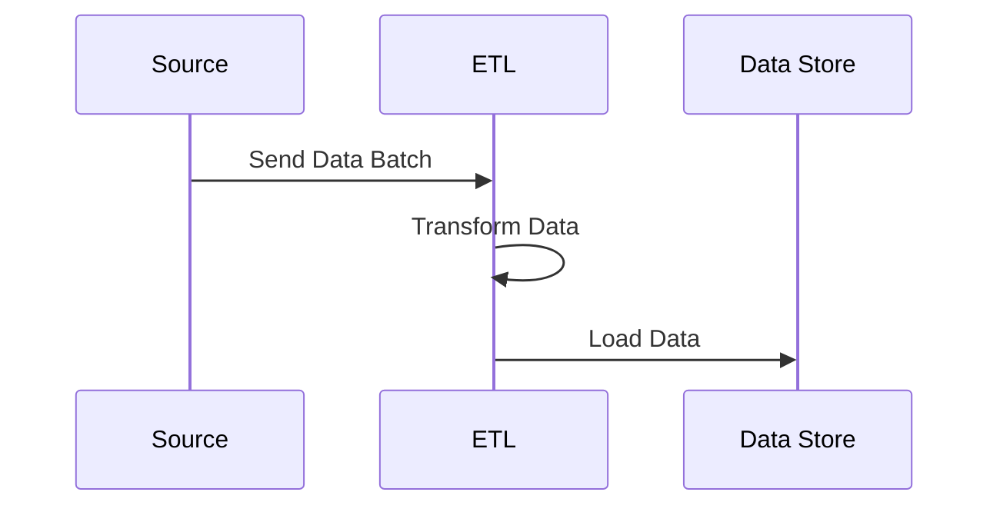

## Batch Data Ingestion

### Description

Batch Data Ingestion is a design pattern used for periodically ingesting large volumes of data in a single operation. This pattern is particularly effective when real-time data processing is not essential, or when interfacing with legacy systems that generate data in discrete sets rather than as continuous streams.

Batch mode is typically used in scenarios such as reporting, backups, or when integrating with systems that do not inherently support streaming, like traditional databases or file systems. This approach minimizes the need for immediate processing resources and allows for more intensive data validation and transformation procedures.

### Architectural Approach

Batch Data Ingestion relies on staging data for processing at set intervals, using a variety of data sources which might include log files, transaction databases, or external APIs. These data batches are processed through ETL (Extract, Transform, Load) pipelines, which manage the data flow through extraction, transformation according to business logic, and finally loading into a data warehouse or database for analytics.




### Best Practices

- **Scheduling**: Utilize scheduling frameworks or tools, such as Apache Airflow, to automate batch runs and manage dependencies effectively.
- **Error Handling**: Implement robust logging and exception handling within your ETL pipelines to track and respond to issues.
- **Data Consistency**: Ensure that data integrity is maintained across the extraction and loading phases to prevent anomalies.
- **Resource Optimization**: Align your batch process timing with periods of low system activity to maximize processing resources.

### Example Code

Here's an example showcasing a batch ingestion script using Apache Spark for processing log files:

```scala
import org.apache.spark.sql.SparkSession
import org.apache.spark.sql.SaveMode

object BatchIngestion {
  def main(args: Array[String]): Unit = {
    val spark = SparkSession.builder
      .appName("Batch Data Ingestion")
      .getOrCreate()

    // Path to the log files
    val logFilePath = "/path/to/logfiles/*.log"

    // Read log files as DataFrame
    val logsDF = spark.read.text(logFilePath)

    // Perform transformations as needed
    val transformedLogsDF = logsDF.transform(parseLogData).transform(filterRelevantEntries)

    // Load the transformed logs into Data Store
    transformedLogsDF.write
      .mode(SaveMode.Append)
      .parquet("/path/to/datastore")

    spark.stop()
  }

  def parseLogData(df: DataFrame): DataFrame = {
    // Implement parsing logic
  }

  def filterRelevantEntries(df: DataFrame): DataFrame = {
    // Implement filtering logic
  }
}
```

### Related Patterns

- **Lambda Architecture**: Combines batch and real-time processing to ensure high availability and fault-tolerance in data ingestion.
- **Streaming Data Ingestion**: Continuously processes data, suitable for applications needing low-latency updates.

### Additional Resources

- [Apache Hadoop Documentation](https://hadoop.apache.org/docs/r1.2.1/hdfs_design.html) for understanding distributed batch processing frameworks.
- [Apache Airflow](https://airflow.apache.org/) for managing large batch operations and workflows.
- [ETL Best Practices](https://docs.aws.amazon.com/prescriptive-guidance/latest/patterns/overview-of-etl-best-practices-on-aws.html) on AWS for designing reliable batch data pipelines.

### Final Summary

The Batch Data Ingestion pattern facilitates organized and efficient processing of large data sets at scheduled intervals. By leveraging this pattern, organizations can manage legacy system integrations and data-intensive processes optimally, ensuring that resources are applied economically and data integrity is maintained throughout the pipeline. The design brings structured competence in handling substantial data volumes, especially in scenarios where latency is a trade-off for throughput.
