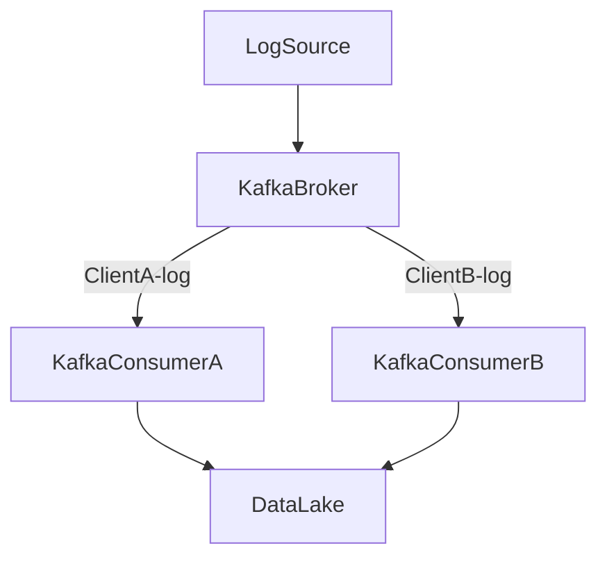

## Introduction

In the era of cloud computing and Software-as-a-Service (SaaS) applications, the capability of handling data ingestion for multiple tenants efficiently, securely, and reliably has become a cornerstone of many cloud-based architectures. Multi-Tenant Data Ingestion patterns address the challenges of designing systems that cater to multiple clients without risking data leakages or performance bottlenecks.

## Pattern Description

Multi-Tenant Data Ingestion involves structuring your data pipelines to accommodate multiple clients or applications, providing each with an isolated environment within a shared infrastructure. The primary goal of this pattern is to ensure that data belonging to one tenant is isolated from that of another, while also efficiently utilizing shared resources.

### Key Components

1. **Tenant Isolation**: Achieved using techniques such as partitioned data streams, unique namespaces, or specific keys to route data specific to each tenant, ensuring logical separation.
   
2. **Security**: Implement access controls and encryption to secure data as it traverses the shared infrastructure.

3. **Scalability**: Ensure the ingestion system can scale dynamically to accommodate varying loads from different tenants.

4. **Monitoring and Auditing**: Enable detailed tracking of data streams for security and compliance.

## Example Implementation

Consider a SaaS platform that provides analytics services to multiple customers. Each client sends log data to be analyzed. The system uses Apache Kafka for data ingestion with the following setup:

- **Namespaces/Topics**: Each client's data stream is written to a separate Kafka topic, such as `clientA-log`, `clientB-log`, ensuring logical separation.
- **Partitions**: Within each topic, data is further partitioned to efficiently process data concurrently.
- **Security**: Use Kafka's ACL (Access Control Lists) to ensure only the client’s data producer and consumers can access their respective topics.
- **Scaling**: Utilize Kafka's ability to balance partitions over brokers to scale seamlessly.
  
```java
Properties props = new Properties();
props.put("bootstrap.servers", "kafka-broker1:9092,kafka-broker2:9092");
props.put("key.serializer", "org.apache.kafka.common.serialization.StringSerializer");
props.put("value.serializer", "org.apache.kafka.common.serialization.StringSerializer");

KafkaProducer<String, String> producer = new KafkaProducer<>(props);

String clientId = "clientA";
String topic = clientId + "-logs";

producer.send(new ProducerRecord<>(topic, "key", "log data"));
producer.close();
```

## Architecture Diagram



## Related Patterns

- **Data Partitioning**: Separating data based on some criteria to improve scalability and performance.
- **Data Encryption**: Ensuring data is encrypted in transit and at rest to enhance security.
- **Rate Limiting**: Implementing rate limits on data ingestion to prevent any single tenant from overwhelming the system.

## Additional Resources

- [Apache Kafka Documentation](https://kafka.apache.org/documentation/)
- [Multitenancy Considerations in Cloud Applications](https://cloud.google.com/solutions/multitenancy)
- [Building Secure and Compliant SaaS](https://aws.amazon.com/architecture/saas)

## Summary

The Multi-Tenant Data Ingestion pattern is increasingly relevant in today’s cloud-centric software architectures. By focusing on tenant isolation, security, scalability, and thorough monitoring, architects can design robust systems that provide seamless and secure data ingestion capabilities for multiple clients. This pattern not only optimizes resource usage but also ensures adherence to security and compliance requirements, aiding in building scalable, efficient, and secure cloud services.
