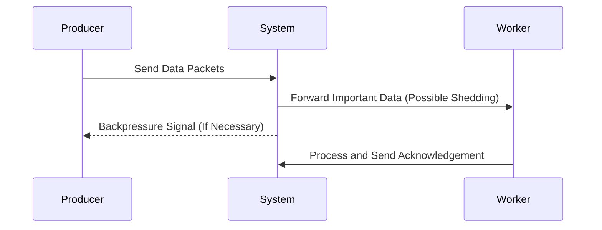

## Overview

Load Shedding is a critical design pattern used in stream processing and data ingestion systems to handle periods of unexpected high load gracefully. This pattern involves intentionally discarding certain data items to prevent system overload and maintain the smooth operation of critical functionalities. By prioritizing critical paths and measurements, systems can ensure robustness and resilience even in stressful situations.

## Architectural Approach

### Key Concepts

- **Backpressure Management**: Mechanisms are put in place to slow down data production rates, which could include applying backpressure strategies or adapting you ingestion strategy dynamically.
- **Data Prioritization**: Establish a hierarchy of data importance, ensuring high-priority messages are never discarded.
- **Load Shedding Strategies**:
  - **Time-based Shedding**: Drop data older than a specified time threshold.
  - **Value-based Shedding**: Focus on dropping data that contributes the least value to key metrics.
  - **Random Shedding**: Randomly drop packets to maintain throughput in severely overwhelmed systems.

### Conceptual Diagram



## Best Practices

1. **Identify Critical Data**: Clearly define which data is mission-critical versus what can be shed during peak times.
2. **Monitoring and Alerts**: Implement real-time monitoring tools to predict when load shedding will be necessary.
3. **Efficient Shedding Logic**: Ensure shedding does not cause a bottleneck itself and is efficient both in decision-making and execution.
4. **Automatic Adaptation**: Systems should dynamically adjust the criteria for shedding based on current load conditions.

## Example Code

Below is a basic example in Scala demonstrating a load shedding model using Akka Streams:

```scala
import akka.actor.ActorSystem
import akka.stream._
import akka.stream.scaladsl._

import scala.concurrent.duration._

implicit val system = ActorSystem("LoadSheddingSystem")
implicit val materializer = ActorMaterializer()

val source = Source(1 to 1000)
val loadSheddingFlow = Flow[Int].filter(x => x % 10 != 0) // Drops multiples of 10

source
  .throttle(10, 1.second, 10, ThrottleMode.Shaping) // = Simulate backpressure
  .via(loadSheddingFlow)
  .to(Sink.foreach(println))
  .run()
```

## Related Patterns

- **Circuit Breaker**: Similar to load shedding, circuit breakers stop operations to prevent a system from reaching a failure state.
- **Bulkhead**: Isolates components to contain failure and protect other parts of the system.

## Additional Resources

- [Netflix Blog on Resilience](https://netflixtechblog.com/)
- [Akka Streams Documentation](https://doc.akka.io/docs/akka/current/stream/index.html)
- [Reactive Streams](http://www.reactive-streams.org/)

## Summary

Load Shedding is an essential strategy for stream processing systems aiming to sustain service quality during unexpected load spikes. By effectively prioritizing and managing non-critical operations, system performance can be preserved without compromising core functionalities. This minimizes the disruption caused by overload conditions and keeps the focus on handling the most important tasks.
