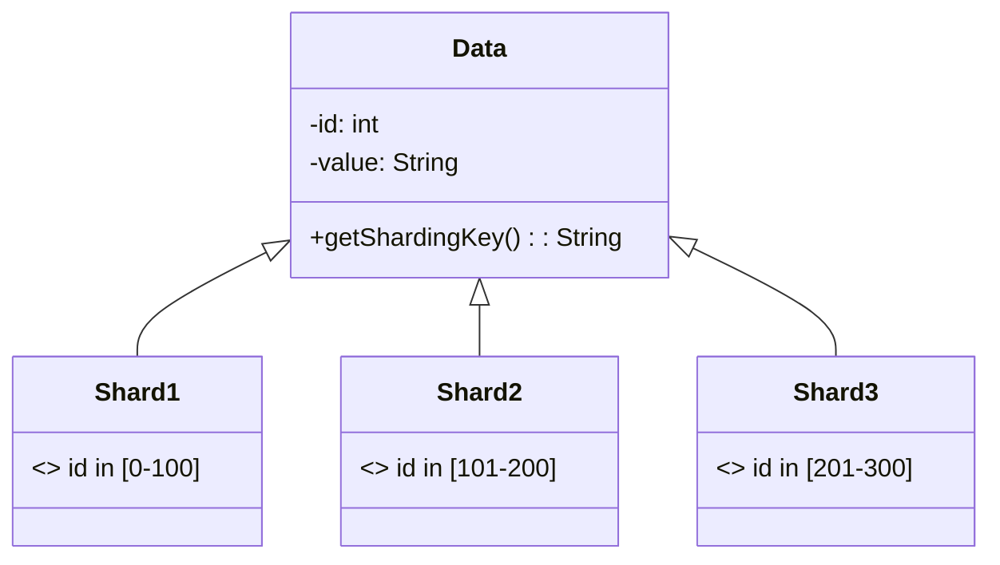

## Description

Data sharding is a design pattern used to enhance system scalability and performance by partitioning data across multiple storage nodes or clusters. The process involves dividing a large database into smaller, more manageable parts known as shards, each of which is stored on a separate database server. Sharding distributes the data based on a sharding key, a specific element within the data that determines which shard the data belongs to, allowing for horizontal scalability and load balancing.

## Architectural Approaches

1. **Horizontal vs. Vertical Sharding**:
   - *Horizontal Sharding*: Splits data across multiple shards by rows. Each shard has the same schema but a different subset of the data.
   - *Vertical Sharding*: Divides a database by different columns. Useful for splitting a database by functionality.

2. **Dynamic vs. Static Sharding**:
   - *Static Sharding*: Sharding setup is defined during the initial design, which may result in some shards being overloaded if not configured carefully.
   - *Dynamic Sharding*: Introduces the ability to adjust shards dynamically as data grows or access patterns change.

3. **Range-Based vs. Hash-Based Sharding**:
   - *Range-Based Sharding*: Assigns a continuous range of records to each shard. Suitable for data with natural ordering, such as time-series data.
   - *Hash-Based Sharding*: Applies a hash function on the sharding key to distribute data across shards uniformly.

## Best Practices

- Always monitor and balance shard loads to avoid hotspots.
- Plan for data growth by choosing a sharding strategy that accommodates scaling out.
- Consider the skew in data access patterns while determining the sharding key.
- Prepare for operations like shard splitting, merging, and rebalancing when capacity changes.

## Example Code

Here's a pseudocode example of implementing hash-based sharding:

```java
public class ShardManager {
    private List<DatabaseConnection> shards;

    public ShardManager(List<DatabaseConnection> shards) {
        this.shards = shards;
    }

    public DatabaseConnection getDatabaseForKey(String key) {
        int hashCode = key.hashCode();
        int shardIndex = hashCode % shards.size();
        return shards.get(shardIndex);
    }
}
```

## Diagrams

Below is a simple Mermaid diagram demonstrating a range-based sharding approach:



## Related Patterns

- **Database Read-Write Splitting**: Enhance performance by separating read and write operations across nodes.
- **CQRS (Command and Query Responsibility Segregation)**: Distinguishes between reading and writing models to optimize database scaling.
- **Event Sourcing**: Utilizes events to rebuild the state instead of relying on the current database state.

## Additional Resources

- "Designing Data-Intensive Applications" by Martin Kleppmann
- "Sharding Pattern" on Microsoft’s Cloud Design Patterns
- Online tutorials and courses on scalable database architectures

## Final Summary

Data sharding is a fundamental pattern for achieving horizontal scalability in distributed data systems. By carefully selecting a sharding strategy and maintaining load balance, systems can efficiently manage high volumes of incoming data and accommodate future growth. As the demand for scalable data systems continues to increase, mastering sharding techniques will become vital for architects and engineers.
