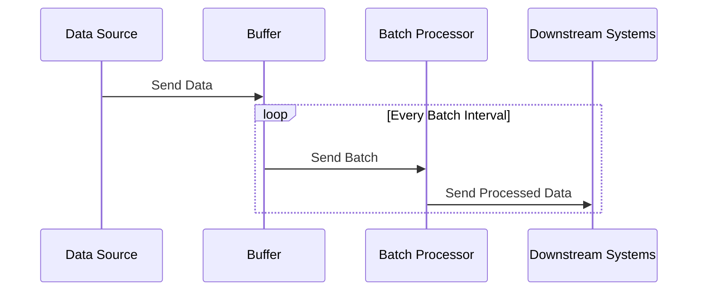

## Description

Micro-Batching is a cloud computing pattern that involves combining a set of small data packets received over time into a single batch for processing. This approach reduces system overhead, as handling each event individually might be inefficient, and balances between real-time and batch processing performance. By configuring micro-batching intervals, systems can optimize for latency and throughput based on specific requirements.

Micro-Batching finds its usage in environments where the cost of event-driven processing is high and real-time processing is not imperative but desirable. It is a mainstay of frameworks like Apache Spark Streaming, where it is used to process data streams by compiling events within a specified temporal window.

## Architectural Approach

In a micro-batching architecture, incoming data streams are buffered for a pre-defined interval, say every second or minute. At the end of this interval, all accumulated data is packaged into a batch and delivered to processing machinery. 

### Key Components:
- **Data Source**: Streams data to the system (e.g., Kafka, IoT devices).
- **Buffer**: Temporarily stores records until the batch is formed.
- **Batch Processor**: Processes the formed batches.
- **Downstream Systems**: Consume processed output.

## Example Code

Let's consider an implementation using Apache Spark Streaming:
```scala
import org.apache.spark.SparkConf
import org.apache.spark.streaming.{Seconds, StreamingContext}

val conf = new SparkConf().setAppName("MicroBatchExample").setMaster("local[2]")
val ssc = new StreamingContext(conf, Seconds(1)) // 1-second interval for micro-batching

val lines = ssc.socketTextStream("localhost", 9999)
val words = lines.flatMap(_.split(" "))
val wordCounts = words.map(x => (x, 1)).reduceByKey(_ + _)

wordCounts.print()
ssc.start()
ssc.awaitTermination()
```
In this example, data received every second is collected, processed within that timeframe, and counted in micro-batches.

## Diagrams



## Related Patterns

- **Batch Processing**: Processes large volumes of data for transformation or analysis but lacks the timeliness of stream processing.
- **Event Streaming**: Offers real-time processing for each individual event, opposite of batching in nature.
- **Lambda Architecture**: Utilizes both batch and real-time processing for analyses requiring different perspectives.

## Additional Resources

- [Apache Spark Streaming Documentation](https://spark.apache.org/docs/latest/streaming-programming-guide.html)
- [Confluent Kafka Streams](https://kafka.apache.org/documentation/streams/)
- "Stream Processing with Apache Spark" - book (for deep-dive into streaming concepts)

## Summary

Micro-Batching provides a flexible pattern for optimizing stream processing systems where real-time processing is desired but cost-efficiency is also critical. By leveraging micro-batch timing, systems equivalently traverse the latency-throughput trade-off, ensuring responsiveness with manageable overhead. As an effective middle-ground between batch and real-time processing, Micro-Batching allows systems to maintain a balance in data-intensive operations across cloud and distributed platforms.
