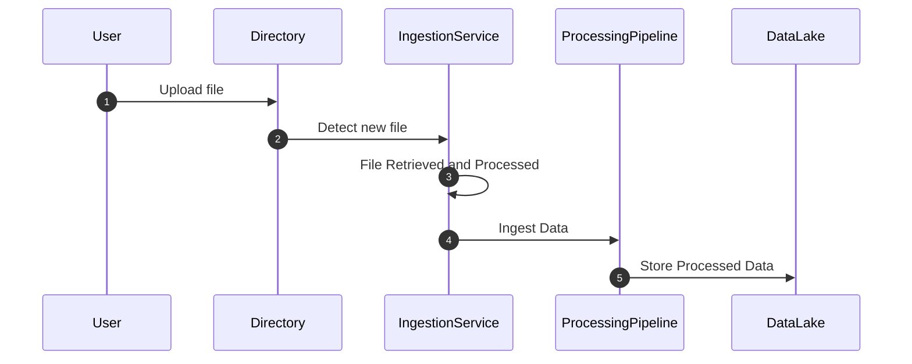

### Overview

File-Based Ingestion is a data ingestion pattern commonly used in cloud computing and big data processing. It involves monitoring directories or object storage systems such as Hadoop Distributed File System (HDFS), Amazon S3, or Azure Blob Storage for files and ingesting their contents into processing pipelines. This approach is particularly effective for handling batch data uploads like logs, CSV files, JSON documents, or any structured data files. 

### Architectural Approach

1. **File Monitoring**: Implement mechanisms to monitor directories or object storage systems for new files. Technologies like Apache Flume, custom scripts, or cloud-specific services can be used for this purpose.
   
2. **File Retrieval**: Once a file is detected, it is accessed and any necessary transformations (e.g., decompression, parsing) are applied.

3. **Data Ingestion**: The processed file contents are then ingested into the targeted data processing pipeline, which could be a stream processing engine like Apache Flink or Kafka Streams, or a batch processing framework such as Apache Spark.

4. **Data Integration**: The ingested data is integrated with other datasets or sent to storage systems like databases or data lakes for further analysis.

### Example Code

```scala
import org.apache.hadoop.fs._
import org.apache.spark.sql.SparkSession

val spark = SparkSession.builder()
  .appName("File-Based Ingestion Example")
  .getOrCreate()

val hdfsPath = "hdfs:///user/sensor_data/"
val fileSystem = FileSystem.get(new java.net.URI(hdfsPath), spark.sparkContext.hadoopConfiguration)

def ingestCsvFiles(hdfsPath: String): Unit = {
  val fileStatus = fileSystem.listStatus(new Path(hdfsPath))
  
  fileStatus.filter(_.getPath.getName.endsWith(".csv")).foreach { file =>
    val dataFrame = spark.read.option("header", "true").csv(file.getPath.toString)
    // Further processing of dataFrame
    dataFrame.show()
  }
}

ingestCsvFiles(hdfsPath)
```

### Diagram



### Related Patterns

- **Event Streaming Ingestion**: Unlike file-based ingestion, this pattern involves real-time ingestion of event streams, often leveraging systems like Apache Kafka.
- **Database Ingestion**: Directly ingesting data from databases through batch extraction or change data capture (CDC) techniques.
- **Change Data Capture**: Efficiently capturing changes in data sources and reflecting these changes in target systems.

### Best Practices

- **Error Handling**: Implement robust error handling and logging to effectively troubleshoot file ingestion issues.
- **Scalability**: Use scalable cloud storage solutions and appropriate partitioning strategies to handle large volumes.
- **Security**: Ensure secure file transfer and access control to avoid unauthorized data access.

### Additional Resources

- [Apache Hadoop Distributed File System](https://hadoop.apache.org/): Learn about HDFS and its mechanisms.
- [Apache Spark Documentation](https://spark.apache.org/docs/latest/): Reference for using Spark for data processing.
- [AWS S3 Best Practices](https://docs.aws.amazon.com/AmazonS3/latest/userguide/best-practices.html): Understanding best practices when using Amazon S3 storage.

### Summary

File-Based Ingestion is a powerful pattern for handling batch data processing, utilizing files as a primary data ingestion source. By leveraging cloud storage systems and scalable processing frameworks, it caters to a broad array of scenarios where batch processing or periodic uploads are required. Through this pattern, organizations can seamlessly transform and integrate large datasets into their data ecosystems efficiently.
