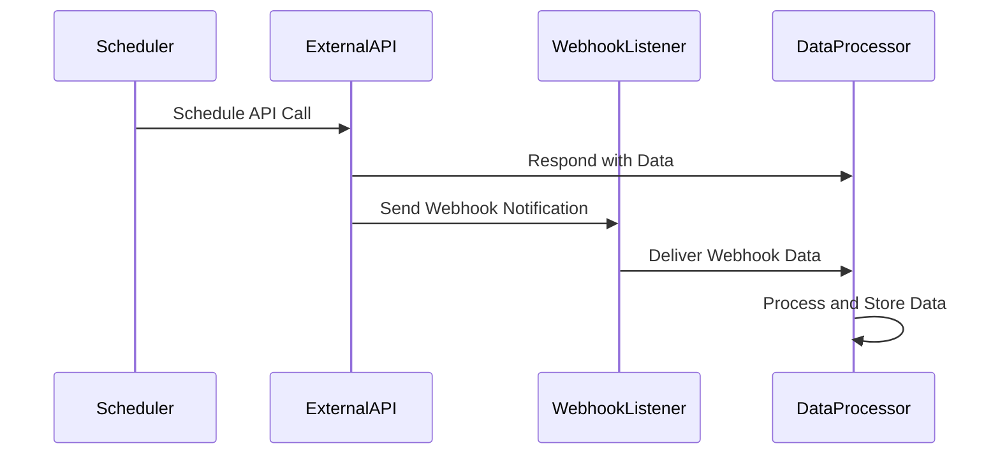

## Overview

API-Based Ingestion is a design pattern used to pull data from external services or systems using APIs. This pattern is effectively employed in scenarios where continuous or batched data retrieval is necessary. The primary techniques for implementing API-Based Ingestion include making regular scheduled requests to fetch fresh data or subscribing to webhooks to receive notifications of new data events.

## Architectural Approach

- **Scheduled API Calls**: In this approach, the system is designed to periodically invoke API endpoints based on a predefined schedule to retrieve data. For example, a schedule could be configured using cron jobs or task schedulers to ensure timely data fetch operations.
  
- **Webhooks**: Webhooks provide a way for an external system to notify your application whenever new data is available. Using webhooks, applications can avoid constant polling, reducing unnecessary network calls and system load.

## Key Components

1. **API Clients**: Responsible for authenticating and communicating with the external APIs. API clients ensure secure data transfer and handle any API-specific requirements such as rate limiting and retries.

2. **Task Schedulers**: These are systems or tools that manage the invocation of API calls at specific intervals. Examples include cron jobs, AWS Lambda with CloudWatch Events, or Google Cloud Functions with Cloud Scheduler.

3. **Webhook Receiver**: A service or endpoint configured to listen for data pushed from external systems. It processes incoming data notifications immediately upon arrival.

4. **Data Processors**: Once data is fetched or received, data processors handle its transformation, validation, and storage to make it ready for downstream processing.

## Best Practices

- **Rate Limiting Awareness**: Be aware of API rate limits imposed by third-party services and implement exponential backoff strategies to gracefully handle rate limit exceeded errors.

- **Security**: Ensure secure data transfer by using HTTPS and authentication mechanisms like OAuth2 tokens, API keys, or client certificates. Implement input validation to protect against malicious data.

- **Idempotency**: Design webhook or API request handlers to be idempotent, meaning that repeated calls with the same data do not result in adverse effects such as duplicate data entries.

- **Scalability**: Design the system to handle varying data volumes without performance degradation, using techniques such as caching, queuing, and load balancing.

## Example

Suppose a financial application needs to regularly update currency exchange rates. It can follow this pattern:

```java
import java.net.HttpURLConnection;
import java.net.URL;
import java.util.Scanner;

public class ExchangeRateUpdater {

    public void fetchExchangeRates() {
        try {
            URL url = new URL("https://api.exchangeratesapi.io/latest");
            HttpURLConnection conn = (HttpURLConnection) url.openConnection();
            conn.setRequestMethod("GET");
            conn.connect();
            int responseCode = conn.getResponseCode();
            
            if (responseCode != 200) {
                throw new RuntimeException("HttpResponseCode: " + responseCode);
            } else {
                Scanner sc = new Scanner(url.openStream());
                while (sc.hasNext()) {
                    System.out.println(sc.nextLine());
                }
                sc.close();
            }
        } catch (Exception e) {
            e.printStackTrace();
        }
    }
}
```

## Diagram

Here is a simplified sequence diagram illustrating API-Based Ingestion:



## Related Patterns

- **File-Based Ingestion**: This pattern focuses on ingesting data uploaded as files, often used when dealing with large data dumps.
  
- **Stream-Based Ingestion**: Involves directly ingesting data from streaming platforms like Apache Kafka or Kinesis, suitable for real-time data processing.

## Additional Resources

- [API Best Practices](https://developer.mozilla.org/en-US/docs/Web/API)
- [Understanding Webhooks](https://webhooks.org/)
- [Handling Rate Limits](https://cloud.google.com/apis/design/errors#rate_limit_exceeded)

## Summary

API-Based Ingestion serves as a robust design pattern for pulling data from external systems using APIs. By employing scheduled requests or webhooks, this pattern facilitates seamless and timely data acquisition. It’s crucial in modern data-driven applications that rely on external data sources, ensuring secure, scalable, and efficient data ingestion and processing.
