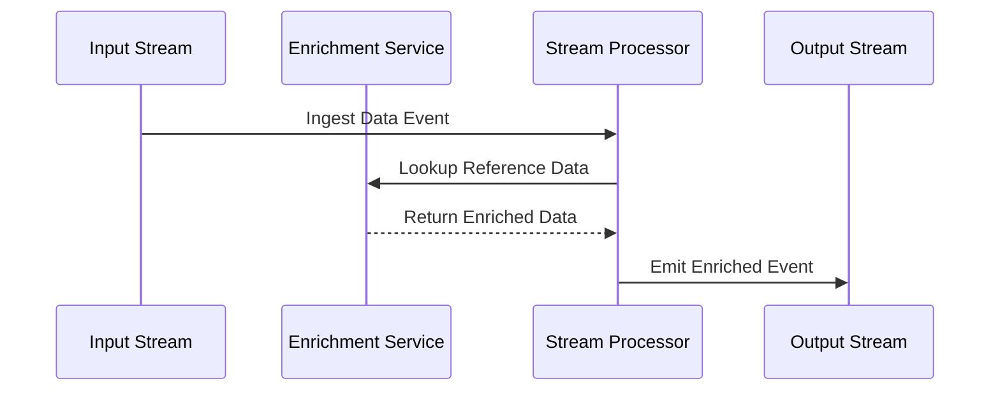

## Introduction

Stream Enrichment at Ingestion is a design pattern employed to enhance the value of streaming data by enriching it with additional context or relevant information in real-time. This enrichment process might involve joining the incoming data with reference datasets or performing lookups to add valuable insights before it's stored or processed further. This pattern is crucial for enabling real-time decision-making and analytics.

## Architectural Approaches

- **Reference Data Lookup**: Incoming data streams are enriched by looking up reference data stored in either in-memory databases, NoSQL stores, or external APIs. This approach is effective for enriching data with attributes such as location, user demographics, or product details.

- **Join Operations**: Use stream processing frameworks that support joining the live data stream with static reference datasets. Apache Kafka Streams or Apache Flink are often utilized for such tasks where enriched data need immediate availability for subsequent operations.

- **Inline Processing and Enrichment**: Implement serverless functions or microservices to act as interceptors between the data ingestion point and downstream systems. These functions can perform synchronization with enrichment sources in real-time.

## Best Practices

- **Maintain Low Latency**: Ensure that the enrichment process doesn't introduce significant delays. Use in-memory data stores and optimize join operations to maintain throughput.

- **Consistency in Data**: Ensure data consistency and completeness, particularly when enrichment involves mutable reference data sources.

- **Scalability**: Design the enrichment architecture to handle variable data loads, scaling seamlessly with the volume of incoming streams. Utilize cloud-native services that offer auto-scaling capabilities.

## Example Code: Kafka Streams

The following is a simple example illustrating how Kafka Streams can be employed for data enrichment:

```java
StreamsBuilder builder = new StreamsBuilder();

// Stream from input topic
KStream<String, ClickEvent> inputStream = builder.stream("clickstream-topic");

// Enrich with geolocation data
KStream<String, EnrichedClickEvent> enrichedStream = inputStream.mapValues(event -> {
    String location = geoLocationService.getLocation(event.getIpAddress());
    return new EnrichedClickEvent(event, location);
});

// Send enriched data to output topic
enrichedStream.to("enriched-clickstream-topic");

KafkaStreams streams = new KafkaStreams(builder.build(), new Properties());
streams.start();
```

## Diagrams



## Related Patterns

- **Lambda Architecture**: This pattern can combine both batch and real-time processing, where stream enrichment at ingestion enhances the speed layer for immediate processing.

- **Event Sourcing**: Use stream enrichment within event sourcing systems to store newly refined events for future reconstruction or querying.

- **Change Data Capture (CDC)**: Often used in combination with stream enrichment to update datasets in real-time, enhancing efficiency with live changes.

## Additional Resources

- ["Stream Processing with Apache Kafka"](https://kafka.apache.org/documentation/streams/) - Official documentation on Kafka Streams, a powerful platform for stream processing including enrichment.
- ["Designing Data-Intensive Applications" by Martin Kleppmann](https://www.oreilly.com/library/view/designing-data-intensive-applications/9781491903063/) - A comprehensive read for understanding various patterns in data processing.

## Summary

Stream Enrichment at Ingestion is an essential design pattern for systems that require real-time insights and data analysis. By incorporating contextual data into streams as they are ingested, this pattern empowers organizations to harness the full potential of their data instantly. Leveraging cloud-native solutions, such as Apache Kafka or Flink, is vital to maintaining scalability, low latency, and efficiency in modern distributed architectures.
