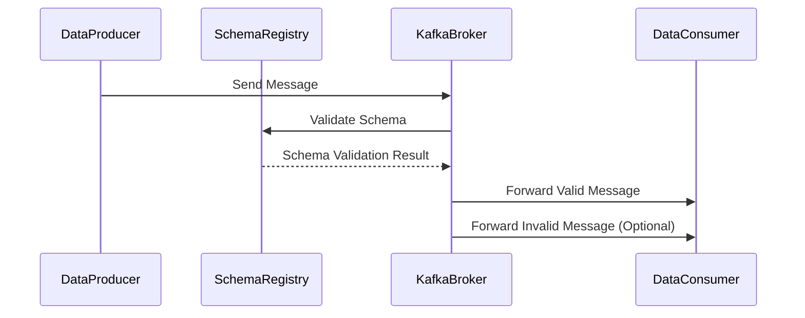

## Overview

Schema validation is a critical design pattern in data ingestion pipelines to ensure that incoming data adheres to a predefined structure. By validating data against a schema, organizations can maintain high data quality and consistency. This process involves rejecting or flagging records that do not conform to the expected schema, thus enabling reliable downstream processing and analytics.

## Architectural Approaches

### 1. Schema Registry

Implementing a centralized schema registry allows multiple producers and consumers to access, validate, and evolve data schemas efficiently. Tools like Confluent Schema Registry integrate with Apache Kafka to provide centralized schema management.

### 2. Inline Validation

Data is validated against the schema at the point of ingestion. This can be accomplished in stream processing frameworks such as Apache Kafka or Apache Flink, where schema validation is a built-in feature.

### 3. Schema Evolution

Supporting backward and forward compatibility in schemas allows changes without breaking the existing consumer applications. This is crucial in agile environments where data structures can evolve over time.

## Best Practices

- **Centralize Schemas**: Use a schema registry that provides a RESTful interface for managing and retrieving schemas.
- **Version Control**: Maintain a version history of all schemas to track changes and support schema evolution.
- **Automated Validation**: Implement automated unit tests for schema validation as part of the data ingestion workflow.
- **Error Handling**: Design robust error handling mechanisms to capture and report schema validation failures for further analysis.

## Example Code

Here is an example of schema validation using Apache Avro in Apache Kafka:

```java
import io.confluent.kafka.schemaregistry.client.CachedSchemaRegistryClient;
import io.confluent.kafka.serializers.KafkaAvroDeserializer;
import org.apache.kafka.common.serialization.StringDeserializer;
import org.apache.kafka.clients.consumer.KafkaConsumer;
import org.apache.kafka.clients.consumer.ConsumerConfig;

import java.util.Properties;

public class AvroSchemaValidationExample {

    public static void main(String[] args) {
        Properties props = new Properties();
        props.put(ConsumerConfig.BOOTSTRAP_SERVERS_CONFIG, "localhost:9092");
        props.put(ConsumerConfig.GROUP_ID_CONFIG, "schema-validation-group");
        props.put(ConsumerConfig.KEY_DESERIALIZER_CLASS_CONFIG, StringDeserializer.class.getName());
        props.put(ConsumerConfig.VALUE_DESERIALIZER_CLASS_CONFIG, KafkaAvroDeserializer.class.getName());
        props.put("schema.registry.url", "http://localhost:8081");
        
        KafkaConsumer<String, Object> consumer = new KafkaConsumer<>(props);
        
        // Further implementation for consuming and validating messages
        
        consumer.close();
    }
}
```

## Diagram

Below is a Mermaid Sequence Diagram illustrating how schema validation can be integrated into a data ingestion pipeline:



## Related Patterns

- **Schema Evolution**: Management of versioned schemas to handle change without breaking applications.
- **Data Cleansing**: Process of detecting and correcting corrupt or inaccurate records.
- **Data Transformation**: Transforming data from one format or structure into another.

## Additional Resources

- [Apache Avro Documentation](https://avro.apache.org/docs/current/)
- [Confluent Schema Registry](https://docs.confluent.io/platform/current/schema-registry/index.html)
- [Schema Management in Apache Kafka](https://kafka.apache.org/documentation/)

## Summary

Schema Validation is a foundational pattern in stream processing and data ingestion pipelines. By enforcing schema compliance, organizations can ensure data quality and consistency, leading to more reliable analytics and business intelligence operations. Utilizing tools like Apache Avro and Confluent Schema Registry, developers can seamlessly integrate schema validation into their data pipeline architectures.
