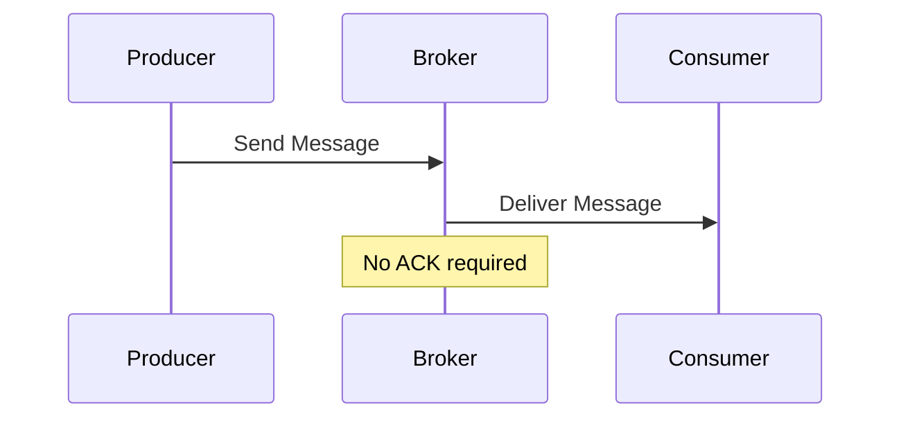

## Introduction

In distributed systems, especially those involving message passing or stream processing, achieving consistent delivery semantics is crucial. The At-Most-Once Delivery pattern prioritizes speed over reliability by ensuring that each message is delivered no more than once, which inherently means some messages may not be delivered at all.

## Architectural Overview

### Core Characteristics

- **Non-Idempotency**: Messages might trigger actions that should not be repeated.
- **Speed Optimization**: Reducing delivery acknowledgment overhead increases throughput.
- **Loss-Tolerant Use Cases**: Most common in scenarios where the occasional loss of messages does not have serious consequences, such as logging, analytics, or monitoring.

### Typical Use Cases

- **Logging Systems**: Non-critical log entries where missing a few logs is acceptable.
- **Monitoring Metrics**: Periodic metrics where exact precision is not a requirement.
- **Non-Critical Notifications**: Alerts or notifications where message loss does not affect the core functionality.

## Example Code

Below is an example using a message broker like Apache Kafka, demonstrating the At-Most-Once Delivery pattern in Java:

```java
import org.apache.kafka.clients.producer.KafkaProducer;
import org.apache.kafka.clients.producer.ProducerConfig;
import org.apache.kafka.clients.producer.ProducerRecord;
import java.util.Properties;

public class AtMostOnceProducer {

    public static void main(String[] args) {
        Properties props = new Properties();
        props.put(ProducerConfig.BOOTSTRAP_SERVERS_CONFIG, "localhost:9092");
        props.put(ProducerConfig.KEY_SERIALIZER_CLASS_CONFIG, "org.apache.kafka.common.serialization.StringSerializer");
        props.put(ProducerConfig.VALUE_SERIALIZER_CLASS_CONFIG, "org.apache.kafka.common.serialization.StringSerializer");
        props.put(ProducerConfig.ACKS_CONFIG, "0"); // Setting acks to 0 for At-Most-Once

        KafkaProducer<String, String> producer = new KafkaProducer<>(props);

        try {
            for (int i = 0; i < 100; i++) {
                ProducerRecord<String, String> record = new ProducerRecord<>("topicName", Integer.toString(i), "message " + i);
                producer.send(record);
                System.out.println("Sent message: " + i);
            }
        } finally {
            producer.close();
        }
    }
}
```

## Diagrams

### Sequence Diagram

Here's a basic Mermaid sequence diagram showing the At-Most-Once Delivery process:



## Related Patterns

- **At-Least-Once Delivery**: Messages are delivered at least once, emphasizing reliability, which can result in duplicate messages.
- **Exactly-Once Delivery**: Guarantees that each message is delivered exactly once, providing the highest reliability at the cost of increased complexity.
- **Eventual Consistency**: In some cases, systems leveraging At-Most-Once can work well if the overall architecture supports eventual consistency.

## Additional Resources

- [Apache Kafka Producer Documentation](https://kafka.apache.org/documentation.html#producerconfigs)
- [Messaging Patterns in Cloud Architecture](https://martinfowler.com/articles/microservices-messaging.html)
- [Scaling Stream Processing with At-Most-Once](https://cloud.google.com/blog/products/data-analytics/scalable-stream-processing)

## Summary

The At-Most-Once Delivery pattern serves cloud-based and real-time processing systems well where speed is paramount. While sacrificing some message reliability, it provides a highly efficient means of handling large volumes of data quickly. Appropriate use cases include non-critical logs and analytics where the loss of a small percentage of messages is tolerable. Developers should align their choice of delivery semantics with the application's specific reliability and throughput requirements.
