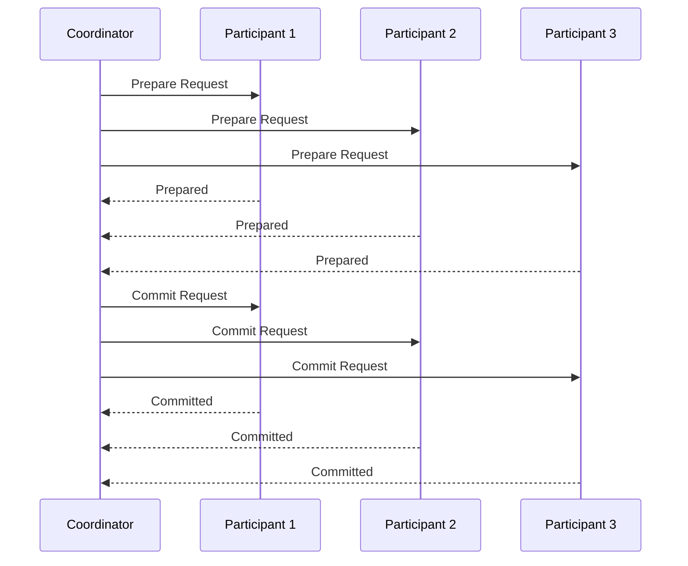

## Description

The Two-Phase Commit (2PC) protocol is a distributed algorithm designed to ensure all participants in a distributed transaction can join in a decision to commit or rollback the transaction as an atomic unit. It is typically used in environments where transactional integrity and consistency are critical, such as involving multiple databases or services that must operate together reliably.

The 2PC process is divided into two distinct phases:

1. **Preparation Phase**:
   - The coordinator node (or transaction manager) requests each participant to prepare for commit and awaits agreement.
   - If all participants respond affirmatively (by acknowledging they are ready), the operation moves to the commit phase.

2. **Commit Phase**:
   - If all participants are prepared, the coordinator instructs them to commit and finalize the transaction.
   - If any participant declines the prepare request, the transaction is rolled back by all participants.

## Example

Consider a scenario where updates to multiple databases need to be coordinated as a single transaction. For instance, when an online retail application processes orders, it may need to update the inventory database, the order management system, and payment services at once. Using the 2PC protocol ensures that all systems reflect the transaction's success or failure consistently.

## Example Code (Java Pseudo-implementation)

```java
public class TwoPhaseCommitCoordinator {
    private List<Participant> participants;

    public TwoPhaseCommitCoordinator(List<Participant> participants) {
        this.participants = participants;
    }

    public void executeTransaction(Transaction transaction) {
        boolean prepareSuccess = prepareAll(transaction);
        if (prepareSuccess) {
            commitAll(transaction);
        } else {
            rollbackAll(transaction);
        }
    }

    private boolean prepareAll(Transaction transaction) {
        for (Participant participant : participants) {
            boolean prepared = participant.prepare(transaction);
            if (!prepared) {
                return false;
            }
        }
        return true;
    }

    private void commitAll(Transaction transaction) {
        for (Participant participant : participants) {
            participant.commit(transaction);
        }
    }

    private void rollbackAll(Transaction transaction) {
        for (Participant participant : participants) {
            participant.rollback(transaction);
        }
    }
}

interface Participant {
    boolean prepare(Transaction transaction);
    void commit(Transaction transaction);
    void rollback(Transaction transaction);
}
```

## Diagram



## Related Patterns

- **Saga Pattern**: An alternative approach to manage distributed transactions by breaking them into a series of local transactions.
- **Compensating Transaction**: Used in scenarios where a rollback process needs to be defined to undo actions if necessary.
- **Eventual Consistency**: Ensures systems remain eventually consistent across distributed services without enforcing immediate coherence.

## Additional Resources

- "Distributed Systems: Principles and Paradigms" by Andrew S. Tanenbaum
- "Designing Data-Intensive Applications" by Martin Kleppmann
- Apache Kafka documentation on Kafka transactions and distributed commit protocols

## Summary

The Two-Phase Commit protocol is fundamental for achieving consistency in distributed systems where transactional integrity is critical. Despite its simplicity, 2PC entails challenges such as potential bottlenecks and system inefficiencies due to its synchronous nature, making it essential to consider alternative patterns like SAGAs when dealing with high-throughput environments or when latency is a concern.
