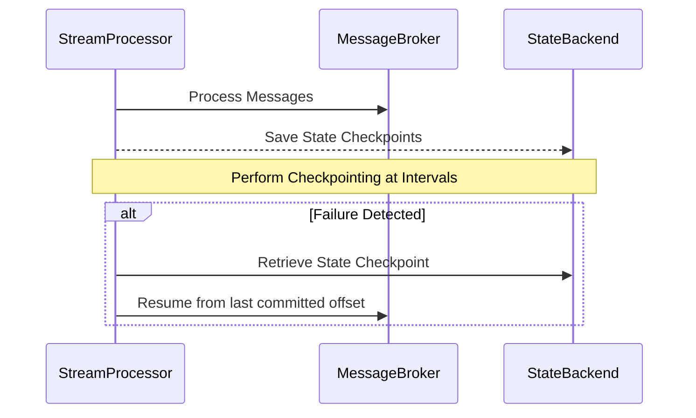

## Description

Checkpointing mechanisms in stream processing are critical for ensuring the reliability and fault tolerance of data pipelines. By saving the processing state at defined intervals, systems can recover seamlessly from failures without losing information or producing duplicate messages. This pattern is especially relevant for applications that require exact-once processing semantics, where every message needs to be processed with utmost accuracy.

In typical implementations, checkpoints are used to save the current state of a data stream application, including offsets in message brokers, states in stateful operators, or snapshots of in-memory data structures.

## Architectural Approach

In the realm of cloud-based stream processing, checkpointing often involves sophisticated interplay between stream processors and state backends:

- **Stateful Operators**: Stream processing applications often consist of stateful operators that maintain intermediate data, crucial for computations such as aggregations, joins, or windowed calculations.

- **State Backends**: State backends, which could be distributed storage systems, databases, or managed state services provided by cloud platforms, store the checkpointed state data.

- **Frequency of Checkpointing**: A critical design consideration involves deciding how often to capture checkpoints. Frequent checkpointing can minimize data loss during failures but also incurs higher I/O costs. 

- **Coordination**: Checkpoint coordination ensures that the processing of state and commit of offsets are synchronized to avoid inconsistencies.

- **Recovery**: Once a failure is detected, the system can recover its state from the most recent checkpoint and resume processing, ensuring previously processed data is not reprocessed unnecessarily.

## Best Practices

1. **Opt for Incremental Checkpointing**: Instead of a full snapshot, only updating changes since the last checkpoint reduces storage and processing overhead.

2. **Optimize Checkpoint Intervals**: Balance between checkpoint overhead and fault tolerance needs when determining checkpoint frequency.

3. **Leverage Managed Services**: Utilize cloud provider offerings like AWS Kinesis Data Analytics, Google Cloud Dataflow, or Azure Stream Analytics that support automatic checkpointing with high availability and scaling.

4. **Isolate Checkpointing I/O**: Design systems to perform checkpointing I/O in parallel with data processing to avoid service disruptions.

5. **Use Consistent Checkpointing**: Ensure all parts of the system use the same checkpointing logic to maintain data integrity.

## Example Code

Here is a basic example of how checkpointing might be configured in an Apache Flink stream processing application:

```java
StreamExecutionEnvironment env = StreamExecutionEnvironment.getExecutionEnvironment();

// Set up a checkpointing interval
env.enableCheckpointing(10000); // checkpoints every 10 seconds

// Optional: Set a state backend
env.setStateBackend(new RocksDBStateBackend("hdfs://namenode:40010/flink/checkpoints", true));

// Optional: Advanced options like checkpoint timeout
env.getCheckpointConfig().setCheckpointTimeout(60000); // 60 seconds

// Define the rest of your streaming pipeline
DataStream<String> dataStream = env.addSource(new FlinkKafkaConsumer<>("my-topic", new SimpleStringSchema(), properties));
```

## Diagrams

Below is a basic conceptual diagram of checkpointing in stream processing:



## Related Patterns

- **Saga Pattern**: Orchestrates long-running processes and tasks in a distributed environment, maintaining consistency across microservices.
- **Event Sourcing**: Instead of storing just the current state, keep a full sequence of state changes to ensure audibility and rollback capabilities.

## Additional Resources

- [Apache Flink Checkpointing Documentation](https://nightlies.apache.org/flink/flink-docs-master/docs/ops/state/checkpoints/)
- [Google Cloud Dataflow Checkpoints](https://cloud.google.com/dataflow/docs/guides/capturing-bm-checkpoints)

## Summary

Checkpointing mechanisms are an essential pattern for implementing reliable data processing pipelines in stream processing architectures. By effectively saving the state of processing at regular intervals and carefully managing recoveries, systems ensure high reliability and accuracy in data processing. Choosing the right configuration and optimizing the frequency of checkpoints can significantly improve system robustness without incurring unnecessary resource overheads.
