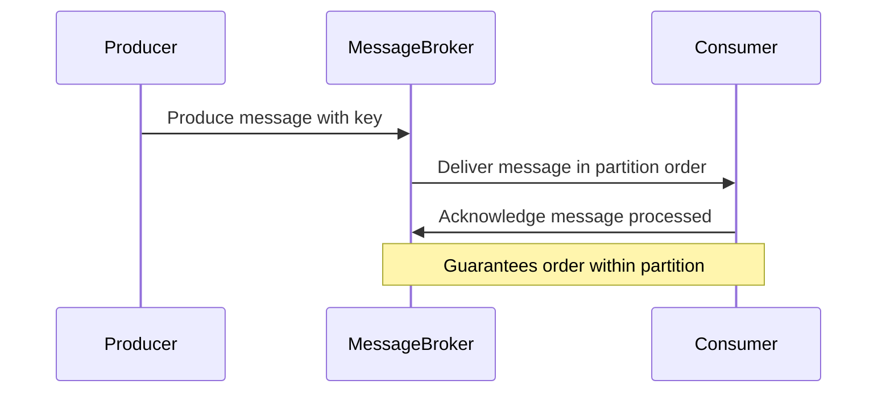

## Introduction
In distributed systems, ensuring that messages are delivered and processed in the exact order they were sent can be crucial for maintaining data consistency and integrity. This pattern is especially relevant in scenarios such as financial transactions, where the order of operations can impact the end results. 

## Architectural Approaches

### Ordering at the Source
One common approach to ensuring message ordering is to enforce ordering at the source itself. This can involve batching messages before they are sent and ensuring each batch retains order. 

### Partitioning
By partitioning data based on keys (such as customer ID or transaction ID), you can ensure that messages within the same partition are processed in order. This is widely used in systems like Kafka, where messages in a partition are always consumed in sequence.

### Total Ordering
In cases where global ordering is required, a total order broadcast or central sequencing service can be implemented. However, this approach may introduce bottlenecks and reduce overall system throughput.

## Paradigms and Best Practices

- **Idempotency**: Ensure that your message processing logic is idempotent. This means that processing the same message multiple times will produce the same result. This is critical in systems where message redelivery can occur.
  
- **Acknowledgements**: Use acknowledgments to ensure that messages have been successfully processed and can be removed from the queue.

- **Dead Letter Queues**: Implement these to handle messages that fail to process repeatedly, ensuring that such scenarios do not disrupt the order of messages being processed.

## Example Code
Here is a basic example of how Kafka can be used to ensure message ordering through partitioning:

```java
Properties props = new Properties();
props.put("bootstrap.servers", "localhost:9092");
props.put("key.serializer", "org.apache.kafka.common.serialization.StringSerializer");
props.put("value.serializer", "org.apache.kafka.common.serialization.StringSerializer");

// Produce messages
KafkaProducer<String, String> producer = new KafkaProducer<>(props);
for (int i = 0; i < 10; i++) {
    String key = "orderId-" + (i % 5); // Partition key
    String value = "Order details for " + i;
    producer.send(new ProducerRecord<>("order-topic", key, value));
}
producer.close();
```

## Diagrams
Here is a Mermaid UML sequence diagram showcasing a message being processed through different components guaranteeing ordering:



## Related Patterns
- **Event Sourcing**: Captures changes to an application state as a sequence of events.
- **Saga Pattern**: Deals with managing failures in long-lived transactions, typically found in multi-step operations distributed across microservices.

## Additional Resources

- [Kafka: The Definitive Guide](https://example.com/kafka-guide)
- [Designing Data-Intensive Applications by Martin Kleppmann](https://example.com/designing-data-intensive)
- [AWS Ordering Guarantees](https://example.com/aws-ordering)

## Summary
Ensuring message ordering is a fundamental requirement for applications where the sequence of operations affects the outcome. By adopting strategies like message partitioning, ensuring idempotency, and leveraging tools like Kafka, system architects can create robust, order-sensitive distributed systems. Understanding the trade-offs and complexities involved in implementing these guarantees is critical to designing high-performance stream processing applications.
