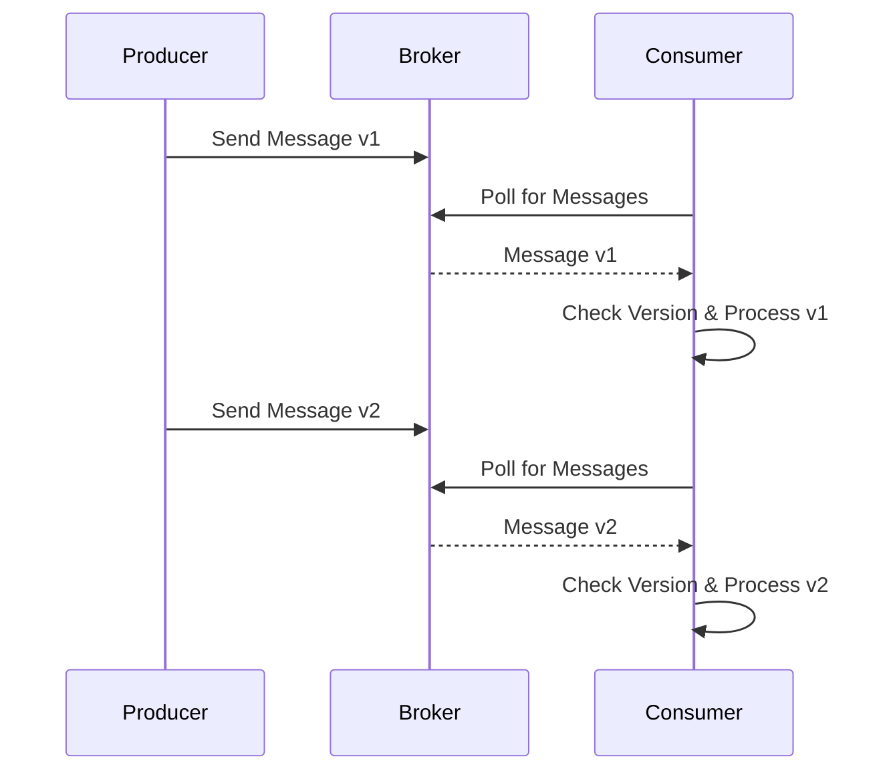

## Introduction

In distributed systems, especially in the realm of stream processing, the schemas of messages evolve over time. A systematic way to manage these schema changes is through versioning for messages, which helps maintain backward and forward compatibility. This design pattern focuses on embedding version information within messages, allowing different components of a system to handle schema changes gracefully.

## Problem Statement

As systems evolve, message formats often change due to new business requirements or optimizations. Handling these changes without causing disruptions or requiring all systems to update simultaneously is crucial. Traditional systems might break if they consume messages they weren't designed to handle, leading to errors or data loss.

## Solution

The **Versioning for Messages** pattern involves including version information within each message. This information can be used by consumers to process the message correctly, irrespective of the schema version. By adopting this approach, systems can:

- Data producers and consumers evolve independently.
- Ensure backward compatibility by maintaining support for older message formats.
- Enable forward compatibility through planned evolution strategies.

### Implementation Steps

1. **Add Version Information**: Embed a version identifier within each message's metadata. This is often a simple integer or string.
2. **Version-Related Logic**: Implement logic in the message consumers to check the version and process the message accordingly.
3. **Schema Registry**: Utilize a schema registry to manage and serve different versions of message schemas.
4. **Graceful Degradation**: For unsupported future versions, implement graceful error handling or fallbacks.

### Example Code

Here's an illustrative example in Java, using a Kafka-based system with Avro serialization:

```java
public class MessageProcessor {
    
    public void processMessage(GenericRecord message) {
        int version = (int) message.get("version");
        
        switch (version) {
            case 1:
                handleVersion1(message);
                break;
            case 2:
                handleVersion2(message);
                break;
            default:
                handleUnknownVersion(version);
        }
    }
    
    private void handleVersion1(GenericRecord message) {
        // Processing logic for schema version 1
    }
    
    private void handleVersion2(GenericRecord message) {
        // Processing logic for schema version 2
    }

    private void handleUnknownVersion(int version) {
        // Logic for handling unknown or new versions
    }
}
```

### Diagram

Here’s a basic Mermaid sequence diagram showing message processing with different schemas:



## Related Patterns

- **Schema Evolution**: Often used in conjunction with message versioning to manage how data schemas change over time.
- **Backward Compatibility**: Ensures that newer producers can communicate with older consumers without errors.
- **Forward Compatibility**: Allows older producers to send messages to newer consumers.

## Additional Resources

- Blog: [Handling Versioning in Stream Processing Systems](https://www.example.com/blog/stream-processing-versioning)
- Documentation: [Kafka Schema Registry](https://docs.confluent.io/current/schema-registry/index.html)
- Book: [Designing Data-Intensive Applications](https://www.oreilly.com/library/view/designing-data-intensive-applications/9781491903063/)

## Summary

The **Versioning for Messages** pattern provides a robust framework for handling schema changes in distributed systems. By embedding versioning information directly into messages, systems can manage schema evolution without imposing strict upgrade requirements on all components simultaneously. This approach helps maintain system stability and continuous operation amid the inevitable changes that occur in software lifecycle management.
