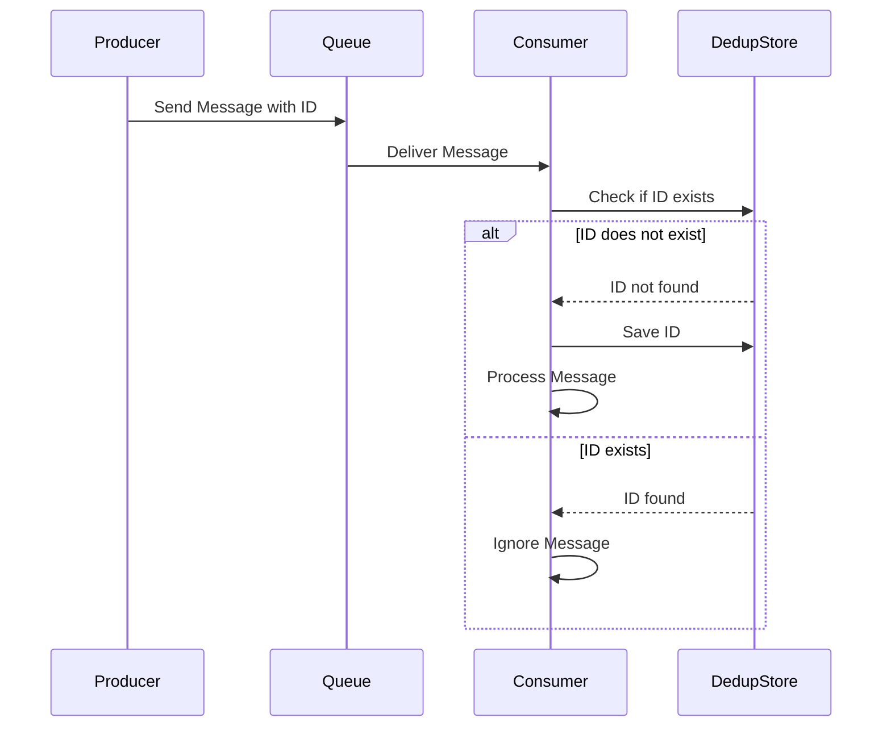

## Message Deduplication

### Description

Message Deduplication is a crucial design pattern in distributed messaging systems, employed to remove duplicate messages that may be introduced due to various network issues or system design, and ensure the integrity and accuracy of data processing. The goal is to ensure that each distinct message is processed exactly once, maintaining consistent and reliable communication within distributed applications.

### Architectural Approaches

1. **Idempotent Consumers**: 
   - Design consumers to perform the same action multiple times without differing outcomes, effectively tolerating duplicates.

2. **Unique Message Identifiers**:
   - Each message is assigned a unique identifier. Upon receiving a message, the consumer checks a store (often a distributed database) to determine if the message has already been processed.

3. **Hashing Content**:
   - Compute a hash of the message content at the producer or consumer. If the hash matches a hash of a previously processed message, the message is identified as a duplicate and ignored.

4. **Message Batching with Checkpoints**:
   - Process messages in batches with periodic checkpoints. Log processed message identifiers in each checkpoint for reference.

5. **Sequence Numbering**:
   - Assign sequence numbers to messages. Consumers track the last processed sequence number, discarding any messages with already processed sequence numbers.

### Best Practices

- **Distributed Caches**: Utilize distributed caches with specified eviction times for storing hash or unique identifiers of processed messages, ensuring not to overflow memory.
  
- **Database Indexes**: Use indexed database tables efficiently to store message identifiers, optimizing for fast deduplication checks.

- **Consistent Hashing Across Nodes**: When using a distributed setup, consistently hash messages across nodes to mitigate discrepancies.

- **Logging and Monitoring**: Implement comprehensive logging and monitoring to audit deduplication activities and quickly identify failures.

### Example Code

```java
import java.util.Set;
import java.util.Collections;
import java.security.MessageDigest;

public class MessageProcessor {
    private Set<String> processedMessageIds = Collections.synchronizedSet(new HashSet<>());

    public void processMessage(String message) throws Exception {
        String messageId = generateHash(message);
        if (!processedMessageIds.contains(messageId)) {
            // Process the message
            System.out.println("Processing message: " + message);
            processedMessageIds.add(messageId);
        } else {
            System.out.println("Duplicate message ignored: " + message);
        }
    }

    private String generateHash(String content) throws Exception {
        MessageDigest digest = MessageDigest.getInstance("SHA-256");
        byte[] hash = digest.digest(content.getBytes("UTF-8"));
        return java.util.Base64.getEncoder().encodeToString(hash);
    }
}
```

### Diagrams



### Related Patterns

- **Idempotent Receiver Pattern**: Ensures that operations can be applied multiple times without changing the result beyond the initial application.
  
- **Message Routing Patterns**: Coordinate message delivery to ensure deduplication logic is consistently applied.

- **Retry Patterns**: Handle message reprocessing logic to complement deduplication mechanisms.

### Additional Resources

- [Apache Kafka Documentation](https://kafka.apache.org/documentation/)
  
- [Amazon SQS Message Deduplication](https://docs.aws.amazon.com/AWSSimpleQueueService/latest/SQSDeveloperGuide/QueueName.html)

- **Book**: "Enterprise Integration Patterns: Designing, Building, and Deploying Messaging Solutions" by Gregor Hohpe and Bobby Woolf

### Summary

Message Deduplication is essential in ensuring accurate data processing within distributed systems by eliminating duplicate messages. Incorporating techniques like unique message identifiers, idempotent consumers, and hashing not only enhances system reliability but also maintains performance. By building robust deduplication strategies, modern stream processing systems can achieve high levels of data integrity and resilience.
