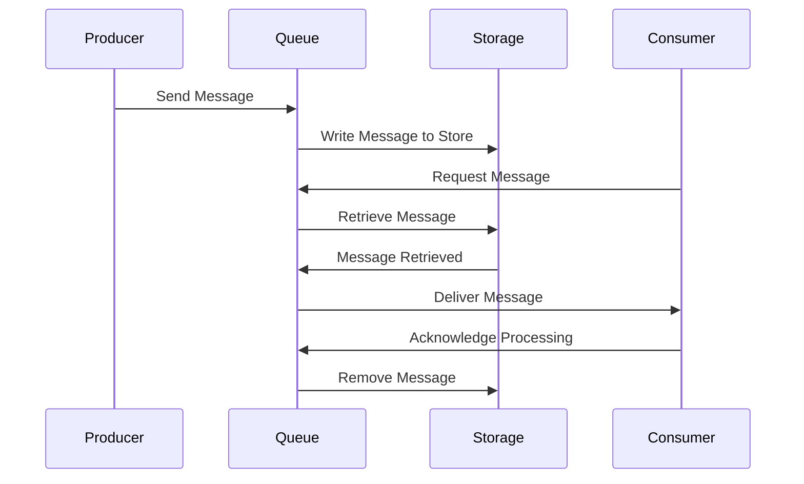
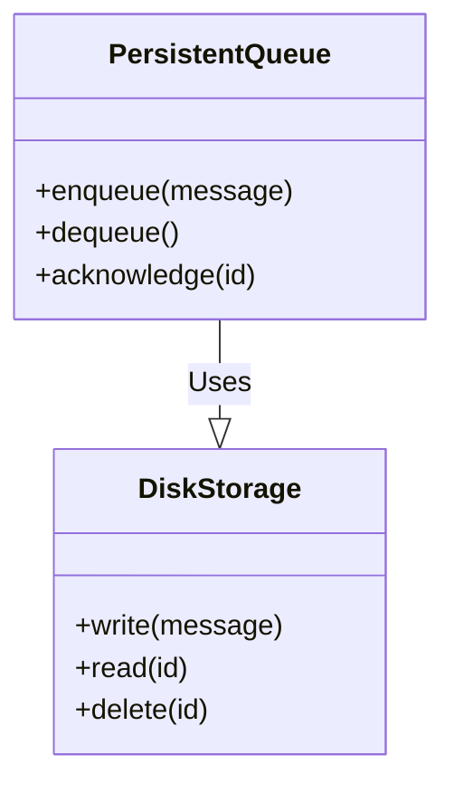

## Overview

Persistent Queues are a fundamental design pattern in cloud computing and stream processing architectures, providing a way to store messages in durable storage before they are consumed by downstream systems. This pattern is essential for scenarios where ensuring message delivery and durability is critical. By leveraging external storage, such as disk or distributed file systems, persistent queues protect against data loss from system crashes, network failures, or power outages.

## Key Concepts

- **Durability**: Ensures that messages are written to non-volatile storage, allowing them to be recovered even if the system fails.
- **Resilience**: Enhances the robustness of the system as messages can be re-queued or replayed from the persistent store.
- **Scalability**: Can support large volumes of data and numerous concurrent consumers by balancing load across multiple storage instances.
- **Throughput vs. Latency**: Persistent queues may increase latency due to disk writes but generally enable higher throughput by decoupling producers and consumers.

## Architectural Considerations

When implementing Persistent Queues, consider the following:

- **Storage Backend**: Choose appropriate storage like local disk, cloud storage services, or distributed systems like Kafka or AWS SQS that provide built-in persistence.
- **Acknowledgments**: Implement acknowledgment mechanisms to ensure messages are successfully processed before being removed from the queue.
- **Replication and Fault Tolerance**: Design the system to replicate data across multiple nodes or regions to protect against widespread outages.
- **Security**: Secure message data at rest and in transit using encryption and access controls.

## Example: RabbitMQ with Disk-Based Queues

RabbitMQ can use disk storage for its queues to ensure messages are not lost:

```yaml
queue_declare: 
  queue: example_persistent_queue
  durable: true
```

In this RabbitMQ configuration, the queue is set to `durable: true`, indicating that the queue should survive server restarts.

## Diagrams

### Persistent Queue Architecture



### Class Diagram for Persistent Queue



## Related Patterns

- **Idempotent Consumer**: Ensures that consumers can process messages multiple times without adverse effects, which pairs well with persistent queues managing duplicates.
- **Retry Pattern**: Works alongside persistent queues to retry message processing after a transient failure.
- **Circuit Breaker**: Monitors failures and helps keep the system stable by cutting off requests temporarily when fault thresholds are exceeded.

## Additional Resources

- [RabbitMQ Documentation on Message Durability](https://www.rabbitmq.com/confirms.html)
- [Apache Kafka Persistence Mechanisms](https://kafka.apache.org/documentation/#basic_concepts_messages)
- [AWS SQS and Message Durability](https://docs.aws.amazon.com/AWSSimpleQueueService/latest/SQSDeveloperGuide/sqs-message-lifecycle.html)

## Summary

By implementing Persistent Queues, organizations can greatly enhance the reliability and durability of their messaging systems, ensuring critical data is not lost even during periods of instability. While introducing some additional latency due to storage operations, the benefits of data protection and system resilience far outweigh these considerations. This pattern is crucial for building robust stream processing systems that need to process large volumes of data consistently.
