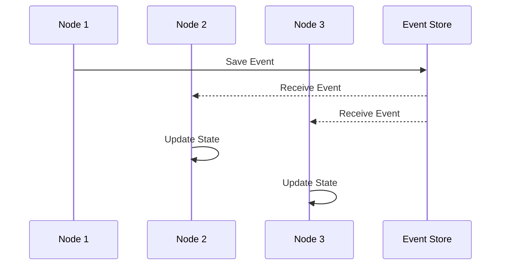

State synchronization is a fundamental design pattern in distributed systems that ensures application state is consistent across multiple nodes. It plays a crucial role in maintaining data consistency, availability, and reliability in cloud-native applications that leverage microservices or distributed architectures.

## Description

In distributed applications, state synchronization ensures that all nodes work with the most recent and consistent data. This prevents discrepancies and ensures seamless operation when a state change occurs. Whether you are dealing with cluster coordination, replicated databases, or session management in web applications, maintaining synchronized state is essential for avoiding errors and improving user experience.

### Key Challenges Addressed

- **Consistency**: Synchronization ensures that state updates reflect across all nodes without inconsistency.
- **Availability**: Enables high availability by ensuring nodes have up-to-date information without waiting for other nodes.
- **Scalability**: Managing state efficiently allows scaling out services to meet increasing demand without bottlenecks caused by stale data.

## Architectural Approaches

### 1. **Event Sourcing**

Event sourcing uses events to represent state changes in the system. Each node in a distributed system replays these events to update its state. This ensures that different pieces of the system reach the same state independently.

#### Example Code

```scala
// Scala implementation of Event Sourcing
case class Event(id: String, data: String)

trait EventStore {
  def saveEvent(event: Event): Unit
  def getEventsSince(lastEventId: String): Seq[Event]
}

class EventSourcedApplication(eventStore: EventStore) {
  private var lastEventId: String = _

  def processEvents(): Unit = {
    val events = eventStore.getEventsSince(lastEventId)
    events.foreach { event => 
      applyEvent(event)
      lastEventId = event.id
    }
  }

  private def applyEvent(event: Event): Unit = {
    // Apply event details to update the state in this node
  }
}
```

### 2. **State Replication**

State replication involves duplicating state across nodes, often through leader-follower patterns or quorum-based consensus methods. Technologies like Apache Kafka and Confluent Platform enable effective state replication.

#### Example Code

```java
// Java pseudo-code for state replication mechanism
public class StateReplicator {
  
  private State currentState;
  
  public void replicateState(String stateData) {
    // Convert stateData into a format suitable for all nodes
    distributeToAllNodes(stateData);
  }

  public synchronized void applyState(String newStateData) {
    currentState = deserializeState(newStateData);
  }

  private void distributeToAllNodes(String stateData) {
    // Logic to send stateData to all nodes in the network
  }
}
```

### 3. **Coordination Services**

Services like Apache Zookeeper and HashiCorp Consul provide mechanisms to synchronize state through locks, queues, or watchers, facilitating coordination in distributed applications.

## Diagrams



## Related Patterns

- **Command Query Responsibility Segregation (CQRS)**: Separates read and write operations for better scalability in distributed environments.
- **Saga Pattern**: Manages state consistency across microservices transactions.
- **Leader Election**: Ensures that a single node is responsible for coordination tasks.

## Additional Resources

- "Designing Data-Intensive Applications" by Martin Kleppmann
- Apache Kafka Documentation: [Kafka Overview](https://kafka.apache.org/documentation/)
- Consul Coordination: [Consul by HashiCorp](https://www.consul.io/docs)

## Summary

State synchronization is a key pattern for ensuring consistency across distributed systems. This pattern enables systems to handle complex data update scenarios while maintaining high availability and data integrity. By leveraging event sourcing, state replication, and coordination services, developers can build robust, scalable applications that manage distributed state effectively in cloud environments.
