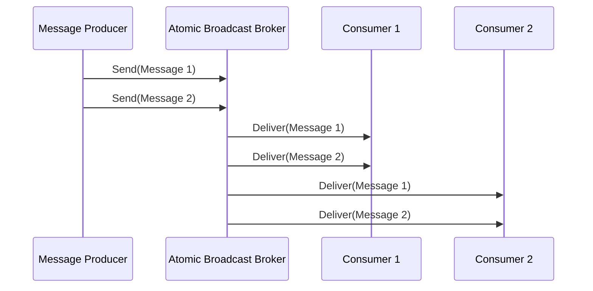

## Atomic Broadcast

### Description

Atomic broadcast, also known as total order broadcast, is a design pattern utilized in distributed systems to ensure that messages are delivered to all consumers in the exact same order. This consistency in message delivery is crucial for systems that rely on synchronization and coordination across distributed components, such as configurations, updates, or ledger operations.

### Architectural Approaches

Atomic broadcast can be achieved using several architectural approaches:

1. **Consensus Algorithms**: Protocols like Paxos and Raft are widely used to achieve consensus across distributed nodes, ensuring that messages processed by all nodes are in the same order.

2. **Sequence Numbering**: Assign a unique, incrementing sequence number to each message before broadcasting. Consume messages based on their sequence numbers to ensure ordered delivery.

3. **Clock Synchronization**: Using synchronized clocks (e.g., synchronized via the Precision Time Protocol) to ensure all messages are time-stamped accurately across components.

4. **Transaction Logs and Replication**: Employing a shared transaction log or ledger where messages are appended in order. Each consumer reads from this log, thereby maintaining consistent ordering.

### Best Practices

- **Logical Clocks**: Use logical clocks instead of physical time to avoid issues due to clock drift and network latency. Lamport timestamps, for instance, can help maintain order without relying heavily on synchronized physical clocks.

- **Idempotency**: Consumers should be designed to handle the same message multiple times without adverse effects, supporting systems that prioritize exactness over performance.

- **Partitioning**: Suitable use of partitioning can help in scaling atomic broadcasts while maintaining order within partitions.

### Example Code

Below is a conceptual example using a simple sequence numbering approach in a hypothetical message broker.

```scala
case class Message(msgId: Long, content: String)

class AtomicBroadcastBroker {
  private var sequenceId: Long = 0
  private val queue = scala.collection.mutable.Queue[Message]()

  def sendMessage(content: String): Long = {
    sequenceId += 1
    val message = Message(sequenceId, content)
    queue.enqueue(message)
    message.msgId
  }

  def receiveMessages(): List[Message] = {
    queue.dequeueAll(_ => true).toList // Dequeing all messages to simulate broadcasting
  }
}

object BroadcastExample extends App {
  val broker = new AtomicBroadcastBroker
  broker.sendMessage("Configuration update 1")
  broker.sendMessage("Configuration update 2")

  val consumers = List("Consumer1", "Consumer2")

  consumers.foreach { consumer =>
    println(s"$consumer received: " + broker.receiveMessages().map(_.content).mkString(", "))
  }
}
```

### Diagrams



### Related Patterns

- **Publish-Subscribe**: A messaging pattern where messages are broadcast to all subscribers, useful to understand how atomic broadcast fits within broader messaging systems.
- **Leader Election**: Ensures that the state of leader nodes responsible for managing atomicity remains consistent.
- **Distributed Locks**: Usage of locks where strong consistency is required in operations.

### Additional Resources

- [The Raft Consensus Algorithm](https://raft.github.io/)
- [Understanding Paxos by Lamport](http://research.microsoft.com/en-us/um/people/lamport/pubs/paxos-simple.pdf)
- [Kafka as a Distributed Log](https://kafka.apache.org/documentation/streams/)

### Final Summary

Atomic broadcast is a crucial pattern for ensuring consistent message delivery across distributed systems. By using consensus protocols, sequence numbering, or effective partitioning strategies, systems can maintain the correct order of message processing across nodes, providing the foundation for highly reliable and consistent distributed applications. Implementations must also incorporate idempotency and logical clocks to tackle the nuances of distributed environments effectively.
