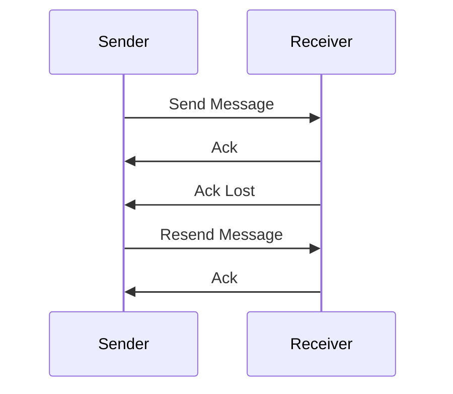
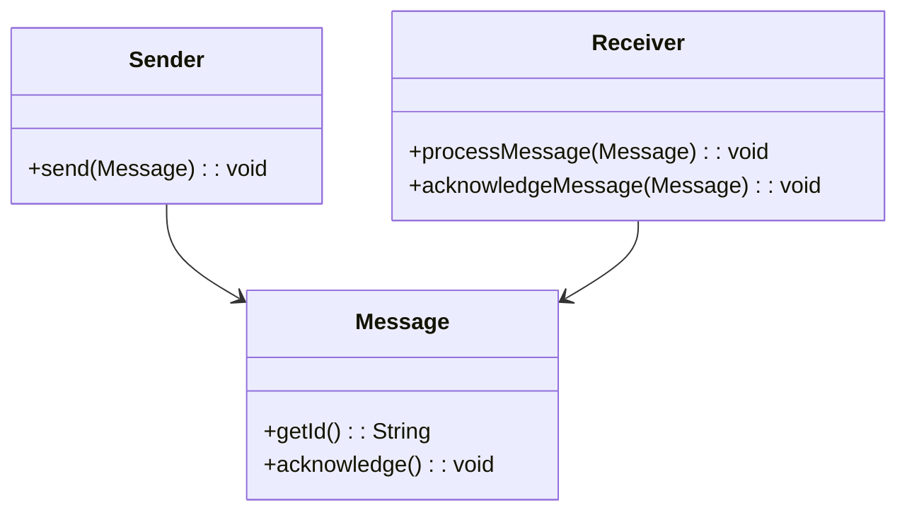

## Introduction

The At-Least-Once Delivery pattern is crucial in distributed and stream processing systems, aiming to guarantee that messages are not lost during transmission. However, this can result in messages being delivered multiple times, leading to duplicates. This trade-off is often acceptable in situations where message loss is more critical than duplicity, and where idempotent message processing is feasible to handle redundancies.

## Architectural Approach

In an At-Least-Once Delivery pattern, the system acknowledges receipt of messages but ensures persistence before acknowledging to the sender. If acknowledgment is not received by the sender, it resends the message, leading to potential duplicates. This pattern requires the receiving end to handle these duplicates to avoid processing issues.

### Key Characteristics:
- **Acknowledgment Mechanism**: Messages are sent until acknowledgment from the receiver is received.
- **Stateful Processing**: The receiver must maintain state to determine whether a message has already been processed.
- **Idempotency**: Receivers should be designed using idempotent operations to handle duplicate messages seamlessly.

## Best Practices

- **Idempotent Operations**: Develop processing functions that can handle duplicates without adverse effects on the final state.
- **Efficient Acknowledgment**: Minimize delays in acknowledgment to prevent unnecessary message duplication.
- **Consistent Logging**: Use detailed logging to trace message delivery and duplication to aid in debugging and performance tuning.
- **Deduplication Strategies**: Implement deduplication strategies using unique message IDs or sequence numbers.

## Example Code

Here's a simple illustration using a fictional messaging framework:

```java
import messaging.*;

public class MessageProcessor {
    
    private Set<String> processedMessageIds = new HashSet<>();
    
    public void processMessage(Message message) {
        String messageId = message.getId();
        if (!processedMessageIds.contains(messageId)) {
            // Process the message
            System.out.println("Processing message: " + messageId);
            processedMessageIds.add(messageId);
            acknowledgeMessage(message);
        } else {
            System.out.println("Duplicate message detected: " + messageId);
        }
    }
    
    private void acknowledgeMessage(Message message) {
        // Send acknowledgment back to sender
        message.acknowledge();
    }
}

```

## Diagrams

### Sequence Diagram



### Class Diagram



## Related Patterns

- **Exactly-Once Delivery**: Ensures a message is delivered and processed once without duplicates.
- **At-Most-Once Delivery**: Provides best-effort delivery with a guarantee of no duplicates, risking message loss.

## Additional Resources

- [Idempotency in Distributed Systems](https://example.com/idempotency)
- [Reliable Message Delivery Protocols](https://example.com/reliable-delivery)
- [Stream Processing with Apache Kafka](https://example.com/kafka-streams)

## Summary

The At-Least-Once Delivery pattern is an essential approach in systems where message loss is non-negotiable. While it does introduce the complexity of handling duplicate messages, careful design through idempotent operations and efficient acknowledgment mechanisms can mitigate potential downsides. This pattern finds widespread use in systems where reliability underpins functional integrity, such as in financial transactions or critical notifications.
