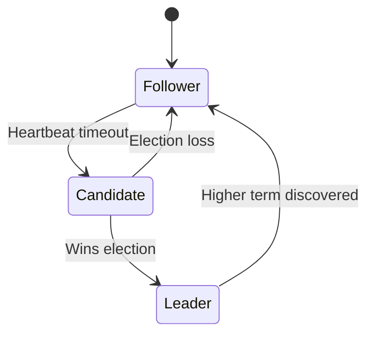

## Introduction

Consensus algorithms are pivotal in distributed systems to ensure reliability, consistency, and coordination among nodes. These algorithms enable systems to agree on a single version of truth or course of action, which is critical for functionalities like leader election, state machine replication, and managing databases.

### Context

In distributed systems, maintaining consistency and coordination between multiple nodes is essential for seamless operation and reliability. Data consistency, fault tolerance, and distributed decision-making necessitate consensus among system components. Without effective consensus mechanisms, distributed systems may encounter states of inconsistency, split-brain scenarios, and potential data loss.

### Problem

Achieving consensus in a distributed network poses several challenges, including network latency, message loss, node failures, and the inherent lack of a central coordinator. The consensus algorithm addresses these issues by providing a structured method for nodes to come to an agreement even when some nodes may be down or messages might not reach their destination.

### Solution

To tackle the problem of consensus in distributed networks, algorithms like Paxos and Raft are employed. These algorithms provide a systematic approach to achieve agreement:

- **Paxos**: A family of protocols for solving consensus issues that is known for its theoretical soundness and correctness. It handles network failures and node crashes while ensuring that consensus is achieved.

- **Raft**: A consensus algorithm designed to be understandable and implementable. It simplifies the Paxos algorithm by introducing a more structured approach and a clear leader election process that helps maintain system consistency and state.

### Use Cases

- **Leader Election**: Deciding which node should act as the leader or coordinator. Consensus ensures that only one node is elected as the leader at any time, preventing conflicts and ensuring steady leadership.
  
- **Distributed Databases**: In databases like Apache Cassandra, consensus algorithms facilitate coordination across database nodes, thus ensuring that updates are consistently applied and once a transaction commits, all nodes reflect this state change.

- **Blockchain Networks**: Distributed ledger systems like blockchain also employ consensus mechanisms to allow distributed trust and agree upon the blocks to be appended to the chain.

### Implementation

Example pseudo-code illustrating a basic Raft-like leader election process:

```scala
case class Node(id: String, state: String, term: Int)

class RaftNode(node: Node, clusterNodes: Seq[Node]) {

  def startElection(): Unit = {
    println(s"Node ${node.id} initiating election for term ${node.term + 1}")

    // Vote for self and request votes from cluster nodes
    var votes = 1
    clusterNodes.foreach { n =>
      // Request vote from peer nodes (simplified logic)
      if (requestVote(n, node.term + 1)) {
        votes += 1
      }
    }

    // Check if enough votes are received
    if (votes > clusterNodes.size / 2) {
      println(s"Node ${node.id} elected as leader for term ${node.term + 1}")
      node.state = "Leader"
      node.term += 1
    }
  }

  def requestVote(peer: Node, term: Int): Boolean = {
    // Simplified vote granting logic
    if (term > peer.term) {
      peer.term = term
      println(s"Node ${peer.id} voted for node ${node.id} for term ${term}")
      true
    } else false
  }
}
```

### Diagrams

#### Example Raft State Transition Diagram



### Related Patterns

- **Leader Election Pattern**: Direct correlation with consensus algorithms, focusing on establishing a leader amidst a group of peer nodes.
- **Eventual Consistency**: Often used in conjunction in scenarios where strict global consistency is not required, but eventual consensus is achieved.

### Additional Resources

- "Paxos Made Simple" by Leslie Lamport
- "In Search of an Understandable Consensus Algorithm" (Raft paper) by Diego Ongaro and John Ousterhout
- Distributed Systems: Principles and Paradigms by Andrew S. Tanenbaum

### Summary

Consensus algorithms form the backbone of reliable distributed systems, providing mechanics to achieve consistent states across a network. Algorithms like Paxos and Raft enable systems to tackle challenges of distributed agreement and ensure robust, fault-tolerant architectures. Understanding and implementing these algorithms are crucial for architects and developers aiming to develop efficient, scalable systems.
