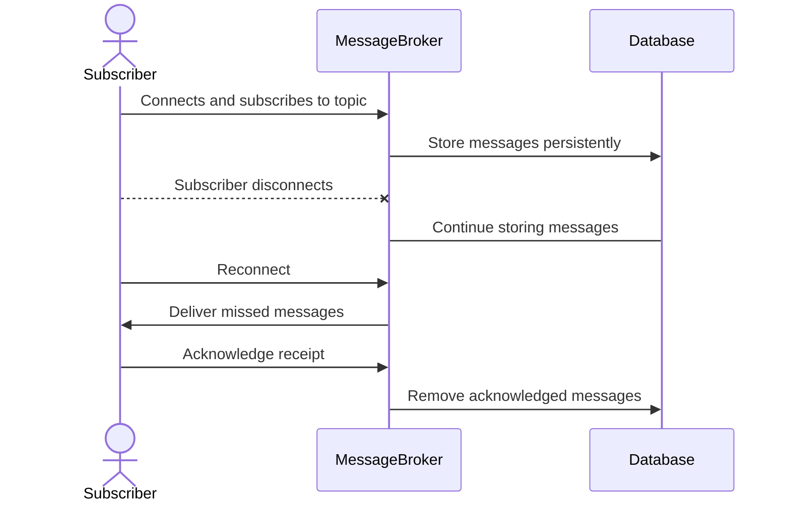

## Durable Subscriptions

### Description

The Durable Subscriptions pattern addresses the need to maintain and manage subscription states over time within a messaging system. This design pattern ensures that subscribers can receive all messages sent during periods when they were offline or temporarily disconnected. The pattern is common in systems where reliable message delivery and guaranteed message processing are essential for business functionality.

### Architectural Approaches

1. **Persistent Message Storing**: Use databases or message queues with built-in persistence to store messages securely until subscribers acknowledge receipt. This method leverages storage systems such as relational or NoSQL databases and integrates with streams or event processing engines.

2. **Acknowledgment Protocols**: Implement acknowledgment protocols that require subscribers to confirm message receipt. Leveraging distributed systems capabilities, acknowledgments ensure messages are only removed from store when confirmed by the subscriber.

3. **Replayability**: Systems should allow messages to be replayed, ensuring subscribers can receive any messages they missed during downtime. Typical implementations include message brokers like Kafka or Pulsar, which naturally support message replay.

### Best Practices

- **Efficient State Management**: Properly design state management to ensure minimal overhead on the system, using efficient data structures and storage solutions.
  
- **Scalability**: Design the system to accommodate an increasing number of subscribers without degrading performance, possibly utilizing cloud scalability.
  
- **Error Handling and Retry Mechanisms**: Implement robust error handling and automatic retry mechanisms to handle failed message deliveries and ensure eventual consistency.

### Example Code

Below is an example of how you might implement durable subscriptions using Apache Kafka for a Scala application.

```scala
import org.apache.kafka.clients.consumer.{ConsumerConfig, KafkaConsumer}
import java.util.Properties
import scala.collection.JavaConverters._

object DurableSubscriber {
  def main(args: Array[String]): Unit = {
    val config = new Properties()
    config.put(ConsumerConfig.BOOTSTRAP_SERVERS_CONFIG, "localhost:9092")
    config.put(ConsumerConfig.GROUP_ID_CONFIG, "durable_group")
    config.put(ConsumerConfig.ENABLE_AUTO_COMMIT_CONFIG, "false")
    config.put(ConsumerConfig.AUTO_OFFSET_RESET_CONFIG, "earliest")
    config.put(ConsumerConfig.KEY_DESERIALIZER_CLASS_CONFIG, "org.apache.kafka.common.serialization.StringDeserializer")
    config.put(ConsumerConfig.VALUE_DESERIALIZER_CLASS_CONFIG, "org.apache.kafka.common.serialization.StringDeserializer")

    val consumer = new KafkaConsumer[String, String](config)
    consumer.subscribe(List("example-topic").asJava)

    try {
      while (true) {
        val records = consumer.poll(java.time.Duration.ofSeconds(1))
        for (record <- records.asScala) {
          println(s"Received message: ${record.value()} at offset ${record.offset()}")
          consumer.commitSync() // Ensure message is marked as processed
        }
      }
    } finally {
      consumer.close()
    }
  }
}
```

### Example Diagram

Below is a Mermaid sequence diagram illustrating the process of a durable subscription:



### Related Patterns

- **Publish-Subscribe**: A foundational pattern often enhanced by durable subscriptions for ensuring reliability.
  
- **Competing Consumers**: Deals with multiple consumers listening on the same channel, where durable subscriptions might aid in load balancing.

- **Message Resilience**: Techniques to ensure message delivery under varying network conditions and consumer availability.

### Additional Resources

- [Apache Kafka Documentation](https://kafka.apache.org/documentation/)
- [Cloud Pub/Sub for Real-time Messaging](https://cloud.google.com/pubsub/docs/overview)
- [AWS SNS Subscription Models](https://aws.amazon.com/sns/)

### Summary

Durable Subscriptions are crucial in creating robust stream processing and messaging systems where message delivery and processing reliability are paramount. By implementing this pattern, you can ensure that subscribers never miss a critical message, preserving the integrity and reliability of your application. Whether used alongside cloud services like AWS, Azure, or GCP, or implemented on-premises, durable subscriptions facilitate greater system resilience and user satisfaction.
