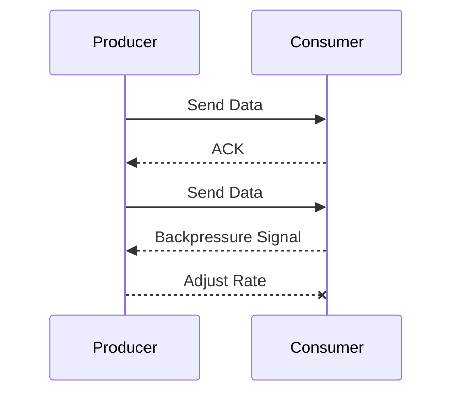

## Overview

Backpressure Protocols are critical in stream processing systems, providing a method where consumers can signal producers to moderate the production rate. This helps align the consumption capacity of the consumer with the production rate of the producer, ensuring efficient data flow without overwhelming system resources.

## Detailed Explanation

### Purpose

The primary goal of Backpressure Protocols is to maintain system stability and optimal performance in the face of varying loads, especially in distributed stream processing systems. This is achieved by preventing resource overload and potential data loss when consumers can't keep up with the producer's data generation rate.

### How it Works

Backpressure Protocols are typically implemented in systems that follow the reactive stream paradigm. Here is a simple explanation of their functionality:

1. **Data Stream Initialization**: Producers begin sending data to consumers.
2. **Signal Transmission**: As consumers process the data, they continuously evaluate their capacity.
3. **Backpressure Signal**: When a consumer identifies that its processing capabilities are reaching a limit, it sends a backpressure signal to the producer.
4. **Rate Adjustment**: The producer receives the signal and adjusts the data generation rate accordingly.

### Example

The implementation of reactive streams is a common approach to managing backpressure in modern applications. For instance, using a library like Akka Streams allows developers to implement flow-controlled streams easily:

#### Example Code (Scala with Akka Streams)

```scala
import akka.actor.ActorSystem
import akka.stream._
import akka.stream.scaladsl._

implicit val system = ActorSystem("BackpressureExample")
implicit val materializer = ActorMaterializer()

val source = Source(1 to 1000)
val sink = Sink.foreach[Int](println)

val graph = 
  source
    .buffer(10, OverflowStrategy.backpressure)
    .map(_ * 2)
    .async  // Introduces an async boundary
    .to(sink)

graph.run()
```

In this example, `OverflowStrategy.backpressure` is applied to control the data flow, preserving system resources and ensuring that the consumer can manage the incoming data load effectively.

## Diagrams

### UML Sequence Diagram for Backpressure

Here's a UML sequence diagram demonstrating how backpressure is communicated between producer and consumer.



## Architectural Approaches

- **Reactive Streams**: Interfaces with built-in backpressure support, forming a part of numerous frameworks like Akka Streams, Project Reactor, and RxJava.
- **Flow-based Programming**: Focused on building applications around streams aligned with consumer demand for data handling.

## Best Practices

- **Buffering with Limits**: Implement bounded queues to control and buffer data between processing stages.
- **Dynamic Load Balancing**: Distribute the load across multiple consumers to effectively manage varying loads.
- **Monitoring and Alerts**: Set up monitoring to detect bottlenecks and trigger alerts for human intervention when necessary.

## Related Patterns

- **Circuit Breaker**: Prevents a system from being overwhelmed by failing components by stopping the flow until they recover.
- **Bulkhead**: Isolates components to ensure that a failure in one component does not cascade to others.

## Additional Resources

- [Reactive Streams Specification](https://www.reactive-streams.org/)
- [Akka Streams Documentation](https://doc.akka.io/docs/akka/current/stream/index.html)

## Summary

Backpressure Protocols are vital in managing data flow in complex stream processing systems, ensuring efficient resource utilization and stability. By leveraging reactive streams and other flow control paradigms, systems can maintain high performance without overwhelming any part of the data pipeline. Through proper implementation and monitoring, backpressure helps in achieving a responsive and robust system design.
