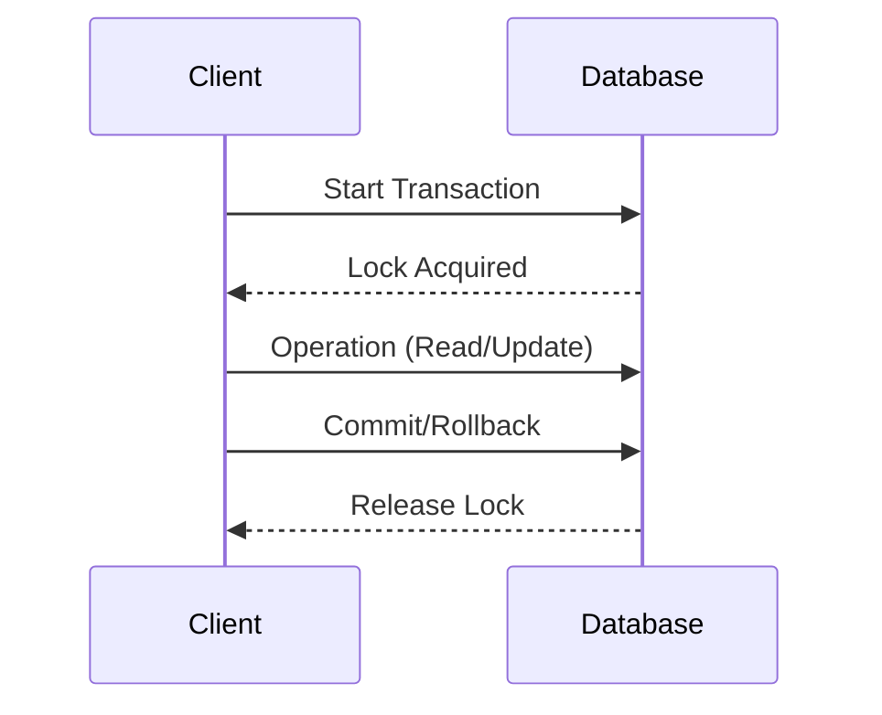

## Introduction to Pessimistic Concurrency Control

Concurrency control is pivotal in systems where multiple transactions occur concurrently. **Pessimistic Concurrency Control (PCC)** is a strategy where a system prevents conflicts by acquiring locks on data resources before operations can proceed. This is particularly useful in scenarios where the high probability of transaction conflicts exists, thereby safeguarding data integrity and consistency.

## Design Pattern Details

### Key Characteristics

- **Locking Mechanism**: PCC relies on locking strategies to prevent other operations from accessing data that a transaction is currently using.
- **Blocking Transactions**: When a lock is acquired, other transactions that require access to the same data must wait until the lock is released.
- **Resource Intensive**: As it involves acquiring locks, this approach can be resource-intensive compared to optimistic concurrency control methods.
- **High Consistency**: Ensures high levels of consistency at the cost of decreased throughput and potential for deadlocks.

### Architectural Approach and Usage

PCC is typically employed in databases like Oracle, Microsoft SQL Server,  and systems requiring high levels of isolation. Here’s a step-by-step breakdown:

1. **Lock Acquisition**: When a transaction begins, it requests a lock on the resource it intends to use.
2. **Operation Execution**: If the lock is granted, the transaction executes its operations.
3. **Lock Release**: Upon completion or abort, the transaction releases the lock, allowing other pending transactions to acquire it.
4. **Conflict Handling**: Conflicts are handled before they occur due to the lock mechanism ensuring only one transaction can modify the data at any given time.

### Implementation Example

Let’s consider an example implementation using Java with JDBC to perform database operations with pessimistic locking:

```java
import java.sql.Connection;
import java.sql.DriverManager;
import java.sql.PreparedStatement;
import java.sql.ResultSet;

public class PessimisticLockingExample {
    public static void main(String[] args) throws Exception {
        Connection connection = DriverManager.getConnection("jdbc:your_database_url", "username", "password");
        
        try {
            connection.setAutoCommit(false);
            
            // Acquire lock on the row with a SELECT FOR UPDATE statement
            PreparedStatement pstmt = connection.prepareStatement("SELECT * FROM accounts WHERE id = ? FOR UPDATE");
            pstmt.setInt(1, 1);
            ResultSet rs = pstmt.executeQuery();
            
            if (rs.next()) {
                double balance = rs.getDouble("balance");
                // Perform account operations
                balance -= 100.00;
                
                // Update the account balance
                PreparedStatement updateStmt = connection.prepareStatement("UPDATE accounts SET balance = ? WHERE id = ?");
                updateStmt.setDouble(1, balance);
                updateStmt.setInt(2, 1);
                updateStmt.executeUpdate();
            }
            
            connection.commit(); 
        } catch (Exception ex) {
            connection.rollback();
            ex.printStackTrace();
        } finally {
            connection.close();
        }
    }
}
```

### Diagrams

Here’s a simple sequence diagram illustrating pessimistic locking:



## Related Patterns

- **Optimistic Concurrency Control**: Contrasts with PCC by allowing transactions to proceed without locks, checking for conflicts only during the commit phase.
- **Two-Phase Locking**: Enforces a protocol that guarantees serializability for transactions, often used in conjunction with PCC.
- **Saga Pattern**: Manages long-running transactions without locking resources for extended periods, commonly used in distributed systems.

## Best Practices

- **Deadlock Prevention**: Ensure the code is designed to avoid deadlock situations by following a consistent order of resource locking.
- **Lock Timeouts**: Implement lock timeouts to handle cases where locks are not released due to failures.
- **Granular Locking**: Use locks at the most granular level possible (e.g., row-level instead of table-level) to enhance concurrency.

## Additional Resources

- [Database Systems: The Complete Book by Hector Garcia-Molina, Jeffrey D. Ullman, Jennifer Widom](https://www.example.com)
- [Oracle Database Documentation - Locking Mechanisms](https://www.oracle.com/database)
- [Microsoft SQL Server Documentation - Transaction Management](https://docs.microsoft.com/en-us/sql/)

## Summary

Pessimistic Concurrency Control is a reliable method for ensuring data integrity in high-conflict environments. By using locks to prevent concurrent transactions from interfering with each other, it offers a strong consistency guarantee at the expense of possible throughput and latency. While it fits well in traditional database systems, it requires careful handling to avoid performance bottlenecks and deadlocks.
