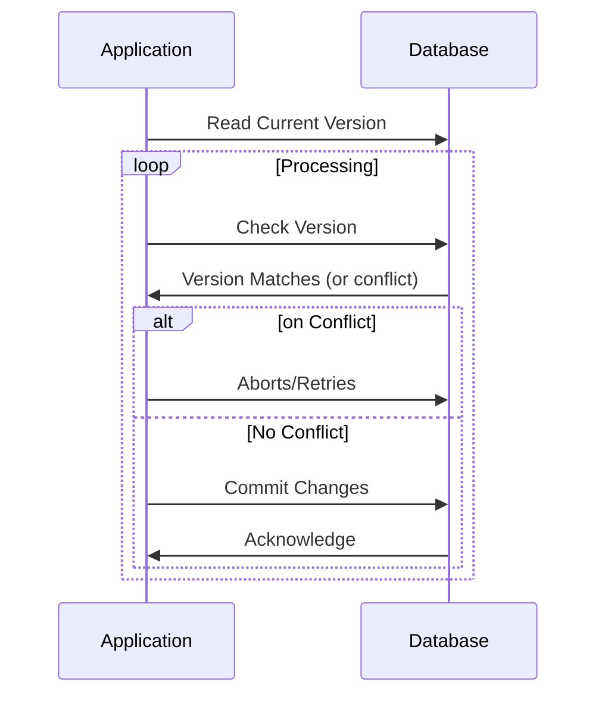

## Overview

Optimistic Concurrency Control (OCC) is a design pattern commonly utilized in systems where conflict is relatively rare but system throughput is critical. This pattern increases system performance by reducing the need for locks during transactions, thus allowing multiple operations to proceed in parallel without interference.

### Key Concepts

- **No Immediate Locks**: Operations execute optimistically without locks, assuming that conflicts are rare.
- **Conflict Detection**: Conflicts are checked at the time of commit. This can be done using mechanism like version numbers or timestamps.
- **Rollback on Conflict**: When a conflict is detected, the operation is aborted or retried, ensuring the data remains consistent.

## Detailed Explanation

Optimistic Concurrency Control works on the principle that most operations do not conflict and therefore can be executed concurrently. By avoiding lock acquisition during transaction processing, the pattern allows for high levels of concurrency and minimizes the blocking of resources.

### Workflow

1. **Transaction Begins**: Operations perform their tasks without acquiring locks.
2. **Versioning/Timestamps**: Each record to be updated contains a version number or timestamp.
3. **Commit Phase**: Before committing, the system checks if the versions/timestamps match what it initially read.
4. **Conflict Resolution**: If a conflict is detected (i.e., data has been modified by another transaction), the system aborts the transaction or retries.
5. **Successful Commit**: If no conflict is detected, the transaction is successfully committed, updating the versions/timestamps.

## Example Code

Here's an example using a simple version-based approach in Java:

```java
public class VersionedEntity {
    private String data;
    private int version;

    public VersionedEntity(String data, int version) {
        this.data = data;
        this.version = version;
    }

    public synchronized boolean updateData(String newData, int expectedVersion) {
        if (this.version != expectedVersion) {
            return false; // Conflict detected
        }
        this.data = newData;
        this.version++;
        return true;
    }
}

// Usage
VersionedEntity entity = new VersionedEntity("initial data", 1);
int currentVersion = entity.getVersion();

// Attempt to update
boolean success = entity.updateData("new data", currentVersion);
if (!success) {
    // Handle conflict (e.g., retry)
}
```

## Diagrams

### Sequence Diagram



## Related Patterns

- **Pessimistic Concurrency Control**: Unlike OCC, this pattern locks resources to prevent conflicts entirely, potentially reducing throughput.
- **Event Sourcing**: Captures changes as a sequence of events; works well with OCC by providing a history to detect versions at different change events.
- **CQRS (Command Query Responsibility Segregation)**: Separates read and write data processing paths to reduce conflicts and optimize operations, complementing OCC for read-heavy applications.

## Additional Resources

- [Concurrency Control in Database Systems](http://example.com/concurrency-database)
- [Implementing Domain-Driven Design by Vaughn Vernon](http://amazon.com/book-link)
- [Optimistic Locking Patterns](http://example.com/optimistic-locking)

## Summary

The Optimistic Concurrency Control pattern is ideal for high-throughput systems where simultaneous operations are more common than conflicts. This pattern increases performance by deferring conflict resolution to the commit phase, using versioning or timestamp comparison to ensure data consistency. It's well-suited for environments with frequent read operations, making it valuable in distributed systems and cloud computing contexts, where managing contention is crucial for scaling effectively.
