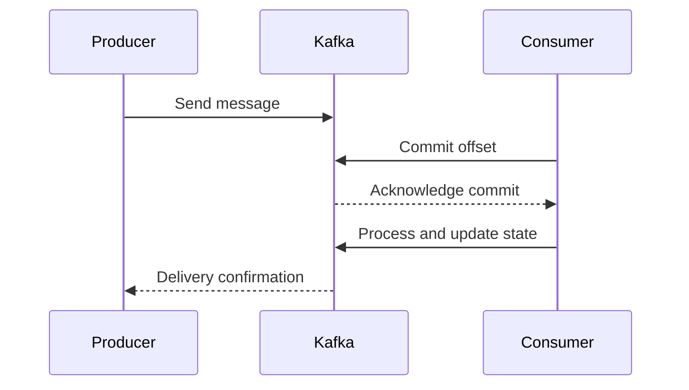

## Introduction

In stream processing, especially within distributed systems, ensuring that operations occur exactly once is crucial to maintain state integrity and prevent duplication of data processing. This pattern is commonly known as "Exactly-Once State Updates," a guarantee vital for scenarios such as financial transactions, maintaining counters, or updating distributed databases.

## Detailed Explanation

### Design Pattern Concept

The "Exactly-Once State Updates" pattern ensures that each operation is applied precisely once, even during retries or failures, which distinguishes it from "at-least-once" or "at-most-once" semantics where duplicates or missed operations may occur.

### Key Challenges

- **Duplicate Processing:** Systems may attempt to apply operations more than once to ensure delivery reliability, leading to duplicate state updates.
- **Loss of Updates:** Improvements may be missed entirely if they are deemed successful without confirmation.
- **Concurrency:** Distributed systems often experience concurrent operations that challenge atomic state updates without locks or transaction management.

### Architectural Approaches

- **Transaction Management:** Implement atomic transactions where updates can be rolled back if an intermediary step fails.
- **Idempotency:** Design operations to be idempotent, meaning applying them more than once does not change the result beyond the initial application.
- **Event Sourcing and Log Compaction:** Use event sourcing to capture every change as an event, enabling replaying or compacting logs to achieve consistency.
- **Offset Management in Stream Processing:** Use systems like Apache Kafka's exactly-once processing capabilities with Kafka Streams or Apache Flink's stateful computations to manage consumer offsets exactly and maintain consistency.

## Example Code

Here's a simple Java example of managing exactly-once state updates using Kafka Streams:

```java
import org.apache.kafka.streams.KafkaStreams;
import org.apache.kafka.streams.StreamsBuilder;
import org.apache.kafka.streams.kstream.KStream;
import org.apache.kafka.streams.kstream.Produced;
import org.apache.kafka.streams.KafkaStreams.StateListener;

public class ExactlyOnceProcessor {

    public static void main(String[] args) {
        StreamsBuilder builder = new StreamsBuilder();
        KStream<String, String> sourceStream = builder.stream("input-topic");

        sourceStream
            .mapValues(value -> processValue(value))
            .to("output-topic", Produced.with(Serdes.String(), Serdes.String()));

        KafkaStreams streams = new KafkaStreams(builder.build(), getStreamsConfig());
        streams.setStateListener((newState, oldState) -> {
            if (newState == KafkaStreams.State.REBALANCING) {
                // Handle state changes for exactly-once
            }
        });

        streams.start();
    }

    private static String processValue(String value) {
        return "Processed: " + value;
    }

    private static Properties getStreamsConfig() {
        Properties props = new Properties();
        props.put(StreamsConfig.APPLICATION_ID_CONFIG, "exactly-once-app");
        props.put(StreamsConfig.BOOTSTRAP_SERVERS_CONFIG, "localhost:9092");
        props.put(StreamsConfig.PROCESSING_GUARANTEE_CONFIG, StreamsConfig.EXACTLY_ONCE_V2);
        return props;
    }
}
```

## Diagrams

### Sequence Diagram



## Related Patterns

- **Idempotent Receiver:** Ensure that repeat message processing does not alter the state incorrectly.
- **Transaction Log Tailing:** Consume records from a log system to keep systems in sync.
- **Stream Aggregation:** Aggregating stream data while maintaining exactly-once guarantees through windowing and computation strategies.

## Additional Resources

- [Apache Kafka Exactly-Once Semantics](https://kafka.apache.org/documentation/#semantics)
- [Stream Processing with Apache Flink](https://nightlies.apache.org/flink/flink-docs-release-1.14/docs/dev/datastream/fault-tolerance/exactly-once/)

## Conclusion

The Exactly-Once State Updates pattern is essential for scenarios necessitating strict consistency in distributed systems. By leveraging strategies like transaction management, idempotency, and effective offset/business transaction handling, systems can robustly manage state with high accuracy and reliability, mitigating risks associated with concurrent and potentially error-prone operations.
