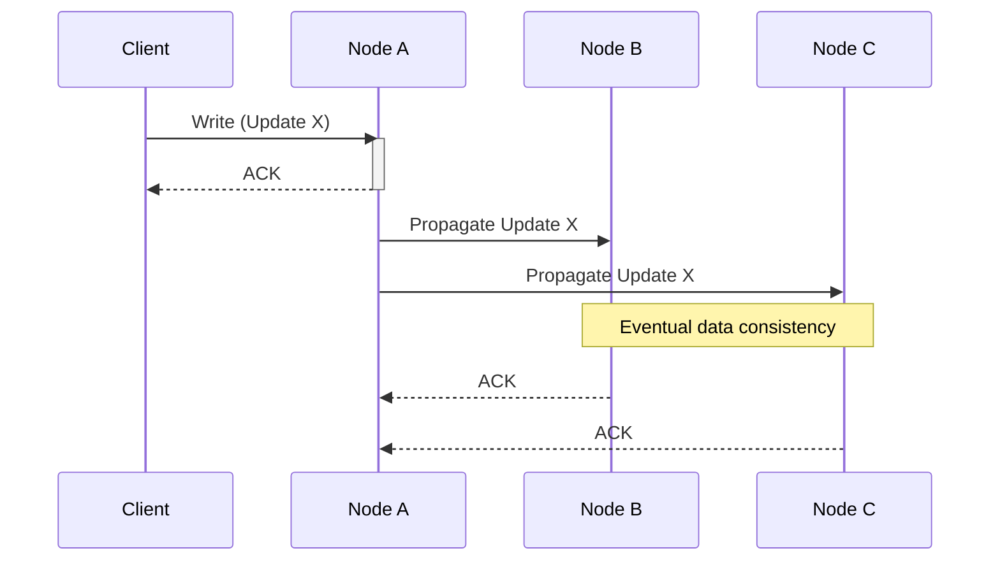

## Overview

Consistency models play a crucial role in cloud computing and distributed systems by determining the visibility and perceived correctness of data across replicated nodes. These models, primarily classified as strong and eventual consistency, dictate how and when updates to data are reflected in a system. Selecting the correct consistency model involves balancing trade-offs between performance, system availability, and data accuracy, making it essential for architecting reliable systems.

## Description

### Strong Consistency

Strong consistency ensures that all replicas of a dataset reflect the most recent write operations. This means that once a write operation is acknowledged, subsequent read operations across any node will return the updated data. This model is akin to sequential consistency and is highly desirable in scenarios demanding high accuracy, such as financial transactions and inventory management. However, the drawback of strong consistency lies in its potential impact on system throughput and response time, as synchronization across nodes can introduce latency.

**Use Cases:**
- Financial services where transactions must be reflected accurately and immediately across all systems.
- Inventory systems that require up-to-date stock levels.

### Eventual Consistency

Eventual consistency offers more flexibility by allowing temporary read discrepancies between nodes. It guarantees that if no new updates occur, all replicas will eventually converge to the same state. This model is advantageous for systems prioritizing availability and speed over immediate correctness. Social media timelines and user preference data are typical examples where eventual consistency is aptly utilized.

**Use Cases:**
- Social media platforms where high availability and low latency are critical.
- Systems where data accuracy is secondary to speed, like analytics dashboards.

## Architectural Approaches

- **Version Vectors or Timestamps:** For achieving eventual consistency, conflict resolution strategies include the use of version vectors or timestamps to manage and reconcile differences among replicas.
- **Quorum-based Implementations:** Strong consistency can be enforced using techniques such as quorum reads/writes, where a majority of nodes must agree on the state of data, common in systems like Cassandra.
- **CAP Theorem Consideration:** The choice between consistency models often involves evaluating the CAP theorem, which postulates that a system can satisfy only two out of three guarantees: Consistency, Availability, and Partition tolerance.

## Example Code

Using a distributed data store like Cassandra, one can specify consistency levels for operations:

```java
// Example of setting consistency level in Cassandra using the Java driver.

import com.datastax.driver.core.*;

Cluster cluster = Cluster.builder().addContactPoint("127.0.0.1").build();
Session session = cluster.connect();

Statement statement = new SimpleStatement(
    "INSERT INTO keyspace_name.table_name (key, value) VALUES (?, ?)", key, value);
statement.setConsistencyLevel(ConsistencyLevel.QUORUM);

session.execute(statement);
```

In this example, the data write operation employs a quorum consistency-level strategy to ensure a balance between consistency and availability.

## Diagrams

### Consistency Workflow



## Related Patterns

- **CQRS (Command Query Responsibility Segregation):** Separates the paths for modifying data and reading data, which can be optimized using different consistency models.
- **Saga Pattern:** Manages data consistency across microservices by implementing a sequence of transactions where eventual consistency is acceptable.

## Additional Resources

- "Designing Data-Intensive Applications" by Martin Kleppmann
- Apache Cassandra documentation for consistency levels
- Consistency models overview from Google’s cloud architecture guides

## Summary

Selecting an appropriate consistency model is pivotal in designing robust distributed systems. Strong consistency ensures precision at the cost of latency, while eventual consistency favors performance and availability. Understanding system requirements and leveraging appropriate architectural patterns can guide the decision-making process to align with business objectives and technical constraints.

Mastering consistency models allows architects to harness the full potential of cloud computing paradigms, facilitating the creation of scalable, performant, and reliable applications.
