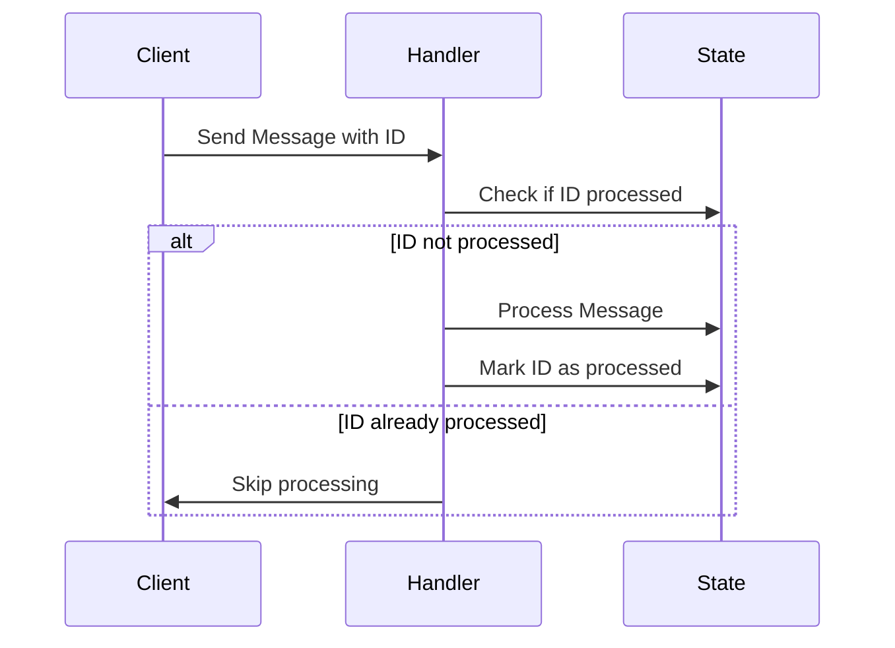

## Idempotent Message Handling

### Description

Idempotent Message Handling is a crucial pattern in stream processing and distributed systems, where messages can be delivered more than once due to system retries, network issues, or processing failures. This pattern ensures that processing the same message multiple times does not alter the outcome beyond the initial application. The goal is to maintain data consistency and system stability in the face of repeat message deliveries.

### Architectural Approaches

The implementation of idempotency usually involves:

1. **Idempotent Operations**: Design operations in such a way that repeated application of the same input yields the same state. For example, using stateless mathematical operations like addition or logical checks.
   
2. **State Checking**: Before processing a message, check if the operation has already been applied using version numbers or timestamps.

3. **Deduplication**: Maintain a record of processed messages, identified typically by unique message IDs, to prevent redundant handling.

4. **Immutable State**: Employ data structures or storage solutions where previous states cannot be modified, facilitating rollback or version re-check.

### Best Practices

- **Use Unique Identifiers**: Ensure each message has a unique identifier that can be used to check whether it has already been processed.
  
- **Design Stateless Handlers**: Decouple business logic from state management so that stateless processing can avoid complexity in repeated deliveries.

- **Use Idempotent APIs**: When interacting with external systems, ensure that the APIs called follow idempotent principles to naturally support repeat calls.

- **Implement Circuit Breakers and Retriers Wisely**: Understand when and how often to retry deliveries and integrate logic that can downgrade functions gracefully if retries aren't successful.

### Example Code

Here's a simple Scala example demonstrating an idempotent message handler using a set to track processed message IDs:

```scala
import scala.collection.mutable

object IdempotentHandler {
  private val processedMessages: mutable.Set[String] = mutable.Set()

  def processMessage(messageId: String, operation: () => Unit): Unit = {
    if (!processedMessages.contains(messageId)) {
      operation()
      processedMessages.add(messageId)
    } else {
      println(s"Message $messageId has already been processed.")
    }
  }
}

// Usage
IdempotentHandler.processMessage("msg-123", () => println("Processing message..."))
IdempotentHandler.processMessage("msg-123", () => println("Processing message...")) // Won't process again
```

### Diagrams



### Related Patterns

- **Message Deduplication**: Helps to reduce processing of duplicate messages.
- **Event Sourcing**: Combines with idempotency to allow reconstructing and repeated processing of events in a consistent manner.
- **Transactional Outbox**: Ensures that messages are only sent once and changes are only applied once, across system operations.

### Additional Resources

- Martin Fowler's post on [Idempotence](https://martinfowler.com/bliki/IdempotentOperation.html)
- InfoQ's article on [Building Idempotent and Reliable Microservices](https://www.infoq.com/articles/microservices-idempotency)
- "Enterprise Integration Patterns" by Gregor Hohpe and Bobby Woolf

### Summary

Idempotent Message Handling is key to achieving robustness in cloud-based distributed systems by ensuring that reprocessing the same message leads to consistent outcomes. Adopting this pattern can significantly enhance system resilience against network glitches and partial failures, ultimately improving user trust and system reliability. This involves designing operations with idempotency from the ground up, aided by tools like deduplication techniques, unique identifiers, and systematic state management.
