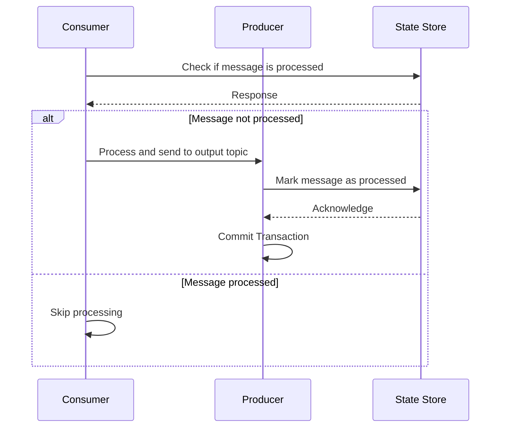

## Overview

The Exactly-Once Delivery pattern guarantees that each message in a stream processing system is delivered and processed exactly once, thus preventing any possible loss or duplication. This pattern is crucial in various systems where precision in data processing is non-negotiable, such as financial applications, billing systems, and inventory management.

Achieving exactly-once delivery is challenging due to the distributed nature of most modern systems, potential failures, and network unreliability. However, by leveraging a combination of idempotent operations, transactional guarantees, and checkpointing mechanisms, it becomes feasible.

## Architectural Approaches

1. **Idempotent Processing**: Design components such that processing the same message multiple times leads to the same result. This is typically achieved by maintaining state effectively and using unique identifiers for operations.

2. **Transactional Messaging**: By employing transactional capabilities (like Kafka’s transactional APIs), systems ensure that a series of operations within a message processing flow either all succeed or are completely rolled back, maintaining consistency.

3. **Checkpointing**: Regular snapshots of the processing state ensure that when a failure occurs, the system can resume from the last known good state, avoiding message re-processing from starting entirely afresh.

4. **State Management**: Utilize robust state management libraries and databases like RocksDB (used in Kafka Streams) to maintain precise state transitions and aides in providing exactly-once semantics.

## Example Code

Consider a basic implementation of an exactly-once delivery concept using Apache Kafka with a hypothetical state management library.

```java
import org.apache.kafka.clients.consumer.KafkaConsumer;
import org.apache.kafka.clients.producer.KafkaProducer;

public class ExactlyOnceDeliveryProcessor {

    private KafkaConsumer<String, String> consumer;
    private KafkaProducer<String, String> producer;
    private StateStore stateStore;

    public ExactlyOnceDeliveryProcessor() {
        // Initialize Kafka consumer and producer with appropriate configs
        // Configs should support idempotency and transactional writes

        consumer = new KafkaConsumer<>(configConsumer());
        producer = new KafkaProducer<>(configProducer()); 

        producer.initTransactions();
        stateStore = new StateStore();
    }

    public void processMessages(String topic) {
        try {
            consumer.subscribe(Collections.singletonList(topic));

            while (true) {
                producer.beginTransaction();

                ConsumerRecords<String, String> records = consumer.poll(Duration.ofMillis(100));
                for (ConsumerRecord<String, String> record : records) {
                    if (!stateStore.isProcessed(record.key())) { 
                        // Process the record
                        processRecord(record);
                        stateStore.markAsProcessed(record.key());
                    }
                }

                // Commit the processing transaction
                producer.commitTransaction();
            }
        } catch (Exception e) {
            // If an exception occurs, abort the transaction
            producer.abortTransaction();
            e.printStackTrace();
        }
    }

    private void processRecord(ConsumerRecord<String, String> record) {
        // Your record processing logic
    }

    private Properties configConsumer() {
        // Kafka consumer configuration with idempotent settings
    }

    private Properties configProducer() {
        // Kafka producer configuration to achieve transactional writes
    }
}
```

## Diagrams

Below is a simplified sequence diagram demonstrating the flow of exactly-once processing in a stream processing system:



## Related Patterns

- **At-Least-Once Delivery**: Focuses on delivering messages with an assurance that each message will be processed at least once, with possible duplication.
- **At-Most-Once Delivery**: Delivers messages ensuring they are processed no more than once, without guarantees of each message being processed.

## Additional Resources

- "Designing Data-Intensive Applications" by Martin Kleppmann
- Apache Kafka Documentation on Exactly-Once Semantics
- Confluent’s Series on Stream Processing Fundamentals

## Summary

The Exactly-Once Delivery pattern plays a crucial role in systems where precision is paramount. Despite the inherent challenges in distributed systems, properly implementing idempotent processing, transactional messaging, checkpointing, and robust state management can lead to achieving the desired consistency guarantees, making your applications reliable and fault-tolerant in the face of failures.

This pattern remains integral to sectors demanding non-negotiable accuracy, ensuring that critical data flows are maintained without loss or duplication.
