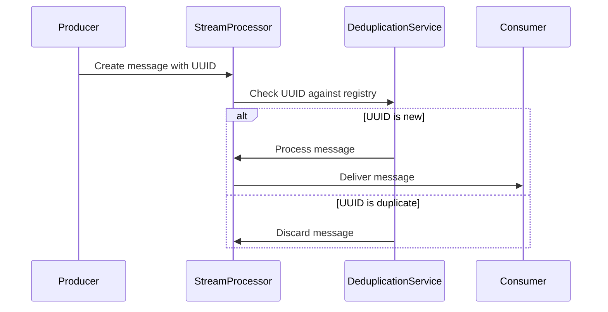

## Introduction

In stream processing and message-driven architectures, ensuring that messages are processed exactly once can be challenging. Duplicate messages can occur due to network issues, retries, or failures. Unique Message Identifiers are a pattern used to tackle this problem by assigning a unique identifier to each message, facilitating deduplication and precise tracking throughout the processing pipeline.

## Detailed Explanation

Unique Message Identifiers (UMIs) are globally unique values assigned to every message within a stream processing system. These identifiers enable systems to recognize and handle duplicate messages by providing a way to:

- **Deduplicate**: Identify and discard duplicate messages that may arrive more than once due to retries or failures.
- **Track Processing**: Trace the path of a message through different stages of processing, ensuring visibility and accountability.

### Key Concepts:

- **UUID**: Universally Unique Identifier, commonly used for generating unique message identifiers. They are designed to be unique across different systems and over time, making them ideal for event uniqueness in distributed systems.
- **Message Hashing**: Another method of generating unique identifiers using cryptographic hashing on message content. This approach ensures that identical messages yield the same identifier.

## Example Code

Here's an example of creating a unique message identifier using a UUID in Java:

```java
import java.util.UUID;

public class Message {
    private final UUID uniqueId;
    private final String content;

    public Message(String content) {
        this.uniqueId = UUID.randomUUID();
        this.content = content;
    }

    public UUID getUniqueId() {
        return uniqueId;
    }

    public String getContent() {
        return content;
    }
}
```

In this example, each `Message` instance is assigned a `UUID` at creation, ensuring that each message can be individually identified and deduplicated.

## Diagrams



## Best Practices

1. **Inevitability of Duplicates**: Design around the assumption that duplicates are inevitable, especially in distributed systems.
2. **Unique Identifier Generation**: Use proven libraries and mechanisms for generating UUIDs or other unique identifiers to avoid collisions.
3. **Logging and Monitoring**: Implement comprehensive logging and monitoring around message IDs for better diagnostics and insights.
4. **Stateful Deduplication**: Maintain state to track processed message IDs over time, specifically tailored to your use case requirements.

## Related Patterns

- **Message Retry Pattern**: Complements UMIs by providing mechanisms to handle message retries without compromising uniqueness.
- **Idempotent Consumer**: A consumer pattern ensuring that operations performed by a message are idempotent, allowing safe handling of retries.
- **Event Sourcing**: A persistence pattern that maintains a complete history of state changes, utilizing UMIs for efficient event tracking.

## Additional Resources

- [RFC 4122: A Universally Unique Identifier (UUID) URN Namespace](https://datatracker.ietf.org/doc/html/rfc4122)
- [Cloud Event Processing Patterns](#)
- [Idempotency in Distributed Systems](#)

## Summary

Unique Message Identifiers play a crucial role in modern stream processing and event-driven systems by preventing duplicate processing and enhancing event tracking. By implementing UMIs, systems can ensure that each event is treated distinctly, improving reliability and observability of the message-driven architectures. From UUIDs to message hashing, selection of the appropriate unique identifier strategy is vital for seamless integration and operation within any cloud-based or distributed framework.
