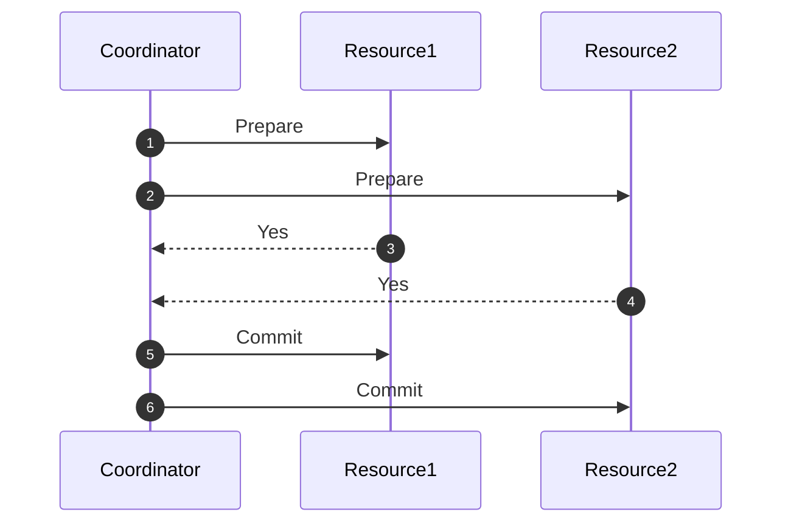

## Introduction

Distributed Transactions are critical in ensuring data consistency in systems where operations span multiple resources or systems. They help enforce ACID (Atomicity, Consistency, Isolation, Durability) properties across heterogeneous systems, ensuring either all or none of the operations are executed.

## Architectural Approach

Distributed Transactions are typically implemented using coordination protocols such as:

- **Two-Phase Commit (2PC)**: 
  - **Phase 1 (Prepare)**: All participating systems agree to commit or rollback the transaction once it has been successfully prepared.
  - **Phase 2 (Commit/Rollback)**: If all systems are prepared successfully, the transaction is committed. If any system fails to prepare, every system involved will rollback the transaction.
  
- **Three-Phase Commit**: An extension to the 2PC for increasing system resilience in distributed systems by adding a timeout mechanism and introducing a `pre-commit` state to circumvent indefinite blocking in the face of failures.

## Example Code

Below is an example using XA transactions in Java to demonstrate distributed transaction management across a database and a message queue (JMS).

```java
import javax.transaction.UserTransaction;
import javax.transaction.TransactionManager;
import javax.transaction.xa.XAResource;

public class DistributedTransactionExample {

    public void executeTransaction(XAResource dbResource, XAResource jmsResource) throws Exception {
        TransactionManager txnManager = // obtain transaction manager
        UserTransaction userTxn = txnManager.getUserTransaction();

        try {
            userTxn.begin();

            // Enlist resources
            dbResource.start(transactionId, XAResource.TMNOFLAGS);
            jmsResource.start(transactionId, XAResource.TMNOFLAGS);

            // Perform database operations
            performDatabaseOperations(dbResource);

            // Perform messaging operations
            performMessagingOperations(jmsResource);

            // Commit the transaction
            userTxn.commit();
        } catch (Exception e) {
            // Rollback in case of an error
            userTxn.rollback();
        }
    }

    private void performDatabaseOperations(XAResource dbResource) {
        // Database transaction logic
    }

    private void performMessagingOperations(XAResource jmsResource) {
        // Messaging transaction logic
    }
}
```

## Diagram

Below is a Mermaid diagram illustrating a high-level sequence of a two-phase commit process.



## Related Patterns

- **Sagas**: An alternative pattern for managing distributed transactions without requiring a traditional locking mechanism in long-lived transactions.
- **Eventual Consistency**: Often used in large scale distributed systems to allow updates in a way that the system becomes consistent over time.

## Best Practices

- Utilize distributed transactions when absolute consistency across systems is critical.
- Monitor transaction management overhead to mitigate possible system bottlenecks.
- Implement proper failure handling to ensure transactional systems revert to a consistent state.

## Additional Resources

- [Compensating Transactions](https://microservices.io/patterns/data/compensating-transaction)
- [Saga Pattern](https://microservices.io/patterns/data/saga.html)
- ["Patterns of Enterprise Application Architecture" by Martin Fowler](https://martinfowler.com/books/eaa.html)

## Summary

Distributed Transactions are a powerful design pattern ensuring data integrity across complex, multi-system operations. While they can be complex to implement and manage, when used appropriately, they provide robust ACID compliance across distributed architectures. Understanding alternative patterns and knowing when to apply distributed transactions is essential for designing resilient, consistent systems.

