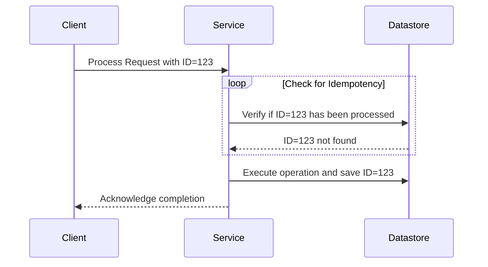

## Idempotent Operations

### Description

Idempotent operations are a fundamental concept in stream processing systems, ensuring operations can be executed multiple times without changing the result beyond the initial application. This property is particularly useful in distributed systems where failures or retries might cause an operation to be performed more than once.

### Advantages

- **Consistency**: Idempotency guarantees that performing the operation multiple times will not produce different results.
- **Resilience**: Enhances system robustness against network failures and service interruptions, allowing safe retries.
- **Simplified Error Handling**: Reduces the complexity of error management in systems sensitive to failures.

### Architecture

In the context of stream processing, idempotent operations can be implemented at the message level, ensuring each computation or transformation applied to the events within a stream does not produce different outcomes if repeated. This requires careful handling at both the application and infrastructure levels to ensure idempotency without introducing significant overhead or latency.

### Implementation Approaches

1. **Request Tracking**: Store a unique identifier for each processed request to detect duplicates and prevent reprocessing.
2. **Tokenization**: Use timestamps, version numbers, or unique constraints in operations, allowing operations to be safely re-applied or discarded.
3. **State Management**: Utilize stateful processing to maintain state in a manner that inherently supports idempotency.
4. **Optimistic Updates**: Implement checks before updates that confirm the new state matches expectations.

### Example Code

Below is a basic illustration in Java showcasing an idempotent operation through unique constraint checks:

```java
import java.util.HashMap;
import java.util.Map;

public class IdempotentService {
    private final Map<String, String> userStatus = new HashMap<>();

    public void setUserStatus(String userId, String status) {
        // Check if current status matches the intended status
        if (!status.equals(userStatus.get(userId))) {
            userStatus.put(userId, status);
            System.out.println("User status updated to " + status);
        }
    }
}
```

### Diagram



### Related Patterns and Concepts

- **Retry Pattern**: Works hand-in-hand with idempotent operations in managing retries.
- **Exactly-Once Delivery**: Often used with idempotency to guarantee no data duplication.
- **Stateful Processing**: Useful for maintaining system state to control idempotency.

### Additional Resources

- [Idempotency Key Design](https://developer.example.com/idempotency-key)
- [Stream Processing with Apache Kafka](https://kafka.apache.org/documentation/streams)
- [REST API Idempotency Guidelines](https://restfulapi.net/idempotent-rest-api/)

### Summary

Idempotent operations are essential in ensuring that stream processing systems maintain consistency and reliability, especially in environments prone to failures or retries. By incorporating idempotency into the design of operations, developers can build applications that gracefully handle duplicates and delays without adverse effects on application logic or user experience. The use of strategies like request tracking, tokenization, and stateful processing are pivotal to implementing idempotency effectively in distributed environments.
