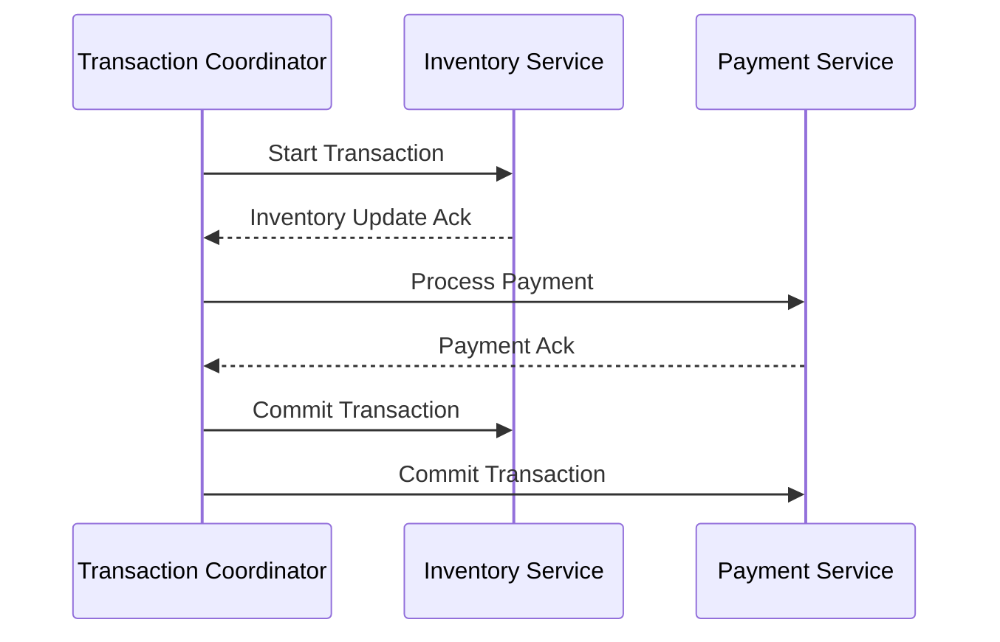

## Transactional Messaging

### Description

Transactional Messaging refers to the design pattern employed in distributed systems and stream processing to ensure that a group of operations is executed in a manner that guarantees atomicity. This means that either all operations within a transaction must complete successfully, or none at all, maintaining the system's state consistently. This approach is pivotal within systems requiring high reliability and consistency, such as financial transactions, order processing systems, and inventory management.

### Architectural Approach

In implementing transactional messaging, several components come into play:

1. **Transaction Coordinator**: This component manages the initiation and completion of a transaction. It ensures either a commit or rollback of all involved operations based on the success or failure outcomes detected during processing.

2. **Participants**: Each participant in the transaction supports a two-phase commit process. Initially, participants ensure they are ready for the transaction before proceeding with it.

3. **Messages**: To maintain transactional integrity, messages should be idempotent and capable of rolling back when possible to support compensatory actions if needed.

4. **State Management**: The use of persistent storage to maintain transaction states and logs for audit trails and reprocessing in case of partial failures.

### Best Practices

- **Idempotency**: Design messages so that repeated processing due to retry mechanisms do not alter the outcome, providing safer retries and recovery.
- **Monitoring and Logging**: Implement comprehensive logging and monitoring to quickly identify failures and facilitate debugging.
- **Compensating Transactions**: For actions that can't be easily undone, design compensating operations to reverse the effects of a transaction if required.
- **Isolation Levels**: Consider employing appropriate isolation levels in databases to manage concurrent transaction effects.

### Example Code

Below is an example using Java with a microservices architecture enabled by Kafka and Spring Boot:

```java
@Transactional
public void processOrder(Order order) {
    // Update inventory within a transaction
    inventoryService.updateInventory(order);

    // Process payment within the same transaction
    paymentService.processPayment(order.getPaymentDetails());
    
    // If any of these throws an exception, the transaction will be rolled back
}
```

### Diagram



### Related Patterns

- **Saga Pattern**: Another technique used for managing long-running transactions by breaking them into steps that can be rolled back using compensating actions.
- **Event Sourcing**: Involves capturing all changes to an application state as a sequence of events, which naturally fits with ensuring consistency and rollback capabilities.

### Additional Resources

- [Distributed Transactions in Microservices with Kafka](https://docs/confluent.io/kafka)
- [Two-Phase Commit Protocol (Wikipedia)](https://en.wikipedia.org/wiki/Two-phase_commit_protocol)
- [Patterns of Distributed Systems](https://patterns/distributed.com)

### Summary

Transactional Messaging ensures that distributed operations within a system execute with consistent outcomes, either succeeding as a whole or leaving the system unchanged. This pattern provides a robust solution for managing state consistency, especially in environments dealing with complex, interdependent processes like stream processing or microservices. Adopting this pattern involves intricate coordination and management, making careful architectural planning and adherence to best practices vital.

